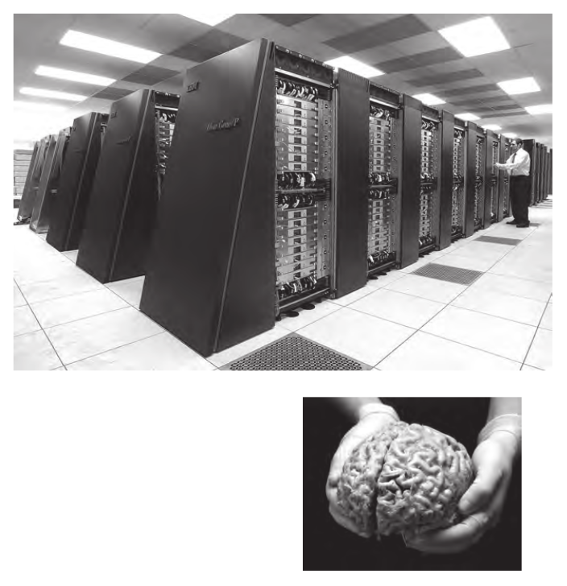

## Introduction

一台笔记本电脑在容量和功耗方面类似于人脑——但它很愚蠢。深蓝是 IBM 制造的超级计算机，它在国际象棋上击败了大师加里卡斯帕罗夫，它的体积比普通笔记本电脑大 100,000 倍，消耗的功率也高 100,000 倍（Figure  I.1）。然而，尽管深蓝在国际象棋方面表现出色，但它依旧很愚蠢，相当于电子白痴。计算机以光速运行，而大脑却运行的很慢，那么，大脑的优势在哪里呢？一个简短的回答是，大脑采用了卓越设计的混合架构。更长的答案是这本书——其目的是确定这种计算效率的来源。

> **Figure I.1**
> **How do neural circuits use space and power so efficiently?** Computer: Image 
>
> http://upload.wikimedia.org/wikipedia/commons/d/d3/IBM_Blue_Gene_P_supercomputer.jpg. 
>
> Brain: Photo by UW-Madison, University Communications © Board of Regents of the University of Wisconsin System.

一个多世纪以来，人们对大脑的内部运作进行了科学的研究，最初是由少数研究人员使用简单的方法进行研究。在过去的 20 年中，该领域呈爆炸式增长，大约 50,000 名神经科学家应用了越来越先进的方法。这种爆发相当于 每年有100 万人参与了这项研究，研究的结果导致实验事实堆积如山。基础研究的内容有神经连接和电反应，与精神状态相关的功能图像，以及离子通道、受体、G 蛋白等分子的组成成分。高级一点的研究的是关于运作机制的关键发现：动作电位、递质释放、突触兴奋和抑制。总结这一海量的事实和机制需要一个极好的纲要（Kandel 等人，2012；Purves 等人，2012；Squire 等人，2008）。

但是，如果有人寻求一本阐明我们的大脑如何在比超级计算机聪明得多的同时也可以更小、功耗更低的原理的书，那书架子一定是光秃秃的。一个原因是现代神经科学一直是“技术驱动的”。虽然在 1960 年代，大多数人可能设想的实验在技术上是不可能的，但现在有了膜片钳、双光子显微镜和功能性磁共振成像 (fMRI) 等方法，在分子生物学的帮助下，情况发生了逆转，构思一个在以前难度大且无法完成的实验在现在是可能的。

因此，伴随着新技术在神经科学的运用，停下来从已知的事实中探索原理的想法就缺乏吸引力了，此外，对于许多以挖掘重大新事实为生的人来说，这似乎是在浪费时间。

然而，我们从查尔斯·达尔文那里得到灵感，他说：“我的头脑似乎已经变成了一种机器，可以从大量事实中挖掘出一般规律”（达尔文，1881 年）。达尔文当然是无与伦比的，但这也是我们的思维方式。所以我们写了一本小书——相对于伟大的纲要而言——我们打算在“数据山”上开辟一条崎岖的道路来寻找大脑的原理。

#### Principles of engineering

大脑是执行特定功能的物理设备， 因此，其设计必须遵循工程的一般原则。 第 1 章列出了一些我们从有关机械和电气设计的论文和书籍中收集到的原则。 这些原则并没有解决关于大脑的具体问题，但它们确实为整理一个人的想法设定了一个背景——这对于一个可能令人生畏的话题特别有用。 例如，它有助于认识到神经科学实际上是一种“逆向工程”的练习——为了理解它而拆开一个设备。 

这种研究思路立即指向一组标准问题，我们认为这些问题是所有“逆向工程师”的口头禅：它是做什么？ 它的规格是什么？ 环境背景是什么？ 这些将是后续研究设计的诫命，例如研究界面和使设计复杂化。 后者可能会让那些在解释现象时通常力求简单的科学家感到困惑。 但是工程师专注于设计有效的设备，所以他们有充分的理由使设计复杂化。我们将会看到，这些诫命当然适用于大脑。

#### Why a brain?

为了解决工程师的第一个问题，我们考虑为什么动物需要大脑——它服务于什么基本目的以及有机体的成本是多少？ 第 2 章从一种微小的细菌——大肠埃希氏菌开始，它在没有大脑的情况下也能成功生存，评估这种细菌能做什么，不能做什么。 然后是原生动物草履虫，它仍然是一个没有大脑的单细胞动物，但比大肠杆菌大得多（300,000 倍），它需要更快地传导信号，这预示着多细胞生物中神经元的长距离信号传导。

第二章以微小的线虫---秀丽隐杆线虫结束，它确实有一个大脑——正好有 302 个神经元。 这个数字在绝对值上很小，但它代表了该生物总细胞的近三分之一，因此这是一项能够更好地获利的重大投资，而且确实如此。 例如，它控制着一个多细胞系统，该系统可以发现、摄取和消化细菌，并让线虫在几个小时内回忆起适宜温度和细菌浓度的位置。

人类自然倾向于忽视小型生物的计算能力，这似乎是智力缺陷，因为这几乎意味着没有学习或记忆的能力。 但小生物确实会学习和记忆。 只是他们的记忆与他们的生活背景相匹配：他们只记得他们需要的东西，并且只记得足够长的时间。 此外，它们为这些计算进化的机制也保留在我们自己的神经元中——所以我们将再次看到它们。

细菌→原生动物→蠕虫的进化伴随着计算复杂性的增加。它的回报是增加了栖息在更丰富环境中的能力，从而向食物链上游移动：原生动物吃细菌，蠕虫吃原生动物。 从工程学的角度来看，这是完全有道理的：小野兽只计算它们必须计算的； 因此他们只为他们使用的东西付费。 对于第 3 章中讨论的具有更大大脑的野兽来说，情况同样如此。

#### Why a bigger brain?

果蝇 (Drosophila melanogaster) 的大脑比秀丽隐杆线虫大 350 倍，人类 (Homo sapiens) 的大脑比果蝇大一百万倍。 这些较大的大脑与较小的大脑来自相同的自然选择过程，因此我们应该继续期望它们没有多余的东西——只有必不可少的机制，并且为自己买单。 我们还应该期望，当一个特性运行良好时，它会被保留下来——比如轮子、回形针、铝制啤酒罐和晶体管（Petroski，1996；Arthur，2009）。 我们注意到大脑在至少 4 亿年的自然选择中保留了（经过适当阐述）的设计特征。 人类大脑中的这些特征通常被描述为“原始的”——爬行动物——反映了我们本性的消极方面。 但是，当然，任何保留了这么久的功能都必须非常有效。

第三章确定了所有大脑的核心任务：它是调节有机体的内部环境——通过响应需求，更好的是，通过预测需求并准备在它们出现之前满足它们。 全知的优势鼓励无所不在。 大脑倾向于成为调整所有内部参数以提高整体稳定性的通用设备性和经济性。 “预期调节”取代了更熟悉的“稳态调节”——它的运行方式是等待每个参数偏离“设定点”，然后检测错误并通过反馈进行纠正。 20 世纪的大多数生理研究都是基于稳态模型——肾脏、肠道、肝脏、胰腺等如何独立工作，尽管巴甫洛夫早期证明了大脑在预期调节中的作用（巴甫洛夫，1904 年）。 但逐渐预期控制已被认可。

预期监管提供了巨大的优势。 首先，它使整体响应能力与需求波动相匹配——应该始终存在足够但不要太多。 其次，它将系统中每个阶段的容量与下游的预期需求相匹配，从而在容量过剩（昂贵的存储）和供应不足导致的故障之间开辟一条有效路径。 第三，它通过设置和转移优先级来解决器官组织之间的潜在冲突。 例如，在消化过程中，它可以将更多的血液输送到肠道，而减少输送到肌肉和皮肤的血液，而在运动过程中，它可以逆转这一优先顺序。 这使得有机体能够以比其他方式所需的更小的血量进行操作。 最后，它最大限度地减少了错误——这些错误可能是致命的，也会造成累积的损害。

#### Anticipatory regulation includes behavior

如果一个器官能够预测需求并通过对生理的总体控制来调节内部环境，那么如果它还能调节行为，它就会特别有效。 例如，它可以通过引导动物寻找阴凉处来减少身体对生理冷却的需求（例如，出汗——这会消耗能量和资源——钠和水）。 此外，它可以唤起对不愉快中暑的记忆，提醒动物采取预期措施（夜间旅行，携带水）。 这种预期机制不断被饥饿、寒冷、干旱或捕食的记忆驱动：摘豆子！ 伐木！ 建一个水库！ 把门锁上！

塑造我们行为的危险和糟糕时期的记忆可能是我们自己的，但它们也通常存储在我们父母和祖父母的大脑中。 我们在他们的噩梦中长大——洪水、干旱、饥荒、大屠杀。 在仅有 6,000 年的书面文明历史出现之前，所有有助于人们预测并因此避免致命情况的教训只能通过口述传统来传播——人类寿命的记忆。 鉴于记忆在小脑中的保留与其有用的跨度相对应，并且保留是有代价的，人类对重大事件的记忆应该随着年龄的增长而保持生动，而最近对较小事件的记忆应该会逐渐消失（第 14 章）。

最持久的危险和机会，远远超过几代人，最终成为神经线路的一部分。 猴子普遍害怕蛇，大多数人类也是如此——这表明这种反应在进化为不同物种分支之前就被编码到大脑结构中——大约有 3500 万年。 但除了对掠食者的警觉之外，灵长类动物社会保留了他们最敏锐的观察和对家庭关系和社会关系的回忆。 这样做的好处是，个体的生存和繁殖机会因群体的预测和调节能力而提高。 代价是个人必须在其历史背景下不断地感知社会结构，以便在需要时获得援助并避免被杀或被驱逐（Cheney & Seyfarth，2007）。 

因此，灵长类动物的大脑在与社会识别和规划有关的部分——例如前额叶皮层和杏仁核——显着扩张。 人类极大地扩展了这些领域以及社交交流领域，例如语言、面部表情和音乐。 这些区域为预期监管的合作和竞争方面提供了非常好的服务。 它们解释了大脑结构和许多难题。

苍蝇也表现出预期行为——达到与它们的寿命和环境范围相一致的水平。 苍蝇不需要等到它的血糖降到危险的低水平时，也不需要等到它的体温飙升到危险的高点时，再采取行动。 相反，它的大脑表达了预先设定的命令：寻找水果！ 在一个凉爽的地方！ **预期命令通常会根据环境规律进行调整**，以预测资源最有可能出现或消失的时间和地点。 因此，昼夜节律支配觅食和睡眠。 广泛影响资源可用性的季节性节律支配着交配和繁殖。 因此，调整到白天长度的特定脑激素会向预先连接的电路发送命令：求爱！ 恐吓竞争对手！

#### What drives behavior?

为确保有机体能够执行这些命令，存在神经机制使其在工作完成时“感觉不好”，而在工作成功时“感觉良好”。这些是人类体验到的活动分别为“焦虑”和“快乐”的回路。” 当然，我们不知道蠕虫或苍蝇经历了什么——但相同的神经化学物质驱动着相似的行为，这是一个经过数亿年装饰的轮子，但没有被重新发明。

实际上，完成一项任务是非常复杂的，重新考虑一下深蓝的任务，国际象棋的每一面都有 16 个棋子，一次移动一个，而且只有二维。 每一块都被限制只能以某种方式移动，并且有些块会重复，因此每一面只有六种不同类型的运动。 这种相对简单的设置会产生如此多的可能动作，以至于评估它们需要深蓝。

但负责预期调节的器官从有机体中的每个感觉神经元（包括内部和外部）以及无数激素和其他化学物质中获取连续数据。 在这样做的同时，它正在实时计算——毫秒——如何从内到外调整每个身体组件。 它在飞翔，寻找食物、阴影和伴侣； 它正在避开掠食者和恐吓竞争对手——同时调整每个内部参数以匹配即将需要的参数。 因此，它
似乎公平地说，即使与果蝇相比，深蓝也是愚蠢的。 这明确定义了下一个工程问题：是什么限制了有效和高效大脑的设计？

#### What constrains neural design?

当希勒尔在公元前1世纪解释摩西五经的**Torah**时回答道：“That which is hateful to you, do not do to your fellow. That is the whole **Torah**; the rest is the explanation; go and learn.”

神经设计有一个单一的答案：“随着信息率的提高，成本会不成比例地上升。 ” 例如，要通过尖峰传输更多的信息，就需要更高的尖峰率。 轴突直径随着尖峰率线性上升，但轴突体积和能量消耗随着直径的平方而上升。 因此，神经设计的本质是：“只发送需要的信息，并尽可能慢地发送”（第 3 章）。 正如第 4 章所解释的那样，这一关键命令深刻地塑造了大脑的宏观布局。我们希望读者能够理解. . . go study。

如果尖峰价格非常便宜，那么它们的价格就不那么重要了。 然而，一个 100 mV 的尖峰需要比一包化学发射器引起的 1 mV 响应大得多的电流。 显然，用较小的电流进行计算会更便宜。 这体现了另一个设计原则：通过尽可能精细的计算来最小化每比特信息的能量。 第 5 章将这一水平确定为纳米级蛋白质折叠的变化。 这种变化可以以接近热力学极限的能量成本捕获、存储和传输一比特信息。 第 6 章解释了蛋白质如何耦合形成微米级的细胞内电路，第 7 章解释了神经元如何将这些电路组装成微米到毫米级的设备。

为了在空间和能量上最有效地计算，神经回路应该纳米化：

1. 使每个组件都小到不可约：一个功能单元应该是单个蛋白质分子（通道），或者是蛋白质亚基的线性聚合物（微管），或者是单分子层的夹层（膜）。
2. 结合不可还原的成分：分离电荷并因此产生电压的膜，蛋白质转运蛋白选择性地泵送离子穿过膜并实际分离电荷（为电池充电），一个孔让离子单独流过膜，从而产生电流，启动和停止电流的“门”，放大电流的放大器，以及使电流与环境匹配的自适应机制。
3. 尽可能使用化学计算：通过结合或解除结合足够数量的小分子以遵守质量作用定律来调节门、放大器和自适应机制。通过保持小体积来提高化学反应速度。
4. 对于距离上的速度进行电计算：将化学计算的信号转换为对膜电容充电的电流，以被动传播至一毫米。对于更长的距离，通过适当聚集的电压门控通道再生电流。

#### Design in the visual system

在讨论了蛋白质计算和小型化作为提高效率的一般途径之后，我们在一个集成系统中举例说明了这些要点——光转导（第 8 章）。工程挑战是捕捉环境中物体反射的光，以提取信息模式来指导行为。转导采用具有大约六个阶段的生化级联将单个光子的能量放大高达一百万倍，同时保留体现为信噪比 (S/N) 和带宽的信息。我们解释了为什么需要这么多阶段。

感光器信号一旦编码为分级膜电压，就会被动地沿着轴突向下传播到突触末端。 在那里，模拟信号被数字化为突触小泡流。 昆虫的大脑可以非常高效地直接读出这条信息，因为距离足够短，可以直接传输被动信号（第 9 章）。 哺乳动物的大脑不能直接读出这个囊泡流，因为距离对于被动信号来说太远了。 哺乳动物的眼睛必须通过动作电位进行传递，但感光器的模拟信号包含的信息比动作电位所能编码的要多。 因此，需要进行现场视网膜处理（第 10、11 章）。

#### Principles at higher levels

更精细和更低级别的神经设计原则也适用于更大范围和更高级别。 例如，他们可以解释为什么大脑皮层的第一视觉区域 (V1) 极大地扩展了神经元的数量和多样性。 以及为什么不同类型从 V1 平行投射到其他皮层区域。 以及为什么皮层使用许多特定区域并以特定方式排列它们。 正如第 12 章所解释的，答案总是相同的：不同的电路允许大脑只发送需要的信息，并以较低的信息速率发送。 这将计算保持在收益/成本曲线的陡峭部分。

#### Wiring efficiency

具有超大规模集成的硅电路力求优化布局——以最少的空间、时间和能源实现最佳性能。 神经回路也是如此，从而在所有空间尺度上产生巨大的神经元结构多样性。 例如，小脑输出神经元（Purkinje cells）使用二维树突状轴，而大脑输出神经元（锥体细胞）使用三维轴。 两种电路都采用分层结构，但大型Purkinje神经元位于一层微小神经元之上，而大型锥体神经元位于较小神经元之下。 小脑皮层在毫米尺度上强烈折叠，而大脑皮层在这个尺度上是光滑的。

这种差异源于普遍存在的生物物理约束：神经元细胞质的不可减少的电阻。 无源信号在空间和时间上仅作为树枝状直径的平方根 (√ d) 传播。 这导致了第二个收益递减定律：一个树突，如果要使其传导距离加倍或传导延迟减半，则其体积必须增加四倍。 这可以防止神经线变得更细，并防止局部电路变得更庞大。 在这两种情况下，传导延迟都会变得太大。 对体积的限制推动了有效的布局：树突和轴突的长度相等，以及导线和突触的最佳比例，这将在第 13 章进行解释。

#### Designs for learning

所有生物都使用新信息来更好地预测未来，因此，学习是生物设计的深层原理，也是神经设计的原理。大脑不断更新其对每个内部和外部参数的知识——这意味着学习也是一种大脑功能。神经学习受到与所有其他神经功能相同的约束，这是所有其它功能必须遵循的设计原则。

为了节省空间、时间和能源，新信息应该存储在处理它的地方，并且可以从那里调用它而无需额外费用。 这是突触。 低级突触传递输入的短期变化，因此它们的记忆应该很短，就像细菌或蠕虫一样。 这些突触应该通过修改蛋白质的结构和分布以最便宜的水平进行编码。 高级突触在经过多个处理阶段后对结论进行编码，因此通过扩大突触并添加新的突触，它们的记忆应该更长，编码更稳定。

直径为 (d) 的新突触占据突触后膜上的面积为d^2，体积为d^3。 由于添加突触会不成比例地增加成本，因此在固定体积的成人大脑中学习受到强大的空间限制。 对于每个扩大或增加的突触，必须缩小或移除另一个突触。 学习设计必须包含“只保存需要的东西”的原则。 ” 第 14 章解释了这在整体设计中是如何发挥作用的。

#### Design and designer

本书提出，大脑设计的许多方面都可以理解为在资源限制下提高效率的适应。 提高大脑效率肯定会提高适应度。 达尔文自己指出，“自然选择不断地试图节约组织的每个部分”，并提出本能，在现代术语中相当于“基因编程的神经回路”，是由自然选择产生的（达尔文，1859）。 所以我们的假设没有打破新的概念基础。

对这一假设的一个著名批评认为，如果无用的特征只是不可避免地伴随着重要特征，那么它们可能会在修剪后幸存下来（Gould & Lewontin，1979）。 这种可能性是不可否认的，但如果能找到神经设计的例子，我们希望它们很少见，因为每次未能修剪无用的东西都会降低大脑的效率——更像是深蓝，而大脑的效率超过深蓝 至少10^5 倍。

那么我们声称什么是新的？ 能源和空间的限制已经为人所知，各种原则也为人所知，例如“尽量减少线路”。 目前的贡献似乎在于我们将各种规则收集为一个简明的清单，并在空间和功能尺度上系统地举例说明它们。 当一个给定的规则被发现可以广泛应用并具有恒定的解释力时，我们称之为“原则”。 ” 十被列为整数。 与圣经诫命和美国权利法案一样，一些读者会发现太多（冗余）而另一些则太少。 我们很满意简单地列出它们以供考虑。

一些读者可能会反对“设计”一词，因为它可能暗示设计者，这可能暗示创造论。但“设计”可以指“元素或细节的安排”，也可以指“支配功能的方案”。这些都是我们想要表达的意思。而且，当然，还有一个设计者——如前所述，这是生物学家理解为的**自然选择的过程**。

#### Limits to this effort

我们的叙述建立在目前已达成共识的事实之上。当某些观点有争议时，我们会注意，但我们不会诉诸想象的机制。我们的目标不是解释大脑是如何工作的，而是要弄清已知的东西。自然，“达成共识”的内容会随着新数据的变化而变化，因此故事会不断发展。我们很高兴地承认这个说明既不完整也不永恒。

我们省略了太多——许多感官、许多大脑区域、许多过程——这会让研究它们的读者失望。 我们专注于视觉，部分原因是它在对数增长阶段主导了神经科学，因此这是知识在所有尺度上最深入的地方。 此外，我们个人专注于视觉，因此这是我们自己的知识最深的地方。 最后，要在整个范围内应用原则，但限于本书的篇幅，需要进行严格的选择。 我们当然希望其他领域的工作者会发现这些原则是有用的。 如果有些证明不那么普遍并且需要修改，那么这就是科学，我们可以用数据山做的最好的事情就是在南壁上设置几个岩钉。

