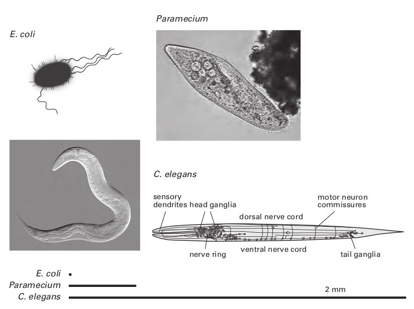

## Why an Animal Needs a Brain
>Essentially only one thing in life interests us: our psychical constitution. The consid-
>erations which I have placed before you employ a scientific method in the study of
>these highest manifestations in the dog, man ’ s best friend.
>— Ivan Pavlov, Nobel lecture, 1904 (edited for brevity)

讲述大脑的书籍通常从大脑的基础构成开始：神经元、轴突、突触和离子通道。 但这种方法不适合我们的逆向工程目标。 不能从具体细节开始解释 B-29。 所以我们推迟了零件清单和详细的原理图，首先考虑一个更大的问题：为什么我们需要大脑？

当然，一个人的第一个想法是，我们需要它来实现它所赋予的神奇活动和感觉：艺术、音乐、爱情，...意识。但是，尽管这些特征引起了强烈的好奇心——正如巴甫洛夫所强调的——我们将看到它们只是对大脑基本目的的巴洛克式装饰，不应被误认为是目的本身。我们在这里确定的大脑目的，特别是因为我们正在寻求原则，不仅应该适用于人类，也应该适用于线虫、秀丽隐杆线虫和苍蝇。线虫的大脑有 302 个神经元，果蝇的大脑有 10^5 个神经元，我们自己的大脑有 10^11 个神经元（Azevedo et al., 2009），它们的深层目的必须相同。通过确定基本目的，我们为以后考虑“装饰”设置了背景。 我们预计对哺乳动物大脑皮层的研究不会揭示许多新原理——而是会详细阐述核心原理。一般来说，在更简单的大脑中发现它们应该更容易。

大脑的目的减少到调节内部环境和帮助有机体生存和繁殖。 所有复杂的行为和心理体验——工作和娱乐、音乐和艺术、政治和祈祷——都只是完成这些功能的策略。 分享这些基本任务，蠕虫、苍蝇和脊椎动物的大脑表现出显着的相似之处——我们将对此进行讨论。 但首先，考虑到一种微小的细菌大肠杆菌和一种更大的单细胞原生动物草履虫在没有大脑的情况下很好地完成了这两项任务。 如何？

#### A bacterium foraging

大肠杆菌很小（1 × 3 μm），在营养汤中茁壮成长——漂浮在大型动物的肠道消化物中（图 2.1；Alberts 等人，2008 年）。 这种微生物配备了“味觉”受体，即一组蛋白质，每种蛋白质都特异性地结合一种引诱剂（如氨基酸或糖）或驱虫剂。 这些受体蛋白聚集在表面膜上并形成信号复合物，它们在其中相互配合以提高灵敏度和响应速度。 最大的簇位于前端，当细菌在汤中翻腾时，它已经准备好品尝味道。 尽管每个簇包含数千个分子——以增加捕捉味道的机会——但只有五种类型的受体分子，每一种都对一系列相关化合物作出反应。

这些受体的第一个功能是评估汤。 每种潜在的营养物质（氨基酸、糖等）都需要自己的特定转运蛋白（渗透酶）才能被细菌吸收，再加上一种特定的酶甚至一整套酶来处理它以获得能量和生长材料。 当在给定时刻只需要一个子集时，保持所有可能的转运蛋白和加工酶的高水平是不经济的。 因此，在味觉受体与目标分子结合之前，细胞不会合成用于摄取和消化的蛋白质。 受体的结合亲和力决定了蛋白质合成变得经济的浓度。

大肠杆菌的默认燃料使用葡萄糖。 但是当葡萄糖不在菜单上时，它可以使用乳糖。 这需要乳糖检测器检测两种蛋白质：一种允许乳糖进入的渗透酶和一种用于分裂乳糖的半乳糖苷酶。 编码这些蛋白质的基因在大肠杆菌的 DNA 中是相邻的，包括一个操纵子（协同工作的基因）。 它们的表达被阻遏蛋白阻断，该阻遏蛋白与这段 DNA 结合并阻断 RNA 聚合酶的进入，RNA 聚合酶是一种将 DNA 转录为 RNA（RNA 聚合酶）以启动蛋白质合成的分子机器（图 2.2）。 阻遏物是乳糖检测器，它在结合异乳糖（一种始终伴随乳糖的异构体）后会改变形状并从 DNA 中释放出来。 这允许 RNA 聚合酶离开并转录操纵子（图 2.2；Phillips 等人，2009）。

实际上，乳糖受体为有机体预测了开发这种新资源所需的条件。 通过将渗透酶和消化酶编码在一起，一种感觉信号可以以正确的比例唤起所有必要的成分。 因此，汤中给定水平的乳糖需要适量的渗透酶，而渗透酶与适量的半乳糖苷酶相匹配。 这种设计原则——耦合系统内的容量匹配——是多细胞动物组织的关键，它被称为“共态”（Weibel，2000）。 我们在这里看到共态始于单细胞。

#### The lac operon

有时，例如当宿主吃过冰淇淋时，大肠杆菌会同时摄入乳糖和葡萄糖。 现在细菌不需要代谢乳糖，因此不需要建造机器来处理它。 为了阻止这种徒劳的活动，有第二个分子开关。 RNA 聚合酶要沿着转录 lac 操纵子的 DNA 前进，必须被蛋白质 CAP 激活，并且 CAP 必须结合一个小信号分子 cAMP。 生化途径将 cAMP 的产生与葡萄糖的浓度结合起来。 随着葡萄糖升高，cAMP 下降； 这会关闭 RNA 聚合酶（图 2.2），大肠杆菌停止生产不需要的机器。

因此，分子控制系统结合来自两个输入的信息来计算加工乳糖的正确条件：如果有乳糖且没有葡萄糖，则 GO； 如果乳糖和葡萄糖都有，那么不去。 控制 lac 操纵子的化学网络使单个细胞能够检测特定的事件模式，并建立促进生存和繁殖的协同反应模式。 当然，这是大脑在更大范围内所做的事情，并且这样做是建立在执行驻留在单细胞分子控制系统中的逻辑的能力之上的（Bray，2009）。

大肠杆菌不仅仅是品尝汤和重新编程其消化酶。 味觉感受器还指导细胞觅食，即发现并迁移到营养浓度较高的区域。 为了执行这个过程，趋化性，细菌用鞭毛推动自己，鞭毛是螺旋形的螺旋，以 6,000 rpm 的速度旋转。 他们的殴打使它在短时间内向随机方向翻滚，然后是短暂的直线运行。 一个表面感受器，感应到一种营养素的瞬时浓度，将其与过去的浓度进行比较——“过去”持续 1 秒。 如果新的浓度更高，运动装置会保持前进的时间更长一些。

这种搜索策略（有偏随机游走，图 2.3）类似于派对游戏，其中隐藏了一个对象，搜索者被简单地告知“更温暖. . . 冷. . . 温暖，温暖. . . ”这样的信号，该机制可以汇总来自几种引诱剂的信号——保持运动方向更长的时间。 或者，它可以将对抗信号（吸引剂+驱虫剂）相加并更快地改变方向。 因此，有了一个传感器，再加上一个控制螺旋桨的“工作记忆”，微生物的游荡最终会将其带到更绿色的牧场（Berg，1993）。

#### A microbe ’ s memory

大肠杆菌的工作记忆很简单：它通过负反馈回路印在受体蛋白上。 激活的味觉受体导致酶将甲基连接到受体复合物上，从而降低其敏感性。 受体上甲基的数量表明它被激活的强度，并且由于反馈回路缓慢，记录可以追溯到细菌疯狂的过去——1秒。 该机制通过使用过去来设定受体的敏感性，决定了细菌在当下的反应——这是记忆的合理定义。 因此，单个细胞可以通过化学便宜地存储信息——通过共价修饰信号分子。

在完成基本任务（保持内部环境和繁殖）时，这个单细胞使用的机制要么是最优的，要么是非常经济的：味觉受体的数量和分布恰到好处，转运蛋白和消化酶的比例恰到好处， 蛋白质表达以匹配成本与资源，加上最小的趋化性信号网络，可以提供足够强大的性能。 此外，它的工作记忆足以驾驭马达转向食物和配偶。 尽管仅持续 1 秒的记忆可能看起来并不令人印象深刻，但要意识到存储乳糖浓度的长期历史是没有意义的——因为它们本身就是易逝的。 考虑到它的生活方式，这种细菌的记忆力应该和它应该有的一样长。

这种微生物很容易像禅师一样生活——就在当下。 给细胞喂食，一个小时后它就消失了，分给了它的后代。 但是一旦有机体变得足够大，可以容纳大脑，禅宗的戒律——“活在当下”——本身就变成了禅宗公案。 大脑为有机体提供了更重要的个人过去和更广阔的未来来利用它。 但如此装备，停留在这一刻变得像用一只手鼓掌的声音一样难以想象。

#### Limitations to life as a microbe

鉴于细菌可以很好地完成生存必须的基本任务，因此必须考虑其局限性。 首先，它们应对环境挑战的能力主要存在于遗传记忆中。 一个种群通过快速繁殖和交换遗传物质而繁荣——因此，当环境发生变化时，种群中至少有一个个体将包含一个基因来应对它。 因此，种群可以“学习”开发新资源——例如潜在美味的工业废料。 然而，在富含乳糖的培养基中突然失去葡萄糖的单个微生物只有在其基因组已经包含 lac 操纵子时才能做出反应。

其次，单个微生物不能主动移动很远。 它既不能回到最后一餐的地点，也不能故意转移到新的宿主身上。 这将每种微生物限制在其专门的受限环境中：白蚁的肠道或人类肘部内侧的皮肤（Grice 等人，2009 年）——细菌基因组在这里为可能遇到的情况做好了准备 ，而且惊喜相对较少。 但这留下了一个更广阔的世界未被探索，因此未被开发。

探索肯定会增加遇到更有利的媒介的机会——但有一个有限的挑战：规模。 对于这样一个微小的物体，水是非常粘稠的。 大肠杆菌的最高速度为每秒 30 微米，当它停止努力时，没有足够的惯性将其向前推进，因此它会在 0.01 纳米范围内突然停止（第 5 章；Purcell，1977；Nelson，2008）。 对于人类来说，这就像在浓稠的糖蜜中游泳——速度慢得令人痛苦，而且精疲力尽。 因此，为了长距离移动，细菌已经进化出其他方法，例如，通过粘在动物身上来搭便车。

简而言之，一种细菌栖息在一个微小的宇宙中——只有几厘米空间——那里的关键因素超出了它的控制范围。 当交通依赖于随机的、耗能巨大的自行推进或陌生人的善意时，生活就岌岌可危。 一个可以更快、更便宜地推进自身的细胞进行更广泛地觅食的细菌，但为了克服布朗抖振和高粘度的影响，它必须变大。 在运动协调成为问题之前，它不需要变得非常大——正如我们现在解释的那样。

#### Protozoa: bigger and faster but still brainless

草履虫是我们熟悉的单细胞原生动物，最大尺寸为 350 μm × 50 μm。 它比大肠杆菌大 300,000 倍，受粘性力的影响较小。 草履虫用覆盖其表面的纤毛推动自身，并协调它们的跳动，从头到尾发送同步波。 巡航速度大约可以达到每秒 1,400 微米，比大肠杆菌快 50 倍，并且相对能量成本更低。 用人类的话说，这就是以 4 英里/小时的速度步行探索和以 200 英里/小时的速度驾驶汽车之间的区别。 因此，草履虫可以探索相对大量的池塘水并通过将细菌扫入其“嘴”来收获细菌。 ” 这种微型鲨鱼在多种味觉感受器的引导下接近细菌繁殖的场所，例如腐烂的植物丛。 它还具有伤害感受器来检测有毒部位，例如被硫化氢污染的过熟污泥。

在杂乱无章的环境中，草履虫不可避免地会遇到不可移动的障碍，为了避免不断撞击的徒劳，草履虫进化出了一种有用的反应（图 2.4；Jennings，1904；Eckert，1972）。 在第一次撞击时，它的纤毛会倒转并后退几毫米。 然后它做了一个快速的旋转，切换到前进，并朝着一个新的方向出发。 这种回避反应很快——在几分之一秒内完成——而且必须如此。 徒劳的活动浪费时间和精力； 而且，这个不动的物体可能是捕食者！

大肠杆菌的化学信号系统无法触发和协调这种快速反应。 对于大肠杆菌来说，扩散就足够了，因为距离很短——一个小的细胞内信使分子在大约 4 毫秒内扩散到整个细菌中。 但是扩散时间随着距离的平方而增加（Nelson，2008），因此对于比大肠杆菌长 100 倍的草履虫，从“头”到“尾”的扩散将慢 10,000 倍，大约 40 秒。 显然，对于头部的受体来说，传递“反向！ ”到尾纤毛太慢了。 电信号则传播得更快：在头部开始的膜电压变化以毫秒为单位到达尾部。

这种回避响应的电信号需要几个新组件。 首先，需要一个机械感受器来检测肿块。 这涉及插入细胞膜的特殊阳离子通道。 膜上的拉伸会使通道变形，使其向钠离子开放，从而使膜快速去极化（< 100 μs）。 去极化打开了电压敏感的钙通道，允许钙离子涌入——进一步使膜去极化，打开更多的钙通道，等等。 这种积极的反馈会产生一种强烈的反应，在整个膜上募集钙通道（图 2.4）。 它们短暂打开，然后关闭并停用。 因此，拉伸门控钠通道和电压门控钙通道这两种成分协同作用，在细胞的整个表面上传递同步的钙脉冲。

通过钙通道而不是电压门控钠通道（例如神经和肌肉使用的）传播电信号的原因是钙离子也可以在细胞内充当化学信使。 在这种情况下，化学信息同步到达所有纤毛的基部，说“反向节拍”，它们的同时性增加了逆转的力量。 当草履虫倒退时，膜中的钙泵会大力降低钙水平，使纤毛斑块滑回“向前”——解释了优柔寡断的旋转。 一旦大部分钙被挤出并且所有纤毛再次向前跳动，草履虫就会朝着新的方向前进（图 2.4）。

最后，将草履虫引向新方向的旋转发生了，因为一些纤毛在其他纤毛之前进入前进档，可能是由于钙泵中的分子噪音（第 6 章）。 无论确切的机制是什么，旋转都会产生一个随机的方向——这很好。 由于缺乏距离感受器，草履虫无法预测哪个搜索方向最有可能是最好的，因此随机行为是最佳的（Reynolds & Rhodes，2009）。 此外，随机运动会阻止捕食者预测草履虫的下一步行动，从而使其更难捕捉。

#### Where brains emerge

尽管草履虫的运动控制系统具有快速控制系统的优势，但草履虫的行为能力是有限的。 更丰富行为的一个障碍是只有一个细胞膜，因此只有一条用于快速（电）通信的线路。 但更深入一点，细胞仍然很小以至于运动必须很慢，环境仍然如此短暂以至于更丰富的行为和更长的记忆没有任何优势。 草履虫的可利用的世界仍然受到充分限制，以至于一个沟通渠道就足够了。 多细胞性可以付出代价——但只有当动物在食物和危险线索持续存在的环境中变得稍大并且寿命稍长时。

交叉——多细胞动物出现并占主导地位（吃单细胞）——发生在大约 1 毫米的大小和几天的生命周期中。 然后细胞专门化并联合形成组织，组织形成系统，系统合作形成更通用的有机体。 因此，多细胞性遵循复杂的工程原理（Glegg，1969/2009a）。 由单个单元执行的许多任务现在被划分为许多专门的组件。 自然，每个层次（细胞、组织、器官、系统和有机体）和跨层次都需要协调。

协调需要某种具有总览的机制，使其能够权衡备选方案、确定优先级，然后发挥最终执行权。 幸运的是，需要这种集成的多细胞设计也提供了一类特殊的细胞来完成它。 这些细胞——神经元——现在可以做草履虫无法做到的事情：提供多条快速通信线路。 简而言之，对于多细胞生物而言，大脑变得必要、可能且有利可图。

#### Worm with tiny brain

线虫 C. elegans 的大小约为 1 × 0.1 毫米（图 2.1），其主要的雌雄同体形式正好包含 959 个体细胞（Herman，2006 年）。 它生活在靠近土壤表面的地方，以腐烂的植物物质中的细菌为食。 与草履虫在土壤和腐殖质中的池塘水化学物质不同，它们不会被对流冲走——它们通过扩散和毛细作用在基质中移动，因此痕迹持续存在（Fé lix & Braendle，2010）。 **The matrix**和表面薄膜为运动提供了更坚固的基质，这些使蠕虫蜿蜒的爬行开辟了全新的大陆供开发利用。

蠕虫扩大的领地及其通过具有持久化学痕迹的迷宫**matrix**的运动值得升级。 蠕虫改善了趋化系统并增加了多种传感器（当前状态、机会和危险），以及更大的行为反应库和更长的记忆（de Bono & Maricq, 2005）。 因为富含细菌的斑块是许多物种竞争的绿洲，所以蠕虫的成功需要它巧妙地穿过斑块，以有效地发现和利用高产区域、相遇、交配和产卵。

改进的觅食必须与更有效的消化、吸收、代谢储存和消除系统相匹配。 随着行为曲目的扩展，更需要评估和确定优先级。 例如，遇到一个好的狩猎场，它应该承受多少热量或酸度？ 遇到两种化学痕迹时，应该遵循哪一种？ 什么时候搜索，什么时候吃草？ 什么时候交配，什么时候满足“满足”？ 简而言之，传道书为人类提出的许多选择甚至出现在这种看似简单的蠕虫上——它用它微小的大脑来决定。

线虫的大脑可能很小，但它的 302 个神经元加上 56 个神经胶质细胞和支持细胞构成了它整个身体的近 40%，在人类中这个数字接近 1%。 因此，我们首先考虑一些证明其巨额投资合理的行为优势，然后我们考虑大脑的设计，注意到与更大的大脑共享的特征表明它们受神经设计原则的支配。

#### Locomotion

食草动物必须继续前进。 蠕虫通过在头部后面弯曲然后向尾部传播弯曲来向前移动。 在这种正弦波的驱动下，它穿过土壤和腐烂的植物物质，游过液体池，爬过潮湿的表面（例如，腐烂的水果、实验室中的琼脂板）。 当刚性物体有规律地以 0.5 毫米间隔（图 2.5）时，蠕虫的行进速度最快，如果这个间隔仅改变 10%，它们的前进速度就会减半。 蠕虫的设计似乎可以最好地应对其首选栖息地的平均颗粒大小，就像专为崎岖道路设计的皮卡车（Park 等人，2008 年）。

但秀丽隐杆线虫既是卡车又是司机，不断调整其推进力以应对不断变化的条件。 当蠕虫从在水池中游泳到在潮湿的表面爬行时，表面张力会增加 10,000 倍的粘性力，并且蠕虫会相应地调整其起伏（图 2.5）。 频率下降十倍，波长缩短三倍，更多的肌肉力量转移到粘性介质。 蜗杆在各种条件下不断调整其传动系统，将波浪的攻角保持在接近 45度的有效值（图 2.5）。 要了解如何，我们必须检查综合运动系统：大脑、肌肉、身体和基质。

一系列肌肉收缩产生移动波（Sengupta & Samuel，2009）。 身体上侧的肌肉细胞收缩以向下侧弯曲，当上侧的细胞放松时，身体会在 0.5 个大气压的内部静水压力的驱动下弹回。 波通过沿着身体发送两个相反的弯曲来传播，一个接一个（图 2.6），并且这个序列以波动的频率重复。 当头部引导尾部时，波浪向下移动蠕虫，将其向前推，而当尾部引导时，蠕虫向后移动。 头部也左右摆动，当虫子决定突然改变方向时，它会弯曲整个身体然后弹回来——这是一种很好的躲避和逃跑的策略。

这四种不同的模式（前进、后退、摇摆和转弯）由控制 95 个肌肉细胞的 75 个运动神经元产生。 每个肌肉细胞接收来自一个兴奋性神经元和一个抑制性神经元的输入，这些神经元严格交替激活（Bullock, Orkand, & Grinnell, 1977）。 为了弯曲头部，身体一侧的兴奋性运动神经元激活肌肉，抑制性运动神经元抑制另一侧的相应肌肉。 为了将弯曲作为波传播，运动神经元沿着身体顺序激活。 它们的输出频率决定了波动的频率，它们的相位决定了它的波形。 一侧的兴奋性运动神经元与另一侧的抑制性运动神经元激活，并与另一侧的兴奋性运动神经元交替激活（图 2.6）。 应该在哪里寻找产生这些运动神经元活动周期的振荡器？

#### Search for the oscillators

早期对动物运动的研究充满了关于周期性活动起源的激烈争论——比如步进。 局部电路（中央模式发生器）可能会在神经系统内产生振荡。 或者它们可能通过循环感觉反馈在神经系统之外产生（Marder & Bucher, 2001; Goulding, 2009）。 反馈机制是早期提出的脊椎动物的步进。 一组运动神经元刺激伸展肢体的肌肉。 这会激活抑制伸肌运动神经元并激发屈肌运动神经元的传感器，从而使肢体缩回。 屈曲激活抑制屈肌运动神经元并激发伸肌神经元的传感器，等等。

许多动物结合了这两种机制。 中央模式发生器向运动神经元发送周期性命令，感觉反馈调整它们的相位、频率和幅度以匹配外部负载的变化（Burrows，1996）。 但蠕虫的电路似乎没有使用中央模式发生器。 没有发现本质上的振荡神经元，大脑的接线图（见下文）也没有显示典型的振荡电路——围绕闭环发送信号的一小群神经元。 蠕虫能够制造中央模式发生器——它们的一些细胞使用内部生化振荡器来控制摄食、排便和交配的节奏运动。 蠕虫可以制造中央模式生成器，但不能用于运动，这表明它可能找到了更好的方法。 蠕虫不是依靠大脑中的模式生成器，而是利用它的身体。

