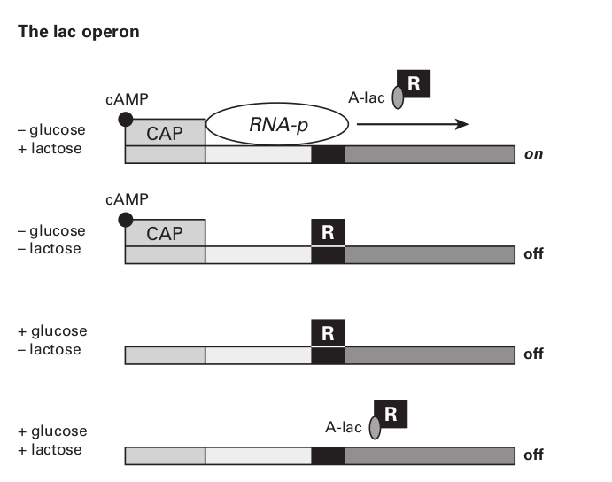
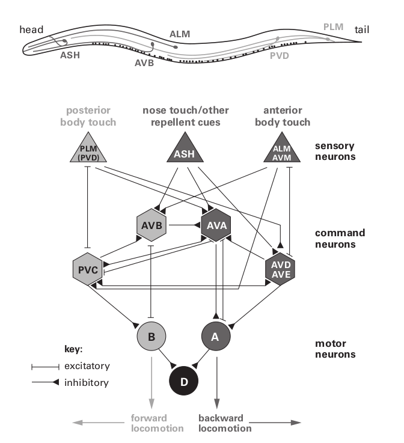
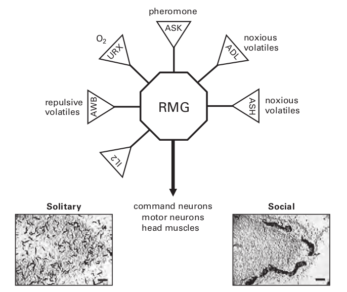
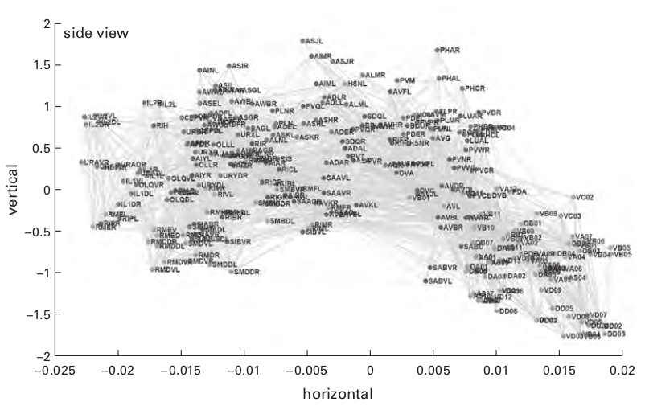

## Chapter 2. Why an Animal Needs a Brain
>Essentially only one thing in life interests us: our psychical constitution. The consid-
>erations which I have placed before you employ a scientific method in the study of
>these highest manifestations in the dog, man ’ s best friend.
>— Ivan Pavlov, Nobel lecture, 1904 (edited for brevity)

讲述大脑的书籍通常从大脑的基础构成开始：神经元、轴突、突触和离子通道。 但这种方法不适合我们的逆向工程目标。 不能从具体细节开始解释 B-29。 所以我们推迟了零件清单和详细的原理图，首先考虑一个更大的问题：为什么我们需要大脑？

当然，一个人的第一个想法是，我们需要它来实现它所赋予的神奇活动和感觉：艺术、音乐、爱情，...意识。但是，尽管这些特征引起了强烈的好奇心——正如巴甫洛夫所强调的——我们将看到它们只是对大脑基本目的的巴洛克式装饰，不应被误认为是目的本身。我们在这里确定的大脑目的，特别是因为我们正在寻求原则，不仅应该适用于人类，也应该适用于线虫、秀丽隐杆线虫和苍蝇。线虫的大脑有 302 个神经元，果蝇的大脑有$10^5$个神经元，我们自己的大脑有 $10^{11}$ 个神经元（Azevedo et al., 2009），它们的深层目的必须相同。通过确定基本目的，我们为以后考虑“装饰”设置了背景。 我们预计对哺乳动物大脑皮层的研究不会揭示许多新原理——而是会详细阐述核心原理。一般来说，在更简单的大脑中发现它们应该更容易。

大脑的目的减少到调节内部环境和帮助有机体生存和繁殖。 所有复杂的行为和心理体验——工作和娱乐、音乐和艺术、政治和祈祷——都只是完成这些功能的策略。 分享这些基本任务，蠕虫、苍蝇和脊椎动物的大脑表现出显着的相似之处——我们将对此进行讨论。 但首先，考虑到一种微小的细菌---大肠杆菌和一种更大的单细胞原生动物---草履虫在没有大脑的情况下很好地完成了这两项任务。 如何？

#### A bacterium foraging

大肠杆菌很小（1 × 3 μm），在营养汤中茁壮成长——漂浮在大型动物的肠道消化物中（图 2.1；Alberts 等人，2008 年）。 这种微生物配备了“味觉”受体，即一组蛋白质，每种蛋白质都特异性地结合一种引诱剂（如氨基酸或糖）或驱虫剂。 这些受体蛋白聚集在表面膜上并形成信号复合物，它们在其中相互配合以提高灵敏度和响应速度。 最大的簇位于前端，当细菌在汤中翻腾时，它已经准备好品尝味道。 尽管每个簇包含数千个分子——以增加捕捉味道的机会——但只有五种类型的受体分子，每一种都对一系列相关化合物作出反应。

这些受体的第一个功能是评估汤。 每种潜在的营养物质（氨基酸、糖等）都需要自己的特定转运蛋白（渗透酶）才能被细菌吸收，再加上一种特定的酶甚至一整套酶来处理它以获得能量和生长材料。 当在给定时刻只需要一个子集时，保持所有可能的转运蛋白和加工酶的高水平是不经济的。 因此，在味觉受体与目标分子结合之前，细胞不会合成用于摄取和消化的蛋白质。 受体的结合亲和力决定了蛋白质合成变得经济的浓度。

大肠杆菌的默认燃料使用葡萄糖。 但是当葡萄糖不在菜单上时，它可以使用乳糖。 这需要乳糖检测器检测两种蛋白质：一种允许乳糖进入的渗透酶和一种用于分裂乳糖的半乳糖苷酶。 编码这些蛋白质的基因在大肠杆菌的 DNA 中是相邻的，包括一个操纵子（协同工作的基因）。 它们的表达被阻遏蛋白阻断，该阻遏蛋白与这段 DNA 结合并阻断 RNA 聚合酶的进入，RNA 聚合酶是一种将 DNA 转录为 RNA（RNA 聚合酶）以启动蛋白质合成的分子机器（图 2.2）。 阻遏物是乳糖检测器，它在结合异乳糖（一种始终伴随乳糖的异构体）后会改变形状并从 DNA 中释放出来。 这允许 RNA 聚合酶离开并转录操纵子（图 2.2；Phillips 等人，2009）。

实际上，乳糖受体为有机体预测了开发这种新资源所需的条件。 通过将渗透酶和消化酶编码在一起，一种感觉信号可以以正确的比例唤起所有必要的成分。 因此，汤中给定水平的乳糖需要适量的渗透酶，而渗透酶与适量的半乳糖苷酶相匹配。 这种设计原则——耦合系统内的容量匹配——是多细胞动物组织的关键，它被称为“共态”（Weibel，2000）。 我们在这里看到共态始于单细胞。

#### The lac operon

有时，例如当宿主吃过冰淇淋时，大肠杆菌会同时摄入乳糖和葡萄糖。 现在细菌不需要代谢乳糖，因此不需要建造机器来处理它。 为了阻止这种徒劳的活动，有第二个分子开关。 RNA 聚合酶要沿着转录 lac 操纵子的 DNA 前进，必须被蛋白质 CAP 激活，并且 CAP 必须结合一个小信号分子 cAMP。 生化途径将 cAMP 的产生与葡萄糖的浓度结合起来。 随着葡萄糖升高，cAMP 下降； 这会关闭 RNA 聚合酶（图 2.2），大肠杆菌停止生产不需要的机器。

因此，分子控制系统结合来自两个输入的信息来计算加工乳糖的正确条件：如果有乳糖且没有葡萄糖，则 GO； 如果乳糖和葡萄糖都有，那么不去。 控制 lac 操纵子的化学网络使单个细胞能够检测特定的事件模式，并建立促进生存和繁殖的协同反应模式。 当然，这是大脑在更大范围内所做的事情，并且这样做是建立在执行驻留在单细胞分子控制系统中的逻辑的能力之上的（Bray，2009）。

大肠杆菌不仅仅是品尝汤和重新编程其消化酶。 味觉感受器还指导细胞觅食，即发现并迁移到营养浓度较高的区域。 为了执行这个过程，趋化性，细菌用鞭毛推动自己，鞭毛是螺旋形的螺旋，以 6,000 rpm 的速度旋转。 他们的殴打使它在短时间内向随机方向翻滚，然后是短暂的直线运行。 一个表面感受器，感应到一种营养素的瞬时浓度，将其与过去的浓度进行比较——“过去”持续 1 秒。 如果新的浓度更高，运动装置会保持前进的时间更长一些。

这种搜索策略（有偏随机游走，图 2.3）类似于派对游戏，其中隐藏了一个对象，搜索者被简单地告知“更温暖. . . 冷. . . 温暖，温暖. . . ”这样的信号，该机制可以汇总来自几种引诱剂的信号——保持运动方向更长的时间。 或者，它可以将对抗信号（吸引剂+驱虫剂）相加并更快地改变方向。 因此，有了一个传感器，再加上一个控制螺旋桨的“工作记忆”，微生物的游荡最终会将其带到更绿色的牧场（Berg，1993）。

#### A microbe ’ s memory

大肠杆菌的工作记忆很简单：它通过负反馈回路印在受体蛋白上。 激活的味觉受体导致酶将甲基连接到受体复合物上，从而降低其敏感性。 受体上甲基的数量表明它被激活的强度，并且由于反馈回路缓慢，记录可以追溯到细菌疯狂的过去——1秒。 该机制通过使用过去来设定受体的敏感性，决定了细菌在当下的反应——这是记忆的合理定义。 因此，单个细胞可以通过化学便宜地存储信息——通过共价修饰信号分子。

在完成基本任务（保持内部环境和繁殖）时，这个单细胞使用的机制要么是最优的，要么是非常经济的：味觉受体的数量和分布恰到好处，转运蛋白和消化酶的比例恰到好处， 蛋白质表达以匹配成本与资源，加上最小的趋化性信号网络，可以提供足够强大的性能。 此外，它的工作记忆足以驾驭马达转向食物和配偶。 尽管仅持续 1 秒的记忆可能看起来并不令人印象深刻，但要意识到存储乳糖浓度的长期历史是没有意义的——因为它们本身就是易逝的。 考虑到它的生活方式，这种细菌的记忆力应该和它应该有的一样长。

这种微生物很容易像禅师一样生活——就在当下。 给细胞喂食，一个小时后它就消失了，分给了它的后代。 但是一旦有机体变得足够大，可以容纳大脑，禅宗的戒律——“活在当下”——本身就变成了禅宗公案。 大脑为有机体提供了更重要的个人过去和更广阔的未来来利用它。 但如此装备，停留在这一刻变得像用一只手鼓掌的声音一样难以想象。

#### Limitations to life as a microbe

鉴于细菌可以很好地完成生存必须的基本任务，因此必须考虑其局限性。 首先，它们应对环境挑战的能力主要存在于遗传记忆中。 一个种群通过快速繁殖和交换遗传物质而繁荣——因此，当环境发生变化时，种群中至少有一个个体将包含一个基因来应对它。 因此，种群可以“学习”开发新资源——例如潜在美味的工业废料。 然而，在富含乳糖的培养基中突然失去葡萄糖的单个微生物只有在其基因组已经包含 lac 操纵子时才能做出反应。

其次，单个微生物不能主动移动很远。 它既不能回到最后一餐的地点，也不能故意转移到新的宿主身上。 这将每种微生物限制在其专门的受限环境中：白蚁的肠道或人类肘部内侧的皮肤（Grice 等人，2009 年）——细菌基因组在这里为可能遇到的情况做好了准备 ，而且惊喜相对较少。 但这留下了一个更广阔的世界未被探索，因此未被开发。

探索肯定会增加遇到更有利的媒介的机会——但有一个有限的挑战：规模。 对于这样一个微小的物体，水是非常粘稠的。 大肠杆菌的最高速度为每秒 30 微米，当它停止努力时，没有足够的惯性将其向前推进，因此它会在 0.01 纳米范围内突然停止（第 5 章；Purcell，1977；Nelson，2008）。 对于人类来说，这就像在浓稠的糖蜜中游泳——速度慢得令人痛苦，而且精疲力尽。 因此，为了长距离移动，细菌已经进化出其他方法，例如，通过粘在动物身上来搭便车。

简而言之，一种细菌栖息在一个微小的宇宙中——只有几厘米空间——那里的关键因素超出了它的控制范围。 当交通依赖于随机的、耗能巨大的自行推进或陌生人的善意时，生活就岌岌可危。 一个可以更快、更便宜地推进自身的细胞进行更广泛地觅食的细菌，但为了克服布朗抖振和高粘度的影响，它必须变大。 在运动协调成为问题之前，它不需要变得非常大——正如我们现在解释的那样。

#### Protozoa: bigger and faster but still brainless

草履虫是我们熟悉的单细胞原生动物，最大尺寸为 350 μm × 50 μm。 它比大肠杆菌大 300,000 倍，受粘性力的影响较小。 草履虫用覆盖其表面的纤毛推动自身，并协调它们的跳动，从头到尾发送同步波。 巡航速度大约可以达到每秒 1,400 微米，比大肠杆菌快 50 倍，并且相对能量成本更低。 用人类的话说，这就是以 4 英里/小时的速度步行探索和以 200 英里/小时的速度驾驶汽车之间的区别。 因此，草履虫可以探索相对大量的池塘水并通过将细菌扫入其“嘴”来收获细菌。 ” 这种微型鲨鱼在多种味觉感受器的引导下接近细菌繁殖的场所，例如腐烂的植物丛。 它还具有伤害感受器来检测有毒部位，例如被硫化氢污染的过熟污泥。

在杂乱无章的环境中，草履虫不可避免地会遇到不可移动的障碍，为了避免不断撞击的徒劳，草履虫进化出了一种有用的反应（图 2.4；Jennings，1904；Eckert，1972）。 在第一次撞击时，它的纤毛会倒转并后退几毫米。 然后它做了一个快速的旋转，切换到前进，并朝着一个新的方向出发。 这种回避反应很快——在几分之一秒内完成——而且必须如此。 徒劳的活动浪费时间和精力； 而且，这个不动的物体可能是捕食者！

大肠杆菌的化学信号系统无法触发和协调这种快速反应。 对于大肠杆菌来说，扩散就足够了，因为距离很短——一个小的细胞内信使分子在大约 4 毫秒内扩散到整个细菌中。 但是扩散时间随着距离的平方而增加（Nelson，2008），因此对于比大肠杆菌长 100 倍的草履虫，从“头”到“尾”的扩散将慢 10,000 倍，大约 40 秒。 显然，对于头部的受体来说，传递“反向！ ”到尾纤毛太慢了。 电信号则传播得更快：在头部开始的膜电压变化以毫秒为单位到达尾部。

这种回避响应的电信号需要几个新组件。 首先，需要一个机械感受器来检测肿块。 这涉及插入细胞膜的特殊阳离子通道。 膜上的拉伸会使通道变形，使其向钠离子开放，从而使膜快速去极化（< 100 μs）。 去极化打开了电压敏感的钙通道，允许钙离子涌入——进一步使膜去极化，打开更多的钙通道，等等。 这种积极的反馈会产生一种强烈的反应，在整个膜上募集钙通道（图 2.4）。 它们短暂打开，然后关闭并停用。 因此，拉伸门控钠通道和电压门控钙通道这两种成分协同作用，在细胞的整个表面上传递同步的钙脉冲。

通过钙通道而不是电压门控钠通道（例如神经和肌肉使用的）传播电信号的原因是钙离子也可以在细胞内充当化学信使。 在这种情况下，化学信息同步到达所有纤毛的基部，说“反向节拍”，它们的同时性增加了逆转的力量。 当草履虫倒退时，膜中的钙泵会大力降低钙水平，使纤毛斑块滑回“向前”——解释了优柔寡断的旋转。 一旦大部分钙被挤出并且所有纤毛再次向前跳动，草履虫就会朝着新的方向前进（图 2.4）。

最后，将草履虫引向新方向的旋转发生了，因为一些纤毛在其他纤毛之前进入前进档，可能是由于钙泵中的分子噪音（第 6 章）。 无论确切的机制是什么，旋转都会产生一个随机的方向——这很好。 由于缺乏距离感受器，草履虫无法预测哪个搜索方向最有可能是最好的，因此随机行为是最佳的（Reynolds & Rhodes，2009）。 此外，随机运动会阻止捕食者预测草履虫的下一步行动，从而使其更难捕捉。

#### Where brains emerge

尽管草履虫的运动控制系统具有快速控制系统的优势，但草履虫的行为能力是有限的。 更丰富行为的一个障碍是只有一个细胞膜，因此只有一条用于快速（电）通信的线路。 但更深入一点，细胞仍然很小以至于运动必须很慢，环境仍然如此短暂以至于更丰富的行为和更长的记忆没有任何优势。 草履虫的可利用的世界仍然受到充分限制，以至于一个沟通渠道就足够了。 多细胞性可以付出代价——但只有当动物在食物和危险线索持续存在的环境中变得稍大并且寿命稍长时。

交叉——多细胞动物出现并占主导地位（吃单细胞）——发生在大约 1 毫米的大小和几天的生命周期中。 然后细胞专门化并联合形成组织，组织形成系统，系统合作形成更通用的有机体。 因此，多细胞性遵循复杂的工程原理（Glegg，1969/2009a）。 由单个单元执行的许多任务现在被划分为许多专门的组件。 自然，每个层次（细胞、组织、器官、系统和有机体）和跨层次都需要协调。

协调需要某种具有总览的机制，使其能够权衡备选方案、确定优先级，然后发挥最终执行权。 幸运的是，需要这种集成的多细胞设计也提供了一类特殊的细胞来完成它。 这些细胞——神经元——现在可以做草履虫无法做到的事情：提供多条快速通信线路。 简而言之，对于多细胞生物而言，大脑变得必要、可能且有利可图。

#### Worm with tiny brain

线虫 C. elegans 的大小约为 1 × 0.1 毫米（图 2.1），其主要的雌雄同体形式正好包含 959 个体细胞（Herman，2006 年）。 它生活在靠近土壤表面的地方，以腐烂的植物物质中的细菌为食。 与草履虫在土壤和腐殖质中的池塘水化学物质不同，它们不会被对流冲走——它们通过扩散和毛细作用在基质中移动，因此痕迹持续存在（Fé lix & Braendle，2010）。 **The matrix**和表面薄膜为运动提供了更坚固的基质，这些使蠕虫蜿蜒的爬行开辟了全新的大陆供开发利用。

蠕虫扩大的领地及其通过具有持久化学痕迹的迷宫**matrix**的运动值得升级。 蠕虫改善了趋化系统并增加了多种传感器（当前状态、机会和危险），以及更大的行为反应库和更长的记忆（de Bono & Maricq, 2005）。 因为富含细菌的斑块是许多物种竞争的绿洲，所以蠕虫的成功需要它巧妙地穿过斑块，以有效地发现和利用高产区域、相遇、交配和产卵。

改进的觅食必须与更有效的消化、吸收、代谢储存和消除系统相匹配。 随着行为曲目的扩展，更需要评估和确定优先级。 例如，遇到一个好的狩猎场，它应该承受多少热量或酸度？ 遇到两种化学痕迹时，应该遵循哪一种？ 什么时候搜索，什么时候放牧？ 什么时候交配，什么时候满足“满足”？ 简而言之，传道书为人类提出的许多选择甚至出现在这种看似简单的蠕虫上——它用它微小的大脑来决定。

线虫的大脑可能很小，但它的 302 个神经元加上 56 个神经胶质细胞和支持细胞构成了它整个身体的近 40%，在人类中这个数字接近 1%。 因此，我们首先考虑一些证明其巨额投资合理的行为优势，然后我们考虑大脑的设计，注意到与更大的大脑共享的特征表明它们受神经设计原则的支配。

#### Locomotion

食草动物必须继续前进。 蠕虫通过在头部后面弯曲然后向尾部传播弯曲来向前移动。 在这种正弦波的驱动下，它穿过土壤和腐烂的植物物质，游过液体池，爬过潮湿的表面（例如，腐烂的水果、实验室中的琼脂板）。 当刚性物体有规律地以 0.5 毫米间隔（图 2.5）时，蠕虫的行进速度最快，如果这个间隔仅改变 10%，它们的前进速度就会减半。 蠕虫的设计似乎可以最好地应对其首选栖息地的平均颗粒大小，就像专为崎岖道路设计的皮卡车（Park 等人，2008 年）。

但秀丽隐杆线虫既是卡车又是司机，不断调整其推进力以应对不断变化的条件。 当蠕虫从在水池中游泳到在潮湿的表面爬行时，表面张力会增加 10,000 倍的粘性力，并且蠕虫会相应地调整其起伏（图 2.5）。 频率下降十倍，波长缩短三倍，更多的肌肉力量转移到粘性介质。 蜗杆在各种条件下不断调整其传动系统，将波浪的攻角保持在接近 45度的有效值（图 2.5）。 要了解如何，我们必须检查综合运动系统：大脑、肌肉、身体和基质。

一系列肌肉收缩产生移动波（Sengupta & Samuel，2009）。 身体上侧的肌肉细胞收缩以向下侧弯曲，当上侧的细胞放松时，身体会在 0.5 个大气压的内部静水压力的驱动下弹回。 波通过沿着身体发送两个相反的弯曲来传播，一个接一个（图 2.6），并且这个序列以波动的频率重复。 当头部引导尾部时，波浪向下移动蠕虫，将其向前推，而当尾部引导时，蠕虫向后移动。 头部也左右摆动，当虫子决定突然改变方向时，它会弯曲整个身体然后弹回来——这是一种很好的躲避和逃跑的策略。

这四种不同的模式（前进、后退、摇摆和转弯）由控制 95 个肌肉细胞的 75 个运动神经元产生。 每个肌肉细胞接收来自一个兴奋性神经元和一个抑制性神经元的输入，这些神经元严格交替激活（Bullock, Orkand, & Grinnell, 1977）。 为了弯曲头部，身体一侧的兴奋性运动神经元激活肌肉，抑制性运动神经元抑制另一侧的相应肌肉。 为了将弯曲作为波传播，运动神经元沿着身体顺序激活。 它们的输出频率决定了波动的频率，它们的相位决定了它的波形。 一侧的兴奋性运动神经元与另一侧的抑制性运动神经元激活，并与另一侧的兴奋性运动神经元交替激活（图 2.6）。 应该在哪里寻找产生这些运动神经元活动周期的振荡器？

#### Search for the oscillators

早期对动物运动的研究充满了关于周期性活动起源的激烈争论——比如步进。 局部电路（中央模式发生器）可能会在神经系统内产生振荡。 或者它们可能通过循环感觉反馈在神经系统之外产生（Marder & Bucher, 2001; Goulding, 2009）。 反馈机制是早期提出的脊椎动物的步进。 一组运动神经元刺激伸展肢体的肌肉。 这会激活抑制伸肌运动神经元并激发屈肌运动神经元的传感器，从而使肢体缩回。 屈曲激活抑制屈肌运动神经元并激发伸肌神经元的传感器，等等。

许多动物结合了这两种机制。 中央模式发生器向运动神经元发送周期性命令，感觉反馈调整它们的相位、频率和幅度以匹配外部负载的变化（Burrows，1996）。 但蠕虫的电路似乎没有使用中央模式发生器。 没有发现本质上的振荡神经元，大脑的接线图（见下文）也没有显示典型的振荡电路——围绕闭环发送信号的一小群神经元。 蠕虫能够制造中央模式发生器——它们的一些细胞使用内部生化振荡器来控制摄食、排便和交配的节奏运动。 蠕虫可以制造中央模式生成器，但不能用于运动，这表明它可能找到了更好的方法。 蠕虫不是依靠大脑中的模式生成器，而是利用它的身体。

#### Cycling with the body

蠕虫通过将反馈与身体力学相结合来构建其振荡器。 运动神经元的爆发性活动驱动一侧的肌肉。 它们的收缩使身体弯曲并拉紧身体的内在弹簧——内部静水压力。 由这些力激发的传感器反馈抑制运动神经元，因此肌肉放松，身体弹回。 这终止了负反馈，使运动神经元重新激活并开始新的循环（图 2.6）。 因为弹簧受到粘性力的阻尼（图 2.5），所以振动表现良好。 此外，它会根据粘性负载的变化自动调整，平滑地改变蜗杆的步态以匹配操作条件。

因此，通过使用其生物力学，蠕虫可以省去中央模式发生器，从而释放大脑空间。 因此，这里有一个对运动系统有用的设计原则：通过使用身体来减轻大脑的负荷。 工程师将此称为**具身计算(embodied computation)**（也称为具身智能或认知；Pfeifer & Bongard，2006）。

早期的机器人，爬行和踏步运动是由一个全能的中央计算机产生的——一个无所不知的中央模式发生器。这种人工智能收集感官信息并将其输入到一个复杂的程序中，该程序通过对机器人的力学进行建模，制定出必要的命令并将它们发送到奴隶般的肢体。为了实现这种自上而下的设计，机器人需要拖着沉重的计算机四处走动，这反过来又意味着更粗的四肢和更强大的执行器——结果就是一个耗电的庞然大物。最终人们意识到机器人及其四肢是一台计算机，一台实时运行其机械装置的模拟计算机（Brooks，1990）。这种模拟计算机是免费提供的，可以设置用来处理信息以进行控制，例如，作为振荡器的一部分。这种洞察力启发了新一代小型、高效、灵巧的步进机器人，它们让庞然大物暗淡无光。因此，蠕虫**具身计算**的一个典型的例子便是通过匹配和集成一些基本组件以有效满足规范的神经机械系统。

#### Neural circuits coordinate patterns of movement

尽管身体力学对振荡器做出了贡献，但神经回路仍然是必不可少的——它们关闭了蠕虫内部的回路。 必须正确配置和调整神经回路以与生物力学配合工作。 传感器必须向运动神经元提供正确的反馈，而运动神经元必须在正确的时间向正确的肌肉发送正确的信号。 电路的构造是通过确保当身体一侧的肌肉收缩时，另一侧的对抗性肌肉放松来实现这一点：一侧的运动神经元抑制对抗性肌肉的兴奋性运动神经元，同时也激发它们的抑制性运动神经元。 图 2.6）。 那么，这里是一个电路基序，即**互惠抑制(reciprocal inhibition)** (Sherrington, 1906)，它被广泛用于大脑，因为它简单有效地解决了一个常见问题。

#### Changing direction

蠕虫大脑使用两组独立的运动神经元产生“向前”和“向后”的运动节律。 每组都有自己的电路：一个与生物力学一起工作以将波动波从头到尾发送，另一组与生物力学一起将波从尾到头发送，这不是一个通用的设计。 大多数动物使用一组运动神经元作为所有肌肉命令的最终执行途径。 使用两个独立的集合，每个集合都有完整的肌肉连接和突触，这看起来很浪费，那么蠕虫为什么要这样做呢？ 我们推测，对于具有神经机械振荡的小型大脑而言，两组运动神经元比复杂的中央模式发生器更加便宜。

#### Directing action

与大肠杆菌和草履虫一样，蠕虫的行为是为了提高其在生态阶段完成生产繁殖的机会，装备的更远更快，它的成本也更高，风险也变得更大，但机会和回报也是如此。 因此，必须适当地指导这些行为（de Bono 和 Maricq，2005；Lockery，2011）。

最简单的行为是厌恶反应，其目的和效果类似于草履虫的回避反应。 轻敲虫子的头，它立刻向后蠕动； 轻拍它的尾巴，它就会向前蠕动。 两个简单的电路会产生这种行为（图 2.7）。 前部的机械感觉神经元驱动激活“向后”运动神经元组的中间神经元，而后部的机械感觉神经元驱动激活“向前”组的中间神经元。 两组有交叉连接，以防止它们对立。

正如大肠杆菌行为的目的在于单个细胞的化学回路中一样，蠕虫行为的目的在于神经元之间的连接。 自然地，具有许多神经元的大脑可以产生更丰富的行为，因为通过在细胞之间形成连接，它产生了更多的回路。 线虫的大脑是如何利用这种潜力并使其行为超越大肠杆菌和草履虫的简单反应的呢？

#### Brain and behavior

像单细胞生物一样，蠕虫从有毒化学物质中撤退，但它的决定更加精细。单个传感器，即大脑接线图中标记为 ASH 的神经元，通过驱动“撤退”命令中间神经元 AVA 来控制这种行为，AVA 关闭“前进”运动神经元并激活“后退”运动神经元（图 2.8） ）。传感器 ASH 表达各种潜在威胁的分子受体和检测器，例如重金属、清洁剂、酸或高温。每个输入都有助于 ASH 活动，当它们的总和足以触发命令神经元时，蠕虫会后退。因此，单个神经元 ASH 充当律师、陪审团、法官和执行者。它通过选择在其表面表达的受体来定义什么构成证据，收集证据，权衡它，判断它是否需要逃逸，并强制做出决定。蠕虫有几个这样的感觉神经元，用来收集其他行为的其他方面的证据。

#### Finding warmth, food, and mates

蠕虫寻找适宜的地方来觅食、生长和交配。 秀丽隐杆线虫在相当狭窄的条件范围内茁壮成长和繁殖：昏暗的光线、温度 13° – 25°C、氧气浓度 7% – 14%、适中的 pH 值、充足的细菌等等。 为了找到这些条件，蠕虫需要一个信号来警告它即将离开范围——“细菌耗尽”、“温度下降”等等。 这个搜索信号激活前向爬行。 通过味觉和嗅觉寻找细菌，气味会激活梯度上升。 在达到有利条件后，蠕虫需要一个停止信号来宣布“满意”——找到了所寻找的东西。 该信号激活一系列转弯，使蠕虫进入放牧模式。 但蠕虫仍然保持警惕，如果任何时候有害条件的传感器被激活，它们会抑制向前运动和转向，并激活反向。

蠕虫保留了大肠杆菌在梯度上上下移动的基本策略，即有偏随机游走。 随着条件的改善，蠕虫转得更少，跑得更多； 随着情况的恶化，它转得更多，跑得更少。 机制也相似：驱动向前运行的分子受体会适应，并且其输出信号的衰减允许转向。 更强的信号衰减得更慢，从而延长了运行时间。

然而，多细胞性带来了进步：使用配对传感器提升对于环境条件的感知程度。 对于盐分而言，头部右侧的传感器因盐分的增加而被激发，而左侧的传感器因盐分的减少而被激发。 右侧传感器激发“前进”电路并禁止转向。 一旦蠕虫找到峰值浓度，这个细胞就会安静下来。 如果蠕虫离开峰顶，由于盐分减少而激发的左侧细胞减少向前运动并激活转向。 这种搜索模式，短暂的向前运动，然后是转向，一直持续到注意力再次开始上升。

蠕虫通过摇头将两个传感器暴露在新的领域，并将这一动作与向前推力结合起来。通过传感器调制的电机输出是一个例子，该系统还提供了一个案例，其中两个通信通道通过感应相同的梯度收集相同的信息，但提取不同的模式并使用它们来驱动相反的电机响应。 这是大脑提供的其他东西——改善觅食的新形式的模式识别。

需要改进感知和控制，因为秀丽隐杆线虫之于大肠杆菌就像超级油轮之于划艇一样，用逐渐修正的方式将整个有机体引导到随机方向上，这在小范围内是有效的，但在更大的范围内，它就变得浪费了，让蠕虫更有辨别力，用它的头搜索并在可以绘制路线后通知身体，在更大的动物中，传感器本身是可动的——昆虫天线、猫外耳、人眼（第 4 章）。

因为大多数蠕虫使用相同的觅食回路，它们会在相同的地点聚集——就像大学生都在一家好咖啡馆里一样。 潜台词也差不多：喂食的地方，也是寻找伴侣的地方。 此外，与大多数的大学生不同，这些蠕虫通常是雌雄同体的，因此它们获得满足感的机会增加了一倍。 即便如此，许多蠕虫通过释放一种信息素来增强它们的吸引力，向信息素的运动由单个神经元 RMG 控制，RMG 是一个网络中心，它收集和整合来自一组传感器和信息素的输入，并驱动适当的命令中间神经元（图 2.8）。线虫的社交程度是由大脑内释放的特定肽来调节的，以响应不断变化的环境，该肽是一类神经调节剂的成员之一，它与特定神经元上的受体蛋白结合以改变它们的活动——从而改变行为（Bargmann，2012）。

#### Stick and carrot(大棒和胡萝卜)

当外部条件开始恶化时，蠕虫需要一些明确的信号才能继续前进。 一种这样的信号是神经调节剂---Octopamine(章鱼胺)，当食物储备下降时，某些神经元会释放章鱼胺，章鱼胺会与特定目标神经元上的受体结合，从而改变它们的兴奋性，并改变它们的突触，这会禁止转动并激活正向运动模式，因此，响应条件变化而释放的单个代理作用于特定的神经元以改变电路并将蠕虫的程序从**放牧**模式切换到**漫游**模式。

当找到食物时，漫游停止并恢复放牧。 这涉及第二种神经调节剂---多巴胺。 在哺乳动物的大脑中，多巴胺表示（除其他外）奖励已超过其预期值。 在蠕虫中，当例如机械传感器接触到细菌大小的颗粒时，食物的存在会释放多巴胺。 多巴胺与目标神经元上的受体结合，关闭章鱼胺受体并将电路恢复到以前的配置。 这将蠕虫从**漫游模式**切换到收集食物奖励的**放牧模式**。 因此，章鱼胺和多巴胺这两种神经调节剂为这个微小的大脑提供了一个原始大棒和一个原始胡萝卜来调节，就像它们在更大的大脑中所做的那样。

迫在眉睫的饥饿并不是唯一的压力，其他包括低氧、高二氧化碳浓度、酸度和过度拥挤，所有这些都暗示了一个疲惫的补丁——是时候继续前进了，与人类一样，压力会增加紧迫感。 一条舒适的蠕虫从有希望的化学梯度上悠闲地移动，但在低氧环境下存活几个小时的蠕虫就会行色匆匆。 为了从漫步变为匆忙，神经调节器重新配置了梯度上升的电路（Bargmann，2012）。例如，传感器 ADF 和 ASG 通过释放另一种神经调节剂血清素来响应低氧。

正如“胡萝卜加大棒”过于简化了人类的动机，对于蠕虫也是如此，争夺有限的资源需要权衡许多因素来决定是漫游还是放牧。一套丰富的神经调节器可以让线虫的 302 个神经元的大脑评估环境因素，例如营养状况、食物供应、拥挤和社会信号，然后进行相应的重新配置。

#### Associative learning and memory

当生活条件良好时，蠕虫在 3.5 天内完成其生命周期，并存活数周。 随着生命周期超出下一个有丝分裂周期，允许过去和未来，现在回忆什么是好的和什么是坏的是值得的。这种蠕虫不像大肠杆菌那样活在当下，而是利用它的大脑来关联随着时间的推移所发生的事件，从而利用它的经验（Ardiel & Rankin, 2010）。

蠕虫会记住它被喂饱的温度，然后通过向上或向下移动热梯度来寻找这个温度，当找到首选温度时，它挂在那里，沿着等温线搜索，但是多巴胺会迅速衰减，所以如果橱柜是空的，偏好就会变成厌恶，蠕虫就会爬走。 在找到食物并因此获得另一剂多巴胺后，蠕虫会重置其温度偏好。

这种学习的机制存在于驱动定向爬行的热传感器中，该神经元感知 0.003摄氏温度的变化，它的反应在首选温度下最小，并且在两侧升高，这个最小值的温度是通过调整神经元的内部信号来重置的； 这需要蛋白质合成，并且需要几个小时，这种学习过程——单个神经元内的化学重编程——会改变蛋白质分子，但不会改变突触连接。

化学偏好也可能与特定信号相关联。 例如，NaCl（盐）通常会吸引蠕虫，但当蠕虫在盐存在下饥饿仅 10 分钟时，它稍后会避免盐。 盐传感器下游的特定神经元释放另一种神经调节剂（胰岛素），该神经调节剂反馈至盐传感器上的胰岛素受体，以激活内部信号通路（涉及 PIP3 激酶）以抑制吸引力。 同样，重新编程神经元内的信号通路可以让经验改变吸引和排斥之间的平衡。 这种机制也为气味剂服务。 秀丽隐杆线虫甚至学会了避免来自使其生病的特定致病细菌菌株的气味。

这些记忆痕迹通过延长动物识别和使用模式的时间来促进生存，建立关联所需的试验次数不多，在 20 分钟内重复 5 到 10 次。 这在条件足够多变的环境中是有意义的，关联必须迅速建立并迅速衰减。 简而言之，蠕虫的行为表明它依赖于来自三个不同来源的信息：外部、内部和过去。 它的大脑整合这些流来选择反映更广泛背景的行为，从而提高蠕虫的活力和繁殖成功率。

#### Some design aspects of this tiny brain

秀丽隐杆线虫的大脑可能很小，但并不简单。 为了实现它的全部行为，蠕虫利用了大量的分子部件目录。 这包括用于细胞内化学和电信号的多种蛋白质，以及用于在突触处处理信息的众多部分。 例如，信号蛋白占线虫基因组的 20%，与哺乳动物相比，其300 多个突触部分占其总细胞数量的三分之一（Emes 等，2008），事实上，蠕虫的大脑使用了较大大脑中存在的许多相同成分。 由于零件是共享的，因此人们可能期望某些设计规则也可以共享。 如果不共享某些规则，那也将具有指导意义，因为它可能表明扩大规模的成本和收益。

下面是从蠕虫的大脑中收集到的一些设计特征，以及它们可能对更大的大脑意味着什么。

#### Computes as much as possible within a single cell

蠕虫的受体及其传感器就是这一特征的例证。 我们区分这些术语：“受体”是指对特定事件（如拉伸、温度、质子或化学结合）作出反应的单个蛋白质分子； “传感器”是指表达一种或多种受体的单个神经元。 尽管神经科学家非常了解这种差异，但由于历史原因，他们经常将“受体”用于分子和神经元。 我们使用不同的术语来减少不熟悉行话的读者的混淆，也为它们提出了两个设计问题。

首先，单个受体分子会受到随机波动的影响，例如热噪声。 因此，神经元可能需要通过对同一类型的群体进行平均来提高由一个受体传递的信号的信噪比。 这就提出了以下设计问题：每个传感器应该表达多少相同类型的受体？ 答案将在第 6 章中给出。

其次，受体比表达它们的传感器神经元更加多样化。 因此，应该如何在传感器之间分配不同的受体类型？ 对于这个问题，C. elegans 有一个规则。 如果一组受体都导致相同的最终动作，它们共享一个共同的传感器。 例如，传感器 ASH 从各种类型的受体收集需要厌恶反应的有害刺激的信号； ASH 将其输出耦合到执行命令的单个神经元：紧急！

该规则一般解释了受体分组，蠕虫使用超过 1,700 种不同类型的受体分子进行化学感受（味觉和嗅觉），这大大超过了哺乳动物中使用的 800 个左右，但与哺乳动物不同，哺乳动物通常为每种受体类型分配自己的传感器，这种蠕虫只提供大约 30 个单独的传感器神经元。 就像有害刺激的传感器一样，每个化学传感器都将其信号发送到特定的命令神经元。 因此，来自 1700 个不同输入通道（味觉和嗅觉的受体）的信号被组装起来用于行动，而不是通过大脑中更高的电路，而是通过几十个感觉神经元。

细胞内的计算节省了神经元的数量。 蠕虫通过少量神经元满足所有基本行为要求（感觉模式识别、感觉运动整合和运动控制）。 38 个传感器连接到 82 个中间神经元（其过程被限制在大脑内），这些中间神经元与 119 个运动神经元（与线虫的 100 个肌肉细胞直接联系的细胞）相联系。 这为内部调节和交配保留了大约 70 个神经元。

然而，在单个细胞中执行多个操作也有不利之处。 细胞处理信息的能力受到内部噪声、动态范围和能量供应等因素的限制。 因此，处理来自多种类型受体的输入的传感器会损害其处理来自任何一种受体类型的信息的能力。 专用传感器可以将更多的受体投入到其特定的模式中，从而提高灵敏度和信噪比。 这是第 1 章中的工程师原则：防止一个组件以次优方式完成两项任务，使其复杂化。

于是，更好的传感器需要更好的感觉器官：眼睛是视觉的，耳朵是听觉的，等等。 为了从这些更准确和有辨别力的感觉器官中受益，专门的感觉系统在更大的大脑中进化，每个系统都致力于处理一种单一的模态。 结论很明显：随着大脑规模扩大以改善行为，神经元会专门化。 第 3 章将说明如何以及为什么，但现在我们考虑一个相关的问题，蠕虫的微小神经元如何有效地进行计算？

#### Uses chemistry wherever possible(尽可能使用化学)

许多蠕虫神经元使用内部分子回路来执行在较大的大脑中使用多个神经元回路的功能。 例如，单个感觉神经元 AFD 通过在其细胞内信号网络中添加新蛋白质来确定蠕虫的温度偏好。 另一个神经元 AWC ON 改变行为反应以适应情况。 当没有食物的情况下存在气味时，AWC ON 的分子受体会适应并且趋化性下降。 然而，当食物中存在相同的气味时，其受体会敏感，趋化性会增加（de Bono & Maricq, 2005）。 这些竞争性反应由细胞内机制控制，该机制切换传感器和行为输出之间的连接以逆转对趋化转向行为的控制（Pereira & van der Kooy，2012）。

这些例子表明，神经元内电路的化学计算可以管理行为。 此外，这可能非常有效，因为化学信号比电信号便宜几个数量级（第 5 章和第 6 章）。 长距离的化学扩散很慢，但蠕虫又小又慢。 因此，蠕虫的大小和速度非常适合它对廉价化学信号的依赖。 此外，化学信号可以广播到特定目标，这为我们带来了另一个设计特征。

#### Uses neuromodulators to switch behaviors

提到了三种神经调节剂（章鱼胺、血清素和多巴胺），它们会根据压力或奖励的前景改变线虫的行为。 但这只是零件目录的第一页，因为这种蠕虫表达了 250 种具有已知神经调节功能的肽。 它们的多样性和普遍性是可以理解的，因为神经调节是如此巧妙（Harris-Warrick & Marder，1991）。 神经调节剂可以广泛传播，但仍然局部和特异性地起作用，仅影响表达适当受体的神经元。 受体通常与调节细胞内信号传导的蛋白质偶联，因此实际上神经调节剂使用跨细胞化学来调节细胞内化学。

神经调节剂的作用范围进一步增强，因为它的受体多样化为多种亚型，这些亚型与不同的细胞内信号网络耦合。 因此，一个小分子可以在不改变解剖连接的情况下重新调整和重新配置整个神经回路。 这允许每个电路总是在做某事，然后根据需要被招募做其他事情。 因此，神经调节剂允许大脑充分利用组件。

#### Conserves synapses

蠕虫的大脑只产生大约 6,400 个化学突触。 这大致是哺乳动物接触单个视网膜神经节细胞或单个皮质锥体细胞的数量。 如此少的突触，蠕虫如何运作？ 神经元要小得多，因此可以由更少的突触驱动。 但既然单个突触是不可靠的，那么这么少的突触怎么能可靠地发出信号呢？

一个答案是：慢慢地——神经元可以通过平均时间来提高可靠性。 这是可以容忍的，因为与许多动物相比，蠕虫生活在慢车道上。 例如，它的嗅觉传感器使用一种化学放大器，一种 G 蛋白信号级联，集成时间超过 20 秒（第 5 章，图 5.6）。 这个传感器驱动一个在几分钟内整合的突触。 相比之下，苍蝇的嗅觉系统在不到 1 秒的时间内起作用。 运动波以 1 Hz 的频率下降到蠕虫的身体，但昆虫的腿移动速度超过 10 Hz。 因此，蠕虫可以通过很少的突触而繁荣，因为它很慢。 这暗示了另一个特点：尽可能慢地发送信息，因为这使用更少的突触、更小的细胞和更少的能量。 后面的章节会解释更多。

#### Uses stereotyped components

高效的设计赋予每个组件明确的任务。 一旦所有组件都针对其任务进行了优化并以最佳方式组合在一起，那么在个人之间重复它们是有效的。 同样，C. elegans 中的每个神经元都有一个通过自然选择优化的明确角色，以满足特定的性能水平。 相应地，每个神经元都被“识别”，这意味着它在每只动物中都表现出刻板的形态、化学和位置（White et al., 1986）。 这些电路也被识别出来，这意味着突触连接在动物之间基本上是相同的。 这是通过从数千张连续切片的电子显微照片中重建整个神经系统来建立的——以产生蠕虫的连接组（图 2.9）。 已识别的神经元和回路始终存在于小脑中：蠕虫和水蚤、水蛭和龙虾，等等。

#### Minimizes wiring costs

秀丽隐杆线虫神经布线的布局表明，所有 302 个神经元都位于尽可能靠近需要它们的位置（Varshney 等，2011）。 化学和热传感器集中在头部； 引导运动的触觉传感器沿身体轴线分布； 推动线虫向前运动的运动神经元分布在身体的后半部分，而用于反向运动的运动神经元则分布在身体的前半部分（图 2.6）。 但是布局是否接近芯片设计人员所寻求的最佳位置——即最小化大脑中连接总长度的独特布局？

硅芯片的设计者已经开发出优化元件布局的算法。 他们的规则：将最密集互连的组件放在一起，将更稀疏连接的组件放置得更远（图 2.9）。 该算法应用于蠕虫的大脑表明 90% 的神经元处于最佳位置（Cherniak，1995；Chen 等人，2006；Pérez-Escudero & de Polavieja，2007）。 未处于最佳位置的 10% 的神经元表明存在竞争需求。 例如，可以将彼此最频繁交流的神经元放置得更近，以节省能量并减少它们之间的传导延迟。 尽管较大大脑中的布局肯定反映了这一点，但传导延迟可能与秀丽隐杆线虫不太相关，因为距离很短，而且蠕虫很慢。 “短而慢”暗示了另一个设计特征。

#### Favors analogue over pulsatile

因为线虫中的电信号传播不到一毫米，神经元可以被动地传导，因为电位的分级（模拟）变化。 在较大的大脑中支配长距离信号的短暂、尖锐、能量密集的动作电位是不需要的，因此蠕虫可以完全依赖直接且节能的模拟计算（Sarpeshkar，1998）。 甚至它的运动神经元也以模拟模式运行。 在这些短距离内，模拟信号以更低的成本在每个神经元传输更多信息（第 7 章）。 C. elegans 如此坚定地坚持这一特征，以至于它已经放弃了编码电压门控钠通道的基因，该通道被更大、更快的物种用来产生尖峰。

#### Conclusions

三种体积不断增大的生物，大肠杆菌、草履虫和秀丽隐杆线虫，展示了为什么动物需要大脑来处理更大规模的信息。 它是在竞争和多变的环境中增加生存和繁殖的机会。

小单细胞大肠杆菌通过表面受体存活，这些受体将信息传递到决定新陈代谢、生长、繁殖和运动的内部化学信号网络。 然而，大肠杆菌只是空间和时间上的一个小点，大多数机会都超出了它的范围。 一个更大的细胞，草履虫，移动得更快，移动得更远，扩大机会，但最终受到其化学信号网络的限制——细胞内马达的扩散和内部通信都太慢了。 添加到细胞膜的电压门控离子通道允许快速的电信号传递，但被困在一个粘性世界中，单个细胞只能做这么多。

多细胞蠕虫 C. elegans 通过扩大来克服粘滞性，并通过特化细胞移动得更快更远。 这导致它面临更多的机会和危险——需要收集和处理的信息来源更丰富，最终需要大脑。 关键的创新是神经元，一种专门用于收集、处理和交流的细胞类型。 每个神经元将其丰富的内部化学通讯网络连接到表面膜上的电网络，然后通过突触连接到其他神经元。 神经调节剂重新调整选定的神经元以重新配置整个电路。 因此，只有 302 个神经元的大脑通过提供适应不断变化的环境的行为库来扩展蠕虫的视野。

蠕虫完成与细菌或原生动物相同的任务——寻找生长条件和配偶，同时避开非生产性或有毒部位。 并且它具有类似的行为，例如通过有偏随机游走和回避动作。 但凭借其大脑，秀丽隐杆线虫可以覆盖更多的领土，并且凭借其更长的寿命（几周而不是几分钟），它可以作为个体而不是作为适应人群中的一小部分来适应令人讨厌的意外。

这里出现了另一个设计原则。 寿命和生活方式与特定类型记忆的出现和特定衰退时间有关。 不应该记住任何不太可能提高生存和繁殖的东西。 记忆也不应该超过有用相关性的典型时间常数——因为当相关性衰减时，记忆不再预测任何有用的东西。 但是在它过时之前快速建立记忆痕迹是有用的——这似乎发生了——很少的试验，间隔很近。 **这表明，人类最长和最深刻的记忆不仅仅是装饰，而是在一生中塑造性格，促进在我们复杂的社会结构中生存（第 14 章）**。

最后，鉴于只有 302 个神经元的秀丽隐杆线虫表现出色，人们可能会批判性地看待一个假设的事实——拥有更大的大脑更好。 那么为什么动物进化出更大的大脑呢？
