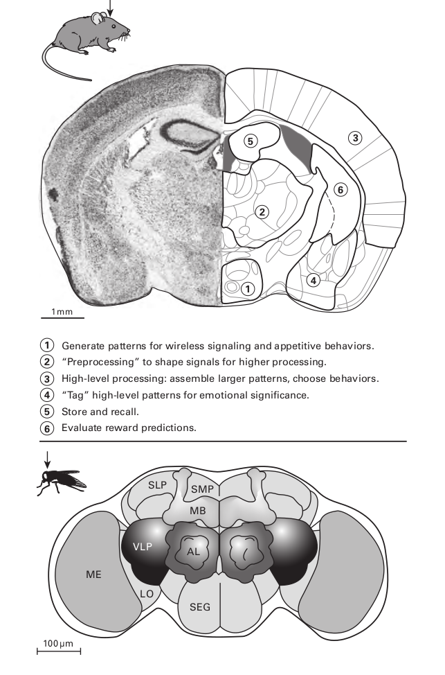
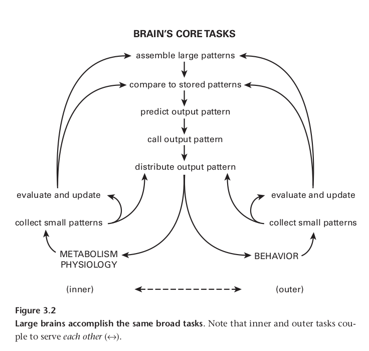

## Why a Bigger Brain?
本章将解释为什么蠕虫在拥有302个神经元后大脑仍然在扩张，老鼠的大脑皮层包含有$10^7$个神经元，这似乎很多，而猕猴的大脑皮层的神经元数量（一种关键的实验模型）是老鼠的100倍，人脑的神经元数量又是猕猴的10倍；尽管各自对比的数量差距如此之大，但对“哺乳动物的大脑”进行概括还是很舒服的——因为在老鼠身上识别出的每个部分也可以在猕猴和人类身上识别出来（图 3.1；Kaas，2005 年）。

考虑一下苍蝇的大脑，它的神经元比老鼠大脑少 500 倍，但比蠕虫大脑多 500 倍，而且结构丰富——因此在“大型大脑”类别中占有一席之地，昆虫和哺乳动物的大脑有许多相似之处，例如，两者都将它们的神经元聚集成簇，将它们的轴突聚集成电缆（束），两者都采用特殊结构来完成相同的广泛任务：存储高级输入模式，生成低级输出模式，以及使用精简的指令检索模式。当然，二者在身体构造和行为上是不同的，然而，尽管有50亿年的进化来不断发生分歧，但是，昆虫和哺乳动物的大脑的设计似乎遵循了相同的规则。

设计在如此巨大的时间和空间尺度上持续存在意味着它们既不是任意的也不是偶然的，相反，它们一定是作为对某种广泛约束的回应而出现的，这就是将共同反应提升到原则地位的原因，本章将确定关键约束，并指出它如何导致管理更大大脑组织的三个原则。

#### A brain ’ s core tasks

随着动物从土壤中出现到一个更广阔、更不粘稠的世界，觅食的可能性大大增加，蠕虫主要在$0.01m^2$ 的区域内进行二维探索，而蜜蜂通常覆盖近$10^{7}m^2$的区域，而苍蝇则要少一些，因此，觅食面积扩大了$10^9$倍，加上第三个维度，待探索的体积就变成了天文数字，较大的动物，如鸟类、鱼类和哺乳动物，它们会迁徙，因此它们的觅食面积会达到数百万平方公里。

如此巨大的生存领域蕴藏着海量的资源，当然也包含着无数的危险。动物为了在发现资源的同时能有效地规避风险，需要从环境中快速收集大量信息；如何量化这个大量信息的大量，举例而言，眼睛向大脑发送信息，大约10M比特每秒，大致相当于以太网连接的速率；所有的感官数据都以微小的模式汇聚到大脑，类似动态拼图的游戏的某一块拼图，它们需要组装以显示更宏大的图像；因此，如果要收集信息是有益的，大脑就必须在空间和时间尺度上投入资源来组装与行为相关的更大模式。

然而，即使是更大的模式也可能毫无用处，除非将其与已经存储的可以识别的模式进行比较，这些模式可被识别为可食用/有毒、朋友/敌人或未找到搜索项；任何一种结果都为行为选择提供了决策基础，一场比赛可以让我们做出自信的选择：吃或拒绝，接近或逃跑。 不匹配表示谨慎，需要收集更多数据。 因此，大脑需要“模式比较器”，这些比较器必须与选择行为的机制相结合：喂食、战斗、交配、调查。 这些反过来又与详细运动模式的机制相结合，以驱动肌肉移动四肢或翅膀。

任何给定的运动行为都可能与命令的动作完全匹配：箭头可能会击中它所瞄准的确切点。 但是由于环境或神经扰动通常会出现错误，需要识别这些错误，以便性能可以逐步提高。 因此，大脑需要机制来评估它发出的命令与实际运动表现之间的不匹配。 因此，除了感知和处理模式以发现“什么是重要的”之外，大脑还投入大量资源来感知和处理自身的运动错误，以及内部“有意”信号的其他错误，以提高准确性 和下一轮的效率。 这就是“运动学习”。 

行为受到另一类重要错误的影响，每一个行动都有成本和后果，成本部分是精力充沛的：消耗了多少能量？ 但也有“机会成本”：对于某些不同的行动，回报是否会更大而风险会更小？ 每一个行为，即使是完美的执行，也需要从这个角度来评估：明智还是愚蠢？ 重复与否？ 这些对奖励预测的评估，就像对运动错误的评估一样，用于更新存储的知识，以改进下一轮预测。 线虫已经在一定程度上表现出这种类型的评估，但更广泛世界的动物为其分配了主要的神经资源。

总之，为了在更广阔的世界中取得成功，动物必须与其外部环境交换大量信息，并评估其行为的成本和后果。 图 3.2 总结了每个大脑必须完成的七项核心任务。 大脑为外部环境所做的事情，它也为同样扩展和复杂化的内部环境所做的事情。 此外，管理内部和外部环境的机制需要紧密结合以相互服务（图 3.2）。

#### Why the internal milieu needs a brain

为了支持更丰富的外部行为，动物需要专门的内部组织和器官。有些人消化从外部世界觅食的奖励物资； 其他人则储存代谢物和富含能量的化合物，以便根据需要释放。 还有一些调节离子平衡和清洁内部环境，或将氧气和代谢物分配给饥饿的组织。专门的免疫器官可防止感染因子和寄生虫。器官耦合形成系统，系统交叉耦合以优化整体功能。

