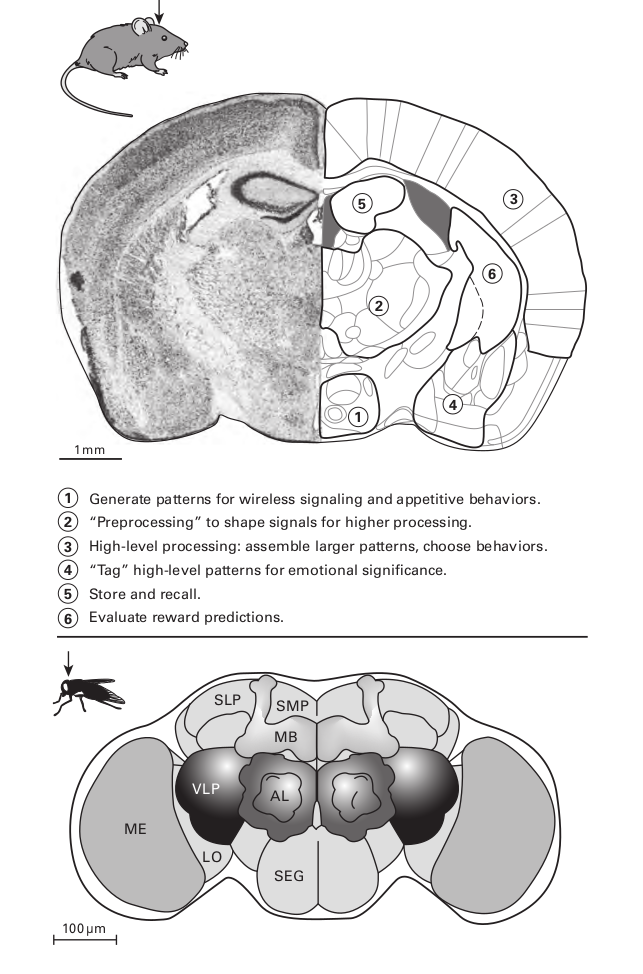
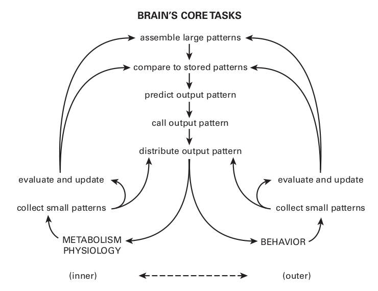
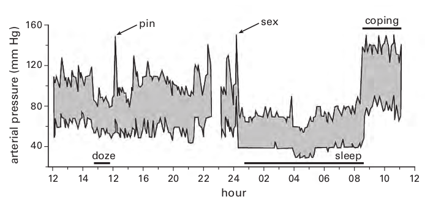
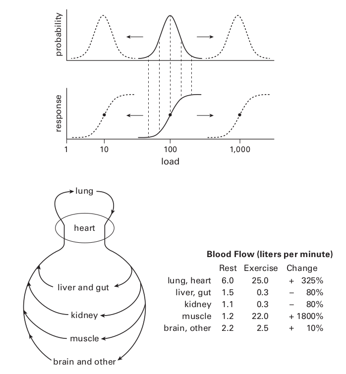
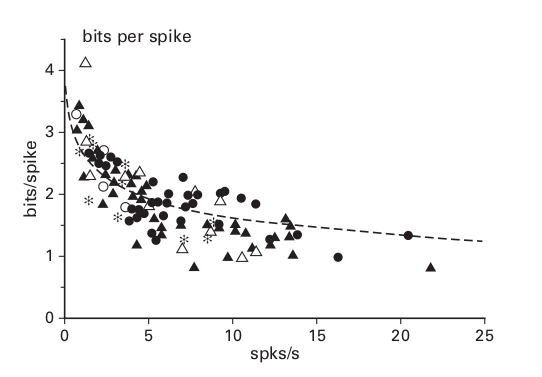
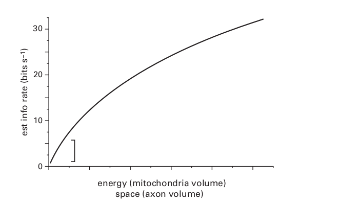

## Chapter 3. Why a Bigger Brain?
本章将解释为什么蠕虫在拥有302个神经元后大脑仍然在扩张，老鼠的大脑皮层包含有$10^7$个神经元，这似乎很多，而猕猴的大脑皮层的神经元数量（一种关键的实验模型）是老鼠的100倍，人脑的神经元数量又是猕猴的10倍；尽管各自对比的数量差距如此之大，但对“哺乳动物的大脑”进行概括还是很舒服的——因为在老鼠身上识别出的每个部分也可以在猕猴和人类身上识别出来（图 3.1；Kaas，2005 年）。

考虑一下苍蝇的大脑，它的神经元比老鼠大脑少 500 倍，但比蠕虫大脑多 500 倍，而且结构丰富——因此在“大型大脑”类别中占有一席之地，昆虫和哺乳动物的大脑有许多相似之处，例如，两者都将它们的神经元聚集成簇，将它们的轴突聚集成电缆（束），两者都采用特殊结构来完成相同的广泛任务：存储高级输入模式，生成低级输出模式，以及使用精简的指令检索模式。当然，二者在身体构造和行为上是不同的，然而，尽管有50亿年的进化来不断发生分歧，但是，昆虫和哺乳动物的大脑的设计似乎遵循了相同的规则。

设计在如此巨大的时间和空间尺度上持续存在意味着它们既不是任意的也不是偶然的，相反，它们一定是作为对某种广泛约束的回应而出现的，这就是将共同反应提升到原则地位的原因，本章将确定关键约束，并指出它如何导致管理更大大脑组织的三个原则。

> **Figure 3.1**
> **Mammalian and insect brains share many broad aspects of design.** 
>
> **Upper:** Cross section through mouse brain; inset indicates plane of section. 
>
> **Left:** Fine dots are neurons; dark regions are neuron clusters; bright regions are myelinated tracts (chapter 4). 
>
> **Right:** Numbered regions dedicated to core tasks: (1) hypothalamus; (2) thalamus ; (3) cerebral cortex ; (4) amygdaloid complex ; (5) hippocampus ; (6) striatum. Reprinted with modifications and permission from Franklin and Paxinos (1996).
>
> **Lower:** Cross section through fly brain; inset indicates plane of section. Brain is built of more than fifty clusters, each specialized for particular tasks. Depicted here are ME, medulla — detect and map local visual patterns; LO, lobula — assemble local visual patterns into larger patterns; AL, antennal lobe — preprocess olfactory signals for pattern recognition; VLP, ventrolateral protocerebrum; SLP, superior lateral protocerebrum; SMP, superior medial protocerebrum — all involved in high-level integration; MB, mushroom body — store and recall; SEG, subesophageal ganglion — integrate information for wired and wireless output to body.

#### A brain ’ s core tasks

随着动物从土壤中出现到一个更广阔、更不粘稠的世界，觅食的可能性大大增加，蠕虫主要在$0.01m^2$ 的区域内进行二维探索，而蜜蜂通常覆盖近$10^{7}m^2$的区域，而苍蝇则要少一些，因此，觅食面积扩大了$10^9$倍，加上第三个维度，待探索的体积就变成了天文数字，较大的动物，如鸟类、鱼类和哺乳动物，它们会迁徙，因此它们的觅食面积会达到数百万平方公里。

如此巨大的生存领域蕴藏着海量的资源，当然也包含着无数的危险。动物为了在发现资源的同时能有效地规避风险，需要从环境中快速收集大量信息；如何量化这个大量信息的大量，举例而言，眼睛向大脑发送信息，大约10M比特每秒，大致相当于以太网连接的速率；所有的感官数据都以微小的模式汇聚到大脑，类似动态拼图的游戏的某一块拼图，它们需要组装以显示更宏大的图像；因此，如果要收集信息是有益的，大脑就必须在空间和时间尺度上投入资源来组装与行为相关的更大模式。

然而，即使是更大的模式也可能毫无用处，除非将其与已经存储的可以识别的模式进行比较，这些模式可被识别为可食用/有毒、朋友/敌人或未找到搜索项；任何一种结果都为行为选择提供了决策基础，一场比赛可以让我们做出自信的选择：吃或拒绝，接近或逃跑。 不匹配表示谨慎，需要收集更多数据。 因此，大脑需要“模式比较器”，这些比较器必须与选择行为的机制相结合：喂食、战斗、交配、调查。 这些反过来又与详细运动模式的机制相结合，以驱动肌肉移动四肢或翅膀（何为思考？思考的生理机制是什么？脑的模式功能是否是分阶段的？一级一级推进，每一级是一个自治体？）。

任何给定的运动行为都可能与命令的动作完全匹配：箭头可能会击中它所瞄准的确切点。 但是由于环境或神经扰动通常会出现错误，需要识别这些错误，以便性能可以逐步提高。 因此，大脑需要机制来评估它发出的命令与实际运动表现之间的不匹配。 因此，除了感知和处理模式以发现“什么是重要的”之外，大脑还投入大量资源来感知和处理自身的运动错误，以及内部“有意”信号的其他错误，以提高准确性 和下一轮的效率。 这就是“运动学习”（学习，何为学习？或者说学习是一种策略，一种评估错误的策略）。 

行为受到另一类重要错误的影响，每一个行动都有成本和后果，成本部分是精力充沛的：消耗了多少能量？ 但也有“机会成本”：对于某些不同的行动，回报是否会更大而风险会更小？ 每一个行为，即使是完美的执行，也需要从这个角度来评估：明智还是愚蠢？ 重复与否？ 这些对奖励预测的评估，就像对运动错误的评估一样，用于更新存储的知识，以改进下一轮预测。 线虫已经在一定程度上表现出这种类型的评估，但更广泛世界的动物为其分配了主要的神经资源。

总之，为了在更广阔的世界中取得成功，动物必须与其外部环境交换大量信息，并评估其行为的成本和后果。 图 3.2 总结了每个大脑必须完成的七项核心任务。 大脑为外部环境所做的事情，它也为同样扩展和复杂化的内部环境所做的事情。 此外，管理内部和外部环境的机制需要紧密结合以相互服务（图 3.2）。

> **Figure 3.2**
> **Large brains accomplish the same broad tasks.** Note that inner and outer tasks couple to serve each other ( ↔ ).

#### Why the internal milieu needs a brain(为什么内部环境需要大脑)

为了支持更丰富的外部行为，动物需要专门的内部组织和器官。有些消化从外部世界觅食的奖励物资； 其他则储存代谢物和富含能量的化合物，以便根据需要释放。 还有一些调节离子平衡和清洁内部环境，或将氧气和代谢物分配给饥饿的组织。专门的免疫器官可防止感染因子和寄生虫。器官耦合形成系统，系统交叉耦合以优化整体功能。

标准的想法是内部系统或多或少会照顾自己。每个参数都应该有一个设定点，如恒温器，偏差会触发反馈以纠正不匹配（稳态）。内部调节还使用自主神经——之所以这样称呼，是因为它们在某种意义上独立于自愿控制——因此是自主的。我们不能“让”我们的心脏跳得更快或血压降低。然而，我们可以通过回忆或想象适当的场景来完成这些转变，这意味着存在从存储的模式到生成自主模式的神经路径。因此，虽然自主神经通常被认为服务于紧急情况（“战斗或逃跑”），但它们实际上服务于持续调节——不仅仅是为了恐慌，而是为了效率。

#### Efficient regulation anticipates(有效的调节预知)

事实上，所有内部调节，即使是最温和的调节，也远非自主。 由于外部环境提供了机会或引起关注，内部流程必须预测外部环境将要提供什么，并且必须准备可能需要支持的特定响应。 对于内部流程，目标不是纠正错配，而是防止错配。

一个多世纪前，伊万·巴甫洛夫 (Ivan Pavlov) 证明了这种预测性调节用于进食和消化：大脑处理来自外部的小模式（某种物质的视觉或气味），并将它们与识别特定食物的存储模式相匹配。然后大脑触发整个消化系统的分泌物为即将发生的事情做准备，从口中开始（如果是面包，然后是淀粉酶；如果是脂肪，然后是脂肪酶），然后是胃（如果是肉，然后是酸加蛋白酶），肠道（如果是脂肪，那么是胆汁），最后是血液循环系统（如果是葡萄糖，那么是胰岛素）。所有这些分泌物都发生在进餐前和进餐期间，可预测性地触发——预测胃肠道会发生什么——从而为吸收和摄取系统做好准备，以防止需要通过负反馈纠正的偏差（Fu et al., 2011）。

现有研究已发现：当胃将食物消化完成后，它会给大脑发出一个信号，告诉大脑需要为下一轮觅食做准备，然后，大脑通过调整嗅觉受体的敏感性，增加嗅觉的速度来做出反应（Julliard 等人，2007；Tong 等人，2011），因此，胃在身体开始耗尽其储备之前就警告大脑“准备再次觅食”，此外，随着脂肪到达小肠，肠道可以自信地预测饱腹感，因此，肠道会警告大脑“停止进食并进行下一项活动”（Fry 等，2007）。

每一个“下一个活动”都需要大脑持续、及时地预测对特定血压的需求。 考虑 24 小时内平均动脉压的记录（图 3.3）。 下午早些时候，当受试者参加讲座时，他的大脑预计需求减少并允许他打瞌睡：压力下降。 被针刺惊醒，大脑预测危险：压力峰值； 然后，识别出一个恶作剧，大脑指示小睡恢复：压力下降。 在午夜，对象进行性交：压力达到峰值，但随后急剧下降并在睡眠期间保持低水平。 早上起来，大脑预测忙碌的一天，恢复了压力。

> **Figure 3.3**
> **Internal systems match behavior.** Arterial pressure fluctuates with demand. Each shift in pressure is accompanied by parallel shifts in hormonal and neural signaling that follow the broad catabolic and anabolic patterns. Redrawn from Bevan et al. (1969) and reprinted from Sterling (2004b).

这种预先调整需要多个器官和器官系统的协调作用。 为了提高压力，心脏加速，血管收缩。 此外，肾脏通过将更多的盐水泵入循环中来扩大血容量。 肾脏还向大脑发出信号，表明身体很快将需要更多的盐和水供应。 因此，就像胃肠道一样，肾脏会在即将需要补给之前提前提醒大脑。 每项贡献都在不同的时间尺度上起作用：心脏和血管更快，肾脏泵血更慢，而大脑对盐的食欲和口渴的上升仍然更慢。 这些对内部监管的贡献都是同时启动的——而且主要是通过相同的信号。

简而言之，我们的一举一动都与相应的心血管和肾脏模式相匹配。 这一点我们一般是不知道的。 然而，如果运动命令（“起来！”）稍早于内部命令（“收紧血管！”），流向头部的血液就会下降，我们就会昏倒。 这种体位性低血压的经历很少证明心血管模式和肌肉模式在 100 毫秒时间尺度上的严格耦合。 在较慢的时间尺度上“起来！ ” 增加八倍的信号给肾脏以节约用水。

请注意，将血压与环境相匹配需要大脑的所有广泛任务，如图 3.2 所示——模式的收集和组合、与存储的比较等等。还有什么方法可以确定刺是来自朋友还是敌人？此外，对外部行动的每一个高层调用都会同时传递到多个内部器官。因此，收集模式和分发模式在内部世界和外部世界之间都是完全耦合的。第 4 章将讨论大脑在何处以及如何影响这种耦合。

#### Adapt, match, trade(适应,匹配,交易)

尽管这本书涉及有效的神经设计，但我们必须记住，大脑仅占身体质量的 2% 和 20% 的能量，所以身体也需要高效运作。每个器官都应使其能力与下游器官的预期需求相匹配。太少，系统会失效；太多了，容量被浪费了。因此，每个器官都需要不断调整以预测下一个需求（图 3.4）。但是，当需求超过供应能力时会发生什么？这个问题是通过安排各种短期的“取舍”来解决的。这样的合作提升了性能空间，同时大大降低了平均过剩产能（图 3.4）。

例如，心脏每分钟通过呼吸系统泵出 6 升血液，然后输送到全身循环；骨骼肌使用约 20% 的含氧血液——与其维持姿势的适度需求相匹配。在运动高峰期，肌肉的供给量必须增加近 20 倍，但肺循环和体循环的输出量只能增加 4 倍。因此，身体必须要么降低其运动的峰值容量，要么将其肺和心血管的峰值容量增加五倍——想象一下胸部！

事实上，在运动高峰期，内脏循环（肠道和肝脏）和肾脏循环（肾脏）的份额都减少了四到五倍，足以支付肌肉锻炼的部分费用。在消化过程中，当内脏循环需要更多血液时，它会从肌肉和皮肤中借用——除非皮肤需要血液来冷却。大脑既不提供贷款，也不允许可能导致其过热的透支。任何吃过东西然后在阳光下锻炼的人都会回忆起这些来自肌肉、肠道和皮肤的相互冲突的需求是如何得到解决的：通过对内部系统（“呕吐！”）和外部系统（“躺下！”）的纠正运动命令，此外，这种体验会收到强烈的负面评价，会更新知识库（“不要重复！”）。

这个例子说明了有效调节的三个关键规则：（1）使响应能力适应输入水平的变化；（2）匹配整个系统的响应能力；（3）系统之间的交易。一旦有足够的统计证据来预测新的目标水平，调节就会立即开始。相比之下，通过反馈到设定点的自我调节将是无望的低效。但要执行这些预测性调节原则，需要一个具有外部知识、内部知识和过去知识的器官来预测整个动物在不同时间尺度上的需求——整个大脑（Sterling，2012）。

>**Figure 3.4**
>**Adapt, match, trade.** 
>
>**Upper:** Adapt response capacity to load. Every system confronts some distribution of probable loads (bold). As conditions shift, so does the distribution (dashed). The response curve (bold) is typically sigmoid with its most sensitive region (steep part) matched to the most probable loads. As a sensor detects a statistically reliable change in the distribution, it prepares the effectors by shifting their response curves to match the new distribution (dashed). Each sensor also adapts its own sensitivity. Reprinted from Sterling (2004b). 
>
>**Lower:** Organs and organ systems couple efficiently by matching loads to capacities. Trade-offs allow better performance while reducing unused capacity and enhancing “ portability. ” Blood flow pattern changes with exercise: total flow quadruples, but that is insufficient for muscle. To meet the full need, blood is routed from liver, gut, and kidney, temporarily reducing their performance but eventually benefiting from what the muscular effort has accomplished. Data from Weibel (2000).

#### Bigger brains

我们似乎已经回答了“为什么要更大的大脑？ ” 在更广阔的世界中，更有效的大脑会扩大行为的可能性。 对鳍、翅膀和腿等附属物的控制为探索提供了速度和范围，因此会遇到更多的小模式，然后需要选择和组装。 更大的模式需要更多的比较，需要更大的库； 更多的比较也需要更多的决定，而这些需要更多的评估。 自然地，需要更多的神经元，并且由于神经元成分非常小（第 7 章），因此大脑必须扩大。

为了有效，更大的大脑必须实时运行。 无需长时间观看树懒，就能意识到慢动作中的生命极限。 更大、更快的大脑必须仍然保持便携，并且在代谢上也可以负担得起。 因此，大脑需要在功能上有效且具有成本效益。 这些对速度、便携性和可负担性的要求都相互影响。 因此，他们单独和共同提出了大脑设计的问题。 我们现在转向任何导致前三个设计原则的大脑设计的基本约束。 然后，在这几个原则的背景下，我们讨论一些实际的设计（哺乳动物和昆虫）。

#### Design constraints(设计约束)

大脑设计的基本约束来自物理定律。 该定律规定了获取、发送和存储信息的成本。 这条定律体现在克劳德香农开发的一系列方程中，同样适用于电话线和神经电缆，同样适用于硅电路和神经电路。 这条定律在所有尺度上都限制了神经设计，并且无法避免，就像 B-29 轰炸机无法避免万有引力定律一样。 但是，尽管大脑从根本上说是一个操纵信息的器官，但很少有神经科学家熟悉这条定律或意识到它对于理解大脑组织的价值。 我们在这里简要解释一下，并在第 5 章和第 6 章中给出更多细节。

#### What is “ information ” ?(何为信息)

信息是减少与观察与 X 有因果关系的任何变量 Y 相关的某些情况 X 的不确定性(信息的熵)，不确定性定义了标准度量：一位是在两个同等可能的选择之间做出决定所需的信息。信息依赖于因果关系，因为为了减少不确定性，消息必须可靠地与其来源相关联，即导致它的事件。任何降低这种连接可靠性的因素，例如噪声，都会增加不确定性并破坏信息。

减少不确定性简洁地描述了大脑的目的。ON 神经节细胞中的尖峰降低了大脑的不确定性，即比平均更亮的物体位于视野的特定区域（第 11 章）。当大脑将一块神经节细胞编码的感觉模式与存储的模式相匹配时，它减少了一个关键的不确定性：“朋友还是敌人？答案有助于选择下一个行为并实施它。为此，运动神经元尖峰降低了其目标肌肉纤维将收缩并帮助动物朝适当方向移动的不确定性。简而言之，为了实现其核心目的，大脑使用代表和操纵信息的物理设备（神经元和电路）。所以现在我们必须问：一个神经元可以表示多少信息，什么限制了它的容量？

#### A neuron ’ s information capacity

为了传输信息，神经元必须将其输入的状态表示为不同的输出（输入和输出必须是因果相关的），因此，神经元传递信息的能力受到它可以产生的明显不同的输出数量的限制。一个脉冲神经元在给定时间内可以产生的不同输出的数量是它在该时间内可以产生的明显不同的脉冲序列的数量，这取决于两个因素，平均发射率（每秒 R个峰值）和峰值时间精度（$Δt$ 秒）。当神经元不能触发尖峰时，放电率的上限由尖峰持续时间加上尖峰之后的时期来设定的。某些神经元在短暂的爆发期间达到此极限，但大多数神经元的运行远低于此极限。精度受通道噪声和膜时间常数的限制，在这里，生物物理学限制了信息容量。

脉冲速率、计时精度和神经元可以产生的不同脉冲序列的数量之间有什么关系？当一个神经元持续1秒钟传输信息时，它会产生时间精度为$Δt$ 的 R 尖峰（Rieke 等人，1997 年）。不同尖峰序列的数量 M 是神经元可以将其 R 尖峰置于$T = 1/Δt$ (1理解为1秒，这样T就理解为在1秒钟时间范围内区间大小为$\Delta t $的区间数量)间隔中的方式数量（图 3.5）。推导 M 是计算**组合**的标准练习（排列组合，组合数不考虑顺序，排列需要考虑顺序），通常以古怪的术语设置给学生，例如将3颗豌豆放入5个花盆中。M的解为公式(3-1):
$$
M = \frac{T!}{R!(T-R)!}
$$
!表示阶乘，(T-R)表示无尖峰的区间数量，T表示总区间数量，R表示尖峰区间数量。

神经元在1秒内可以生成的不同消息的数量M转换为信息率，按照香龙的理论，信息H表示为公式(3-2):
$$
H = log_2 ( M )
$$
使用公式(3-1)进行替换，则得到公式(3-3):
$$
H = log_2( \frac{T !}{( R !( T – R)!}) = log_2( T !)  —  log_2( R !)  —  log_2 (( T – R )!).
$$
因为香农使用了对数刻度，一条持续两倍长的消息传达了两倍多的信息，而且，因为他使用了以 2 为底的对数，所以信息是以位为单位的。因此，一个神经元可以用 1秒钟传输的信息 H 是它的信息容量，以比特/秒为单位（图 3.5）。

有了这个表达，我们可以“跟着钱走”，也就是说，使用标准货币（比特），我们可以像优秀的工程师一样问：神经元发送信息的速度有多快（每秒比特）以及效率如何（每尖峰的比特数）？ 空间（每立方毫米比特数）和能量（每分子三磷酸腺苷的比特数）的成本是多少？ 这种分子，缩写为 ATP，是用于传递能量的标准细胞内分子。

#### Information costs energy and space

信息率随着尖峰率和尖峰定时精度的增加而增加，即 Δt 减小。 然而，对于任何给定的精度，信息率随着尖峰率的增加呈亚线性增加（图 3.5）。 因此，随着尖峰率的上升，每尖峰的比特数应该下降，并且通过实验观察到每尖峰比特的理论下降（图 3.5）。

还有另一种方法可以解释为什么更频繁的尖峰携带的信息更少，出现频率较低的符号更令人惊讶，因此信息量更大（第 4 章，等式 4.2）。这种效果，香农称之为 surprisal ，使具有更少尖峰的代码更有效。例如，在一组神经元中稀疏分布尖峰的代码在每个尖峰中传达更多的比特（第 12 章；Levy & Baxter，1996）。

> **Figure 3.5**
> **Mathematics and biophysics govern the representational capacity of signal trains.**
>
> **Upper:** Distinct sequences of spikes in time intervals Δ t represent different inputs.
>
> **Middle left:** Theory predicts information rate to increase sublinearly with spike rate,
> with the consequence shown at 
>
> **Middle right:** Increasing spike rate reduces the information transmitted per spike. These theoretical curves were calculated using the standard approximation for signal entropy at low spike rates (Rieke et al., 1997, equation 3.22). In general neurons do not achieve their theoretical capacity because of noise and redundancy; consequently, measured values of bits/spike are lower (figure11.25). 
>
> **Lower:** Measured bits per spike falls as mean spike rate increases. Data pooled from several classes of guinea pig retinal ganglion cell. Reprinted with permission from Balasubramanian & Sterling (2009).

> **Figure 3.6**
> **Law of diminishing returns.** Doubling information rate of retinal ganglion cells more than doubles space and energy costs. Consequently, neural designs try to stay on the steep region of this empirically measured curve. Modified from Balasubramanian & Sterling (2009) and reprinted with permission.

这个简单的定律——不频繁的尖峰能携带更多的比特——对神经设计产生了深远的影响，因为跟着钱走，人们发现尖峰是昂贵的。它们使用了大约 20% 的大脑能量（Attwell & Laughlin，2001；Sengupta 等，2010）。尖峰为神经元的膜电容充电约 100 mV，由于神经元的局部分支，膜面积很大，更高的平均峰值速率需要更大的细胞体和更大的膜面积；这增加了每个尖峰的能量成本，并增加了高速传输比特的成本。因此，在零星地以低平均速率发送尖峰的情况下，可以用相同的能量发送更多信息——每个 ATP 更多的比特，通过低速率节省能源与节省空间相得益彰。

更高的峰值速率也需要更粗的轴突，因为轴突直径 d 直接随发射率增加，轴突体积随着$d^2$增加；因此，将发射率加倍会使轴突体积增加四倍。线粒体浓度是能量消耗的指标，随着轴突直径的变化趋于恒定；因此，体积翻了两番，能源供应也翻了两番（Perge et al., 2009, 2012）。总之，有一个收益递减规律：每比特的成本，无论是能量还是空间，都随着比特率急剧上升（图 3.6）。

#### Three principles of neural design

发送任何信息的不可避免的成本和以更高速率发送的不成比例的成本导致了三个设计原则：

1. 只发送需要的东西；
2. 以可接受的最低代价发送；
3. 最短连接线路，即所有神经通信线路的长度和直径都需要最小；

最后一条原则似乎很明显，但它实际上反映了一个由速率约束引起的微妙点。
