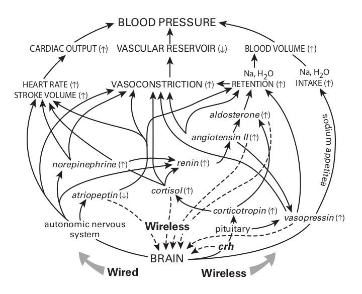
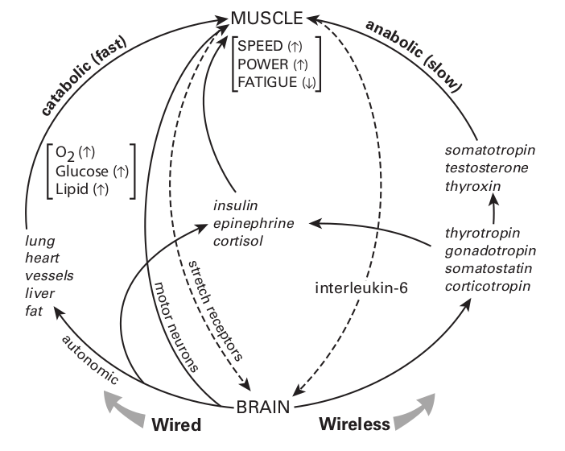
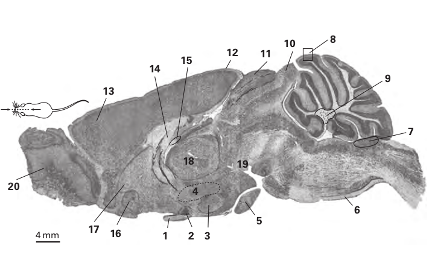
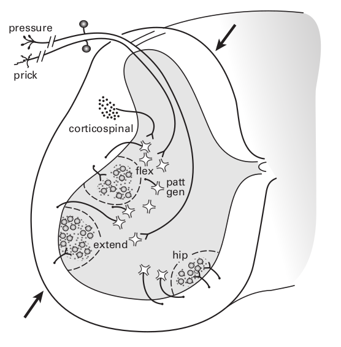
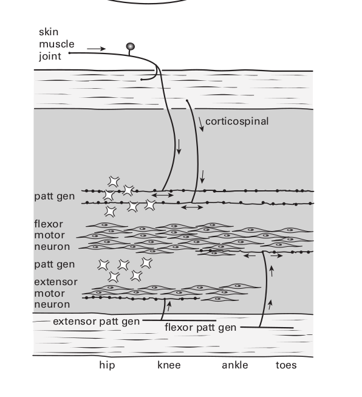
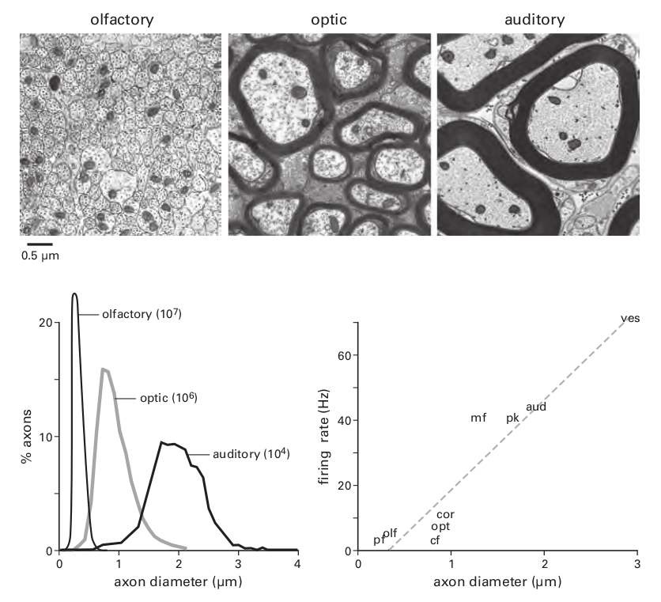
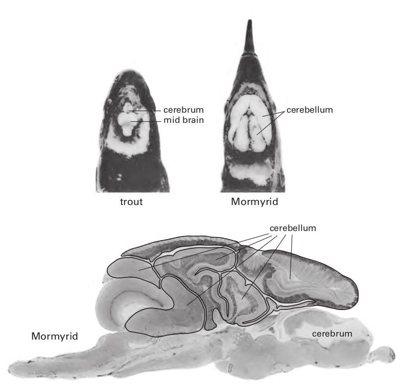
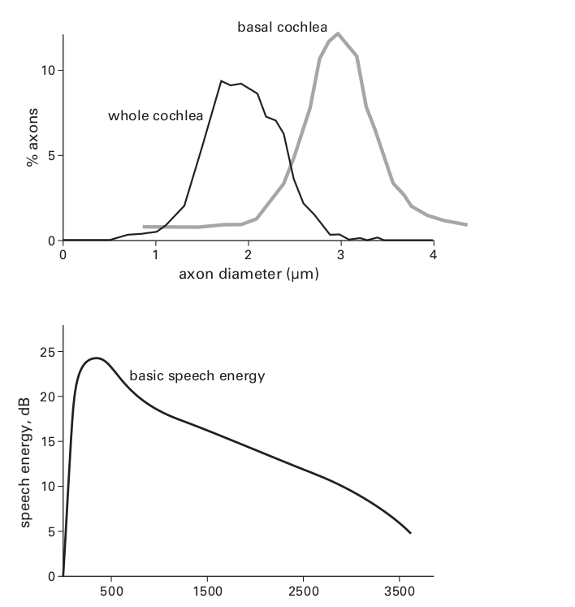
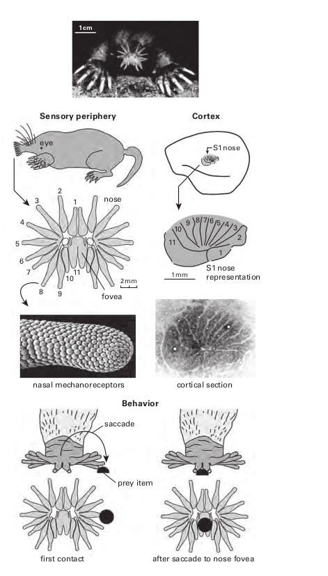

## How Bigger Brains Are Organized
>我感觉地球正在慢慢变暗. 夜的影子像一条展开的黑纱一样笼罩着大地, 从这条经线到下一条经线的所有生物, 将在太阳落山后躺下, 一个人可能正在观察着落日中的地球, 然后只看到一排排不断躺倒的身体，好像被土星的金色镰刀夷为平地了一般. 
>
>— W. G. Sebald, paraphrasing Sir Thomas Browne (edited for brevity)

前一章确立了大脑发送信息需要能量和空间，此外，更高的速率（每秒更多的比特）需要更多的能量和空间，因为它们需要更厚的轴突——空间和能量都随着直径的平方而增加。因此，最有效的设计将只发送必要的信息，并以允许服务于给定目的的最低速率发送。如果信息可以在没有任何电线的情况下发送，那是最好的，如果绝对需要电线，它们应该尽可能短和细。这些原则可以让我们深入了解更大的大脑是如何组织的。

一项设计决策无处不在，以至于需要立即提及，大脑将彼此之间连接的局部电路与远距离连接的电路隔离开来，原因很简单，也很根本：将电线与电路混合会增加电线的总长度和厚度——这违反了最小化电线的原则（第 13 章）。在哺乳动物中，如果轴突移动超过几毫米，它们就会分离，原因是增加距离需要增加传导速度以避免计算延迟，而这需要更粗的轴突。当轴突直径超过约 0.5 μm 时，轴突被髓鞘包裹，这导致直径每增加1μm，神经信号传导速度将增加6mm/ms(每毫秒6毫米)。因为活体大脑中的髓鞘发出白色的光，延伸的有髓轴突片被称为白质。

#### Saturn ’ s scythe sets brain design(昼夜交替与大脑的设计)

地球上所有生命最深刻的条件，即独特地塑造每个有机体中每个细胞的条件，就是我们的星球每天围绕其轴心旋转。这种运动在 24 小时内将到达的太阳辐射强度改变了$10^{10}$倍，这一行为的影响是如此深远，以至于对于许多文化来说，它开启了创造的故事。一个熟悉的例子是圣经中提到的：“上帝将光明与黑暗分开 . . . 有晚上，有早晨，总有一天“  ---（创世记 1：4-5）。

动物当然可以在没有光的情况下生存（例如，在洞穴中），但是那些能够接触到光的动物通常会选择一天中的特定时间来觅食，从而选择特定范围的光强度。基本的选择是白天、夜间、昼夜交替间(黎明和黄昏)，这决定了他们对传感器的投资：具有色彩的精细空间的视觉与可能具有回声定位的敏锐的听觉，与嗅觉，加上胡须。觅食期也决定了它们对付占据同一位置的掠食者的策略：伪装、躲避飞行或潜行行为。

在其活跃期间，身体消耗化学能来支持外部行为，例如觅食，以及内部活动，例如消化和吸收，有些需要依赖于内部和外部的行为，例如体温调节。因此，活跃阶段涉及广泛的分解代谢模式：（1）将大聚合物分子（蛋白质、脂肪、碳水化合物、核酸）分解成它们的单体结构单元（氨基酸、脂肪酸、糖、核苷酸）；(2) 将单体分配到代谢活跃的组织；(3) 将单体转化为能驱动细胞过程的能量分子，例如 ATP；(4) 使用有氧（需要氧气）途径产生 ATP，因为它比厌氧途径的效率（每个葡萄糖单体的 ATP）效率高 16 倍。

在其不活动期间，身体转变为更新、合成代谢的广泛模式：(1) 组装新的聚合物用于生长、修复、重塑和免疫；(2) 通过将剩余单体储存为重新合成的聚合物来补充储备。因此，肝脏将多余的葡萄糖转化为储存的聚合物糖原；脂肪细胞将多余的葡萄糖转化为单体脂肪酸，然后用于构建储存聚合物脂肪。因为分解代谢和合成代谢涉及相反的生化反应组，同时运行它们是低效的。因此，自然选择将内部过程分离为日常周期不同部分的互补模式。

大脑本身参与分解代谢与合成代谢的循环。在清醒期间，它收集、处理和分发大量信息；在睡眠期间，大脑通过特定的调节酶切换到合成代谢，并使用此阶段来存储最近获得的信息（Dworak 等，2010）。这包括通过缩回某些突触并添加新的突触来重塑局部回路，在某些情况下，还会产生新的神经元（第 14 章）。

分解代谢和合成代谢之间的强制性交替涉及限制一组生化途径并加速另一组——这两者都需要时间。因此，每种模式都需要预测环境变化——以便最佳匹配睡眠和觅食的关键时间窗口。因此，在图 3.3 中看到的模式，即血压随睡眠而下降并随醒来而上升，是完全普遍的：身体和大脑中的所有过程都在这个循环中移动。因此，它们共享相同的广泛信号是有效的，虽然有些过程在黑暗中停止，而另一些在光明中停止，但所有过程都必须遵循土星的镰刀。

#### Brain clock(主时钟)

许多体细胞包含一个内在的时钟，由相互作用的蛋白质的振荡建立，周期约为 24 小时（昼夜节律）。但是如果没有一种机制来调整它们，这些时钟很快就会出现异相。因此，需要一个主时钟来跟踪这一天，包括它在绕太阳每年公转期间由于地球的轴向倾斜而不断发生的变化。主时钟包括一个离散的神经元簇（人类大约有 8,600 个），即视交叉上核 (SCN)。SCN 神经元的一个亚组包含一个生物钟，该生物钟每天根据来自视网膜的信号进行重置，该信号跟踪一天和季节中光强度的缓慢变化（图 4.1）。

主时钟既不需要颜色，也不需要空间信息，也不需要精细的时间信息——只需要缓慢的强度变化。因此，遵循两个设计原则，这块视网膜发送尽可能少，发送尽可能慢。它仅使用一小部分视网膜输出神经元 (0.2%)，这些神经元稀疏地覆盖视网膜并以非常低的速率发射，一天内平均只有几赫兹 (Crook 等人，2013；Wong，2012)。SCN 神经元本身在大约 8 Hz（白天）和大约 1 Hz（夜晚；Häusser 等人，2004）之间发射。为了遵循另一个原则，最小化导线，SCN 准确定位视束连接大脑的位置（见图 4.1）。但是主时钟如何控制整个身体和大脑的模式呢？

SCN 的相对较少的神经元，在老鼠中约为$10^4$个，无法想象它直接接触所有其他细胞（Güldner，1983）。他们的工作不是对每个细胞进行微观管理，而是主要是为了保持时间。除了时间，SCN 相当无知——基本上不知道内部生理和外部行为，因此，它无法负责任地告诉身体或大脑何时改变广义模式。例如，老鼠通常在晚上觅食，但如果食物在晚上变得稀少而在中午变得丰富怎么办？如果 SCN 直接指示指挥中心发布觅食命令，它可能会在没有晚餐的情况下让老鼠入睡。

#### Coupling clock to behavior: A hypothalamic network(耦合时钟与行为: 下丘脑网络)

相反，SCN 耦合到相邻区域，即下丘脑，由于其相对较小的范围，其信息非常丰富（图 4.1；Saper 等，2005；Thompson 和 Swanson，2003）。该区域监测无数内部参数，包括温度、血液中的盐分和代谢物水平、饱腹感、饥饿、口渴、疼痛、恐惧和性状态的荷尔蒙信号。它的一些神经元簇表达自己的内源性振荡器，其中至少有一个对食物供应的变化做出反应（Guilding et al., 2009）。该区域还监控存储的模式——例如最佳觅食地点和时间以及过去的危险。它使用各种感官监控外部环境。综合所有这些数据，加上 SCN 时钟时间，该区域计算出哪些需求是紧急的。然后，在机会和危险之间平衡紧迫性，它告诉老鼠是觅食、交配、战斗还是睡觉。执行时，它不会进行微观管理，而是调用适当的行为模式（Saper 等人，2005；Thompson & Swanson，2003）。

下丘脑网络，被设计去预测即将到来的需求，然后生成信号去引出各种行为，即引发各种有动机的行为，这些行为包括但不限于觅食、饮水和性行为。当这些激励信号被广播到其他大脑区域时，就会出现我们（在其他动物中）体验为欲望的主观成分。如果一个区域可以被认为是无意识欲望的源泉，那就是它。如此小的区域能够访问和整合如此多的信息并唤起如此多样的核心行为，这似乎令人惊讶。下丘脑网络怎么可能有足够的空间来做这么多呢？

部分答案是这个消息灵通的区域决定了低级模式的序列。例如，进食行为需要按以下顺序：嗅→咬→咀嚼→吞咽。这些组件由位于脑干下方效应器肌肉附近的专用模式发生器来详细编程。局部模式生成器管理协调行为所需的肌肉收缩的确切时间。平滑地调用每个组件的广泛序列可以通过简化的指令集指定给本地模式生成器 - 就像音乐指挥跟随乐谱从 80 名低水平演奏者手中召唤贝多芬交响曲一样，只有一根细长的指挥棒。这个类比并没有解释这两种情况的神奇之处，但它确实强调了设计原则：发送简单的指令并在本地计算复杂的细节（Büschges et al., 2011）。

这种经济的设计允许下丘脑区域为每种行为模式提供专用连接网络，它们足够紧凑，细电极可以单独刺激它们，表明每个网络都会唤起完整的行为模式，以及适当匹配的内脏模式（Hess，1949；Bard & Mountcastle，1947）。例如，一只猫的电极被放置以引发“愤怒的攻击”，它的背部拱起，发出嘶嘶声，并用裸露的爪子和牙齿进行攻击（躯体模式）。同时，它可以扩大瞳孔、竖起皱纹并增加心血管活动（内脏模式；Bü schges 等人，2011 年；Hess，1949 年）。将电极移动几毫米可以激活其他行为的电路：喂食或饮水，交配或蜷缩着睡觉。简而言之，许多连接网络适合一个小空间，因为它们的输出信息很简单。

每个行为的连接网络都明显地由一组丰富的输入信号引导。例如，受到电刺激进食行为网络的猫会攻击模仿老鼠的棉花球，但只是短暂的，而它会持续攻击真正的老鼠，直到电流停止。如果老鼠被一只大老鼠代替，猫就会退回到它的家角落。显然，喂食行为连接网络由识别猎物、区分真假猎物和识别危险猎物的输入调制——所有这些都基于与存储模式的比较。此外，每一种行为都充满了激励成分——当动物受到刺激进食时，很明显会寻找隐藏的食物并努力获取它（按下杠杆）。

这个小区域，即下丘脑，是如何进入大脑的感知、空间记忆、危险、经济价值和紧迫性的核心系统的？同样，它依赖于其他地方计算的细节，并且仅作为结论提供：来自 SCN 的时间；来自定义内部状态的无数来源的综合生理数据；从海马体和杏仁核中选择的位置和危险记忆；纹状体系统奖励价值的近期历史；前额叶皮层选择的高级分析。因为这些下丘脑区域的输入都发送摘要，所以它们可以使用低信息率和细纤维，从而大大节省空间（图 4.1）。能量也是守恒的，这使得这个关键区域的代谢率处于最低水平（Sokoloff，1977）。

这种策略允许主要的记忆器官海马体访问动物生活史的关键方面，但只发送适度的剪辑来指导特定的行为。这或许可以解释为什么海马体的输出束（穹窿）可以处理大部分细纤维，类似于视神经，它本身会从视网膜发送经过强烈编辑的摘要（第 11 章）。一个明显相似的策略允许大脑皮层的感觉运动区域通过类似精细结构的输出束（皮质脊髓束）为运动行为提供速度和敏捷性（图 4.2；Quallo 等人，2012 年）。简而言之，下丘脑网络旨在接收执行摘要作为输入，并提供广泛的备忘录作为输出（Perge 等，2012）。

#### Resurrection(苏醒)

从沉睡中醒来感觉很可怕，也难怪，身体和大脑中的每个细胞都在努力根据其分解代谢阶段发挥作用——违背所有保持在合成代谢阶段的中央指令。但是当合成代谢完成时——当身体补充了储备、治愈了伤口、重建了肌肉和免疫系统，当大脑的分类机制完成了“删除”或“保存”时——所有的细胞和组织最终都苏醒了。

SCN 向下丘脑网络发出“黎明”信号，然后由下丘脑网络根据许多因素决定是否是顺畅地苏醒，如果是这样，网络会向附近的神经元簇（大小与 SCN 相当）发出信号，以分泌肽递质食欲素。食欲素神经元在大脑上广泛投射，以激活一系列调节唤醒的系统（Sakurai，2007）。由于食欲素神经元将时钟与大脑的唤醒系统相结合，缺乏食欲素的动物往往会意外地陷入睡眠。

食欲素簇专门唤醒嗅觉传感器，增强其敏感性，并唤醒觅食的运动机制（Julliard 等，2007）。在主时钟的通知下，食欲素集群使用下丘脑模式生成器网络来协调警觉性、嗅觉敏感性和饥饿感——所有这些都是为了在适当的时间开始觅食。现在是大脑信号恢复广泛分解代谢模式的时候了：调动来自肝脏的能量储存和来自脾脏和骨髓的氧载体（红细胞）；用来自肾脏的盐水重新扩张血管水库。现在是解除合成代谢过程以促进生长、修复和免疫的时候了。

总之，下丘脑网络管理着整个大脑及其所有功能——没有微观管理。但是现在，微观管理呢？指挥家很好，但必须有人演奏巴松管。那么，涉及微观管理的过程是如何受这里考虑的设计原则控制的呢？

#### Distributing output patterns

**Wireless signaling**

设计原则规定，最慢的过程应该由最慢的效应器和最少的线路控制。在可以不通过连线发送信号的地方，那是最好的。因此，对广泛的分解代谢和合成代谢模式进行微观管理的效应器是内分泌腺。例如，肾上腺分泌一种类固醇激素，可以增强肾脏对钠的吸收，另一种可以增强分解代谢，调动能量，抑制生长和修复。睾丸分泌增强肌肉的合成代谢类固醇，肝脏分泌刺激红细胞生成的激素。是什么协调了这些低级效应器？来自垂体的更高水平的内分泌信号又受大脑激素的控制。图 4.3 总结了两种特定功能（血压和肌肉收缩）的无线调节。

脑激素由神经分泌神经元直接分泌到循环中，神经分泌神经元的簇与模式发生器的下丘脑网络相邻。模式生成器通过非常细、非常短的电线（图 4.1）交付他们消息灵通但简单的订单。下丘脑网络中的每个节点都可以调用特定模式的大脑激素释放到垂体上游的血液中，从而刺激它将自己的激素释放到全身循环中。整个内分泌网络在几秒钟内到达身体的每个细胞。速度不是非常快，但另一方面，消息是在没有任何电线的情况下广播的，并且比心脏已经在做的能量成本为零。

这个无线系统的天才部分在于接收器。尽管所有体细胞都暴露给了全部激素，但只有某些细胞类型才会下载给定的信息。为此，它们会产生一种特定的分子受体，该受体结合特定的激素并触发特定的细胞内反应。因此，扩散到全身的信息可以被有限数量的细胞类型读出——它们对信号的反应是协调的。第 5 章描述了它如此经济的分子机制和原因。

另一个聪明的特点是受体细胞可以表达分子受体的不同亚型，每个亚型都可以在细胞内以自己的刻板印象与特定的第二信使耦合。例如，一个信使可以极大地放大激素信号，并用它来激活或抑制某些细胞内过程。因此，无线广播的单个消息可以在不同组织之间引起复杂的响应模式，包括负相关和正相关。

例如，骨骼肌通过粗电线上的快速信号迅速作用于外部世界。然而，它也是体内的一种组织，因此受到各种激素的无线调节，包括合成代谢类固醇、胰岛素、生长激素和甲状腺素（图 4.3，下图）。因此，无线信号有助于大脑有效地耦合内部和外部世界。

> Figure 4.3
> Wireless regulation broadcasts slow signals to efficiently couple inner and outer
> worlds . Upper : To adjust blood pressure rapidly and locally, the brain uses wires
> (autonomic nerves). But to shift pressure slowly and broadly, it uses wireless signals
> (hormones) ( italicized ). Dashed lines indicate wireless feedbacks to brain. Feedbacks
> by wire are used by certain sensors, such as for oxygen and pressure, but are not
> shown. CRH, corticotropin releasing hormone . Lower : Catabolism in muscle activates
> rapidly to support contraction; so to rapidly activate catabolism, the brain uses wires.
> But anabolism in muscle is slower, so the brain activates those processes with wireless
> signals ( italicized ).

**Wireless collecting**

大脑还使用无线接收器，这是一组位于大脑和血管之间专门接口的脑室周围器官。血液和大脑部分之间存在正常屏障，从而使神经元暴露于循环化学物质中。这些神经元通过表达适当的分子受体来选择它们需要的东西。例如，穹窿下器官位于调节对盐和水的食欲的下丘脑模式发生器附近（图 4.4）。神经元感知血液中的钠含量，以及告诉肾脏保存钠的激素（血管紧张素 II 和醛固酮）水平（图 4.3，上图）。因此，这个无线接收器关闭了预期调节的循环：大脑向肾脏发送有关盐和水的指令，而大脑的穹窿下器官无线接收有关当前钠平衡状态的信息。

#### Need for wires: Faster, spatially directed signaling

神经分泌物缓慢扩散（几秒钟内）并缓慢调节靶细胞，因为释放到庞大血管系统中的激素分子包被大大稀释（浓度约为 10 – 9 M）。因此，分子受体需要高亲和力来捕获激素，因此它们的解除结合速度很慢（第 6 章）。然而，这种延迟是无关紧要的，因为它们调节的细胞内过程通常跨越几分钟或几小时。因此，无线信号的缓慢节奏与它们的目标相匹配，即缓慢上升和下降的生理过程。

在需要更快反应的情况下，激素被释放到直接通向下游目标的门静脉中。由于激素稀释程度较低，它可以被较低亲和力的受体捕获，这些受体解结合得更快，并在结合/反应曲线的陡峭部分上起作用。例如，大脑激素促肾上腺皮质激素释放激素被分泌到通向垂体的门脉血管中；肾上腺皮质将类固醇激素分泌到通向肾上腺髓质的门静脉中。然而，某些内部过程必须更加智能地进行，这需要电线。

例如，为了让大脑开始改变身体姿势，它必须改变肌肉收缩的模式。这将需要改变氧气的分布，从而改变血管舒缩模式以重新分配血液。此外，活跃的肌肉需要吸收葡萄糖，这需要触发胰腺细胞分泌胰岛素。这些血管和内分泌调整需要与肌肉活动一起启动，而这些更快、空间定位的信号需要电线。

这种需求由自主神经元提供，其轴突接触每个内部器官和血管。它们的平均发射率小于 1 Hz，因此在香农的意义上，它们以低信息速率传输。这看起来很直观，因为一条信息——“分泌一些胰岛素”或“收缩这个血管”——在某种程度上超出了“是”或“否”（一点点），但不是很多，因此只需很少的尖峰就可以完成。以低于 1 Hz 的速率传输的信号使用最好、最便宜的轴突。

是什么管理这些自主效应器？ 答案：低水平模式发生器位于输出簇附近的脑干和脊髓（图 4.1，右）。 后者形成两个子系统（交感神经和副交感神经），它们使用不同的发射器。 每个发射器耦合到几种受体类型，这些受体又耦合到不同的第二信使。 因此，自主效应器可以产生丰富的内部模式。 他们是管弦乐手——准备好并等待指挥选择下一个模式和节奏。

是什么管理着改变身体姿势的肌肉？同样，答案是位于运动神经元簇附近的低级模式生成器。这些模式生成器必须增加某些肌肉的力量并减少其他肌肉的力量——以恰到好处的数量和恰到好处的时刻。精确的时序需要大电流、快速积分（短时间常数）和高平均放电率（第 7 章）。因此，这些模式生成器需要具有厚树突和厚轴突的大型神经元。为了降低成本，它们位于效应器附近。这延长了监督它们的下行路径，但如前所述，这些路径更便宜（图 4.2）。

电机控制需要快速反馈。 来自皮肤和关节感受器的最快信号传播速度约为$50ms^{-1}$，而来自肌肉感受器的信号传播速度约为$100ms^{-1}$。 这些速度需要非常厚的、有髓鞘的轴突，直径为 8 – 17 μ m。 这些纤维比下行束粗 10 倍，因此体积大 100 倍。 如果模式发生器位于大脑的较高位置，例如，靠近下丘脑模式发生器，即使这些轴突很大，反馈也会延迟。 因此，对快速输出和快速反馈的综合需求将运动模式的低级生成器限制在其效应器附近，即运动神经元（图 4.5）。

#### Arrangement of effector clusters

> 1. optic nerve
>
> 2. suprachiasmatic nucleus (clock)
>
> 3. hypothalamic neuroscretory cluster (brain hormones)
>
> 4. hypothalamic pattern generators (high-level)
>
> 5. pituitary gland (wireless signals → periphery)
>
> 6. corticospinal tract (summaries from motor cortex to low-level pattern generators)
>
> 7. area postrema (monitor blood chemistry)
>
> 8. cerebellar cortex (correct errors of intention)
>
> 9. cerebellar output clusters (integrates cerebellar output)
>
> 10. inferior colliculus (early auditory processing)
>
> 11. superior colliculus (orient head and eyes toward key information sources)
>
> 12. primary visual cortex (far from long-term storage sites)
>
> 13. frontal cortex (near long-term storage sites)
>
> 14. fornix (summaries from hippocampus to hypothalamic pattern generators)
>
> 15. subfornical organ (monitor blood sodium and related hormones)
>
> 16. amygdala (tag high-level patterns for storage)
>
> 17. striatum (evaluate predictions of reward)
>
> 18. thalamus (process signals for economical transfer to cerebral cortex)
>
> 19. ventral tegmental area (dopamine neurons → frontal cortex + striatum)
>
> 20. olfactory bulb
>
> Figure 4.4
> **Longitudinal section through rat brain.** This section shows relative size and loca-
> tion of various structures discussed in this chapter. From http://brainmaps.org/ajax-
> viewer.php?datid=62 & sname=086 & vX=-47.5 & vY=-22.0545 & vT=1 © The Regents of
> the University of California, Davis campus, 2014.    

神经分泌簇位于下丘脑网络附近，因此可以用很少的导线调节它们（图 4.1）。 但自主神经和躯体运动神经元簇远离下丘脑网络，从中脑向下分布通过脊髓。 这种扩展的分布为它们的低级模式生成器提供了空间。 自主效应器及其模式发生器的总体积，在脊髓长度上的总和，比下丘脑网络的总体积大约 100 倍。 这种对空间的需求很容易证明将大脑向后延伸是合理的，并有助于解释为什么这种设计被保存下来。 此外，扩展允许额外的效率。

共享来自本地模式生成器的输入的神经元应该聚集在一起。 因此，调节内部器官和内分泌细胞的自主效应神经元排列成一列，允许它们共享来自自主模式的柱状低水平发生器的输入。 躯体运动神经元也排列成列——平行于自主神经列并靠近它； 因此，内部生理和外部行为的电路可以通过短线在本地进行协调（图 4.1）。

因为用于内部生理和行为的低级模式发生器位于一起，下行束可以一起调节它们而无需额外的电线。 例如，皮质脊髓束将一个简化的指令集从运动皮层发送到肌肉的低级模式生成器（Yak-ovenko 等人，2011 年）以及相邻的肾脏自主模式生成器（见图 4.1）。 因此，下行的信息，“起来！ ”可以有效地发送到两个效应器（Levinthal & Strick，2012）。

躯体运动神经元将这种设计扩展到更精细有效的组件放置（图 4.5）。给定肌肉的运动神经元经常一起发射，这意味着共享输入，因此它们会聚集在一起。通过关节协同作用的肌肉运动神经元也经常一起发射，这也意味着共享输入，因此它们的集群保持紧密。跨多个关节合作的肌肉的运动神经元也会同时发射，但频率较低，因此它们的簇相距较远，纵向分布，其间隔大致对应于它们的共激活频率。最后，拮抗肌的运动神经元倾向于相互激发，屈肌兴奋/伸肌被抑制。这种互惠依赖于一个共享回路（交叉抑制，如蠕虫），因此拮抗运动神经元的簇也保持紧密 - 在沿着脊髓延伸的平行列中（Sterling & Kuypers，1967；图 4.5）。

简而言之，躯体运动神经元根据一个广泛的设计规则分布：一起激发的神经元应该定位在一起。 这条规则也适用于感觉图和大脑所有有序的地形连接（第 12 章和第 13 章）。

#### Design for an integrated movement

运动神经元在纵向列中的放置允许模式生成器经济地唤起整合的肢体运动（Bizzi & Cheung，2013）。任务是激发跨多个关节的数十块肌肉的收缩单位并抑制它们的拮抗剂（Sherrington，1910；Creed & Sherrington，1926）。关键是运动神经元在长距离（约 1 毫米）的柱内纵向发送其树突，以便协同剂的树突重叠。然后，输入轴突可以简单地通过在列内分支为 T 并定期分布突触来共同激活协同作用。强协同剂将大大重叠它们的树突，因此比重叠较少的弱协同剂共享更多输入（图 4.5，下图）。运动神经元列的所有输入都遵循此规则，包括来自感觉受体的轴突、来自局部模式发生器的轴突和来自皮层的轴突（图 4.5，下）。这种设计比任何其他可能的几何形状使用的线更少，因此它是最佳的（第 13 章）。

模式生成神经元使用厚的有髓轴突同步激活运动神经元列不同水平的运动神经元。 为了做到这一点，同时对突触电路的干扰最小，轴突被引导到白质中，在达到适当的水平后，它们重新进入运动柱并连接（图 4.5）。

这种架构的一个好处是来自同一位置的不同感觉受体可以有效地引起相反的反应。在这里，来自足部的压力感受器连接到伸肌模式发生器，因此当重量转移到足部时，所有伸肌都被激发以支撑肢体。疼痛感受器连接到屈肌模式发生器，因此当重量转移到那只脚时，所有的屈肌都被激发（而伸肌被抑制）以收回肢体。这些替代决策在最低级别完成，从而避免了咨询更高级别的时间、空间和精力成本。皮质脊髓束将“执行摘要”从运动皮层传递到模式发生器。所以皮质脊髓轴突可以简单地说“Flex！”，剩下的就是本地电路（Bizzi & Cheung，2013）。

#### Collecting input patterns

> Figure 4.5
> **Efficient wiring for integrated movement.**
>
> **Upper:**  Cross section through the spinal cord. Flexor and extensor motor neurons for the leg form separate clusters, which locate near each other and also near to the pattern-generator neurons that reciprocally excite and inhibit them. The flexor and extensor clusters form parallel columns extending over several segments of spinal cord. Each column is structured as a motor map: motor neurons for thigh muscles locate at higher spinal levels, then in descending order: knee, ankle, and toes. Within a column, the motor neuron dendrites extend longitudinally for about 1 mm in both directions; consequently motor neuron dendrites for synergistic muscles overlap. Their overlap allows a pattern-generator axon to excite motor neurons for synergistic muscles simply by spreading its axon arbor longitudinally within the dendritic plexus. This uses the least possible wire to excite motor neurons for several muscles. The longitudinal dendrites appear in this plane as dots scattered within the motor neuron clusters. Motorneuron clusters for hip muscles locate separately, near the midline. Patt gen, pattern generator.
>
> **Lower:** Longitudinal section through spinal cord in the plane indicated by arrows in upper diagram. This plane reveals the motor neurons ’ longitudinal dendritic plexus that spans the motor map from hip to toe. This plane shows the pattern generator axons leaving the white matter to enter a flexor or extensor dendritic plexus where they encounter overlapping dendrites of synergistic motor neurons. The pattern generator neurons do not orient longitudinally and thus do not overlap. Consequently, a sensory axon or a corticospinal axon, coursing longitudinally within the pattern-generator columns, can efficiently access a discrete subset of pattern-generator neurons and thus a subset of motor neurons for a particular integrated limb movement.

**Different senses, different costs**

使更大的大脑成为如此好的投资的更广阔的世界包含由各种形式的能量携带的看似无限的模式：电磁（光），热，空气的机械振动（声音），直接的机械接触，挥发性分子（气味），溶液中的分子、电模式、磁场和重力。动物进化出机制来收集所有这些形式所携带的信息——并用它们来寻找食物和配偶，避开掠食者，并在空间和时间上定位。挑战在于决定投资哪些形式以及投资多少。有些本质上很便宜，而另一些本质上很昂贵。然而，对于某些生活方式来说，便宜是行不通的，而昂贵的却是得到了很好的回报。因此，动物根据其谋生方式以及地球日常自转的哪个阶段从模式的宇宙中进行选择。

白天觅食的动物大量投资于对 300 – 700 nm 波长敏感的光感受器。夜间觅食的动物大量投资于其他受体。捕食老鼠的蛇使用温度感受器将其范围扩展到红外线（约 800 nm）。飞蛾和食果蝙蝠大量投资于嗅觉受体，但某些蝙蝠更喜欢飞蛾而不是水果，因此大量投资于产生、检测和处理超声波（频率高达 180 kHz）的声纳系统。

栖息在清水中的鱼会投资于感光器，因为光谱内容随着深度向蓝色移动，那些栖息在较深水域的鱼也会相应地改变其峰值感光度。居住在洞穴中的鱼不投资感光器并且基本上是盲目的。某些生活在富饶但浑浊的热带河流中的鱼类投资于电感应系统，这些系统通过发射高达 2 kHz 的短暂电脉冲或正弦波来询问周围环境，并用电感受器测量电场。

传感器的成本差异很大。 嗅觉传感器很慢并且以较低的平均速率传递信息，因此它们的轴突非常精细，接近通道噪声设定的极限（第 7 章）。 视觉更快，因此视网膜神经节细胞轴突（视神经）以更高的平均速度发射并且稍微厚一些； 并且听力仍然更快，因此听觉轴突要粗得多（图4.6)。 轴突口径的这种进展对应于发射率的线性进展（图 4.6）。 然而，由于空间和能源成本随着直径和发射率而急剧上升，最粗的听觉轴突的成本是嗅觉轴突的 100 倍（Perge 等人，2012 年）。

皮肤感应系统遵循类似的设计规则。机械传感器采用各种机制来转换和过滤压力和触摸。有些感知高频（振动）并通过粗轴突传输（图 10.3）；其他机械传感器感知较低频率并通过更精细的轴突传输。疼痛和温度传感器以最低的峰值速率发送并使用最好的轴突。在中心，快速和慢速系统并行处理，并且在很大程度上通过不同的区域到达它们的丘脑中继（Willis & Coggeshall, 1991; Maksimovic et al., 2013; Boyd & Davey, 1968）。

当然，收集初级图案的这些成本仅仅是首付。 以高速率到达的听觉模式必须以高速率处理——因此它们的初始中央电路使用粗线和快速（昂贵）突触（Carr & Soares，2002）。 哺乳动物大脑中最昂贵的部分是那些致力于早期听觉处理的部分，例如上橄榄核和下丘（见图 4.4；Mogensen 等，1983；Borowsky & Collins，1989）。 因此，食虫蝙蝠的超声成像系统本质上比食果蝙蝠的嗅觉系统更昂贵。

对于使用电信号的鱼来说，成本是巨大的。 一组神经元需要产生高频脉冲； 另一个需要检测它们并向大脑发出信号。 那么，食虫蝙蝠的超声成像过程代价是很高的。 该系统所需的计算由小脑电路执行，因此小脑大大扩展（图 4.7）。 因此，与体型相当的鳟鱼（图 4.7）相比，使用电信号的鳐鱼的大脑是巨大的（图 4.7），并且需要占用动物 60% 的能量预算！ 这强调了大脑设计的目的不一定是为了廉价运行——因为那样会限制功能。 相反，它是为了确保大脑的投资得到回报。

> Figure 4.6
> Unit cost of sending information differs greatly across senses . 
>
> **Upper row** : Electron micrographs of cross sections through the olfactory, optic, and cochlear nerves
> shown at the same magnification. 
>
> **Lower left** : Distributions of axon diameters. The auditory axons are nearly sevenfold thicker than the olfactory axons, so their unit volume and energy cost are nearly 50-fold greater. In parentheses are the number of axons serving that sense. The relation is reciprocal: low unit cost allows a many-unit design (olfactory) whereas high unit cost restricts the design to fewer units (auditory). 
>
> **Lower right** : Higher mean firing rates require thicker axons. Vestibular axon unit cost is 100-fold greater than that unit cost of an olfactory axon. Reprinted with modifications and permission from Perge et al., 2012.

**Design and usage of sensor arrays**

在哺乳动物的耳朵中，每个听觉毛细胞都被调谐到一个特定的频率范围——这些细胞沿着耳蜗的基底膜映射，从顶端的最低频率（人类为 20 Hz）到底部的最高频率（20,000 Hz）。 服务于最高频率的轴突以更高的平均速率发射，并且比最低频率的轴突厚大约三倍。 因此，它们使用了将近 10 倍的体积和能量（图 4.8）。 对人类来说，最关键的频率是说话的频率——峰值低于 500 赫兹，然后逐渐下降到 3500 赫兹（图 4.8）； 从大脑经济的角度来看，幸运的是，自然选择将人类语言置于听觉神经频率范围的低端，这是最经济的（图 4.8）。 这一设计决策还为中央处理节省了下游成本。

事实证明，音乐使用与人类语音相同的频率。音乐中最频繁的间隔对应于人类语音的标准化频谱中的最大功率集中。此外，音阶的结构、半音音阶间隔的首选子集以及协和与不协和的顺序都可以从语音中的幅度 - 频率配对的分布中预测（Schwartz 等，2003）。因此，音乐的音调特征与人类发声相匹配，后者是音调刺激的主要自然来源。鉴于音乐用于表达和交流情感，这种匹配似乎是可以理解的。蓝调似乎唤起了悲伤，因为这些是古代人类在表达悲伤时发出的声音（Bowling 等人，2012；Han 等人，2010）。

音乐由右半球的听觉区域处理，该区域专门用于感知和表达情感； 语言由左侧的相应区域处理。 在两个半球分析具有相同频率和结构的声音似乎是多余的，但计算方式却大不相同，因此将电路分开是经济的。 投入如此大量的神经资源有什么回报？ 人类的生存和繁衍需要社会合作——这取决于情感和认知上的交流。 简而言之，音乐有助于社区生活，让大脑变得困难，至少可以忍受，偶尔也很快乐（Chanda & Levitin, 2013）。

> Figure 4.7
> **Mormyrid brain greatly expands cerebellar structures.** 
>
> **Upper**:  Electrosignaling Mormyrid from turbid waters resembles trout in body size but requires a far larger brain,most of which is a highly elaborated cerebellum. 
>
> **Lower**:  Longitudinal section shows that the cerebellum (outlined) occupies most of the brain, completely obscuring the cerebrum. Central processors of high temporal frequencies often use a cerebellar-like design, including, in mammals, the dorsal cochlear nucleus (Oertel & Young, 2004; Bell et al., 2008). Reprinted from Nieuwenhuys & Nicholson (1969).

> Figure 4.8
> **Speech uses lower frequencies and thus finer axons.** 
>
> **Upper**: Axons from the highfrequency end of cochlea (basal) are thicker and cost more space and energy than axons from the low-frequency end. 
>
> **Lower**: Human speech occupies mostly frequencies below 500 Hz — the cheaper end. Upper, reprinted with permission from Perge etal., 2012); lower, after Freeman (1999).

传感器阵列必须足够精细，以解决对其任务至关重要的细节。例如，人类视觉解析每度 60 个周期的空间模式，这需要每度 120 个视锥细胞（奈奎斯特规则）。在二维中，这相当于 200,000 个锥体$mm^{-2}$ (Packer et al., 1989)。同样，这只是首付——为了保持这种空间分辨率，从每个锥体到视觉皮层的通信线路必须保持独立。所有设计都必须预见后续成本。

一般的解决方案是对数组的一小部分进行密集采样，而对其余部分进行更稀疏的采样。 因此，我们的视网膜将一半的视锥细胞密集地包裹在一个小斑块（中央凹）中，该斑块仅占视网膜表面的 1%。 在这种设计中，视觉皮层将其一半的体积用于处理中央凹所传递的内容——从而允许进行精细分析，而不会不可接受地扩大皮层。

为了使这种策略发挥作用，通常需要使采样阵列移动——这样它就可以针对任何具有潜在重要性的特征进行训练。因此，中央凹需要一个肌肉系统来移动眼睛，加上一个控制系统来指导其不断的探索，以及一个更高级别的系统来选择要跟踪的对象。效果是稳定中央凹上的物体，使其能够以高空间分辨率进行采样。稳定带来了额外的经济性：它减少了中央凹的时间频率范围，允许中央凹神经元（及其后续处理器）以较低的信息速率运行，即在空间和能量利用效率的成本曲线的陡峭部分上运行。

这种策略也适用于触觉——指尖、嘴唇和舌头的传感器密集分布——并解释了人类皮层地图中扭曲的*homunculus*，以及代表胡须的小鼠皮层中的桶形场（Pammer 等人，2013 年） ) 和星鼻鼹鼠怪异的面容（图 4.9）。

> Figure 4.9
> **Design of sampling arrays.** Fine sampling required for spatial acuity requires large areas of cortex. Shown here is the mechanosensory system of the star-nosed mole.
>
> **Upper**: Frontal view shows tip of nose surrounded by 22 fleshy appendages. 
>
> **Middle left**: Each nostril surrounded by 11 appendages, all covered by mechanoreceptors. No.11 bears the densest distribution of receptors and thus serves as a mechanosen-sory fovea. 
>
> **Middle right**: Each appendage is represented separately in somatosensory cortex (S1), with no.11 occupying the greatest area. 
>
> **Lower**: When a lateral append-age contacts an object of interest, the nose shifts to touch it with no.11, the foveal appendage. Reprinted with permission from Sachdev and Catania (2002).

#### Motorizing the sensors

对精细的移动采样器的战略选择引发了另外两个设计问题：首先，如何将传感器指向需要它的地方，其次，如何告诉大脑传感器正在被指向。 这两个设计问题都需要一个专用部分，即上丘脑（图 4.4）。

选择传感器指向何处的机制需要视觉输入。 当中央凹外的视网膜区域感应到移动的物体时，视网膜信号会驱动一个运动机制，将中央凹巧妙地移动到该物体上并跟踪它。 上丘通过将视网膜图与运动图对齐来有效地做到这一点，这样每个视网膜点，使用极短的轴突（约 0.1 毫米）可以激发运动图中的相应点并将眼睛驱向该位置。 其他感官也与同一个运动图耦合，因此它们中的任何一个——闪光、砰砰、拍打——都可以宣布哪个区域的空间需要大脑立即关注。

当然，我们也会关注与某些存储模式相匹配的较温和的刺激，尤其是当被内在的欲望信号（食物、性）唤醒时。 因此，用于定位传感器的碰撞机制需要了解许多问题。 关于看哪里的决定是在皮层水平上做出的，这需要大脑皮层与上丘脑进行沟通。

上丘层接收视觉模式并向上传递以供与运动相关的皮层区域进行进一步处理，并且它们接收来自相同区域的信号（Berman & Wurtz，2010）。 更深的丘层收集来自最高执行层——额叶和顶叶皮层——的信号，这些信号传达了关于去哪里看的高度明智的决定。 做出该决定所需的计算量很大，涉及大脑的大部分。 但是这个决定可以通过一个相当适中的通道传递给上丘，该通道只需要 6% 的皮质丘通路（Collins 等，2005）。

简而言之，下丘脑的深层知道眼睛的方向——该电路在运动图和协调眼部肌肉的低级模式发生器之间硬连线。更深层通过将原始感觉输入与从皮层下降的经过处理的信号相结合来学习是否移动眼睛以及何时移动眼睛。集成输出向脑干中用于微观管理眼球运动的模式生成器和上脊髓中用于微观管理头部运动的模式生成器提供有关矢量和时间的指令。因此，降丘束与其他各种束相似，如穹窿、下丘脑、视神经和皮质脊髓，被组织起来发送最少的指令。

