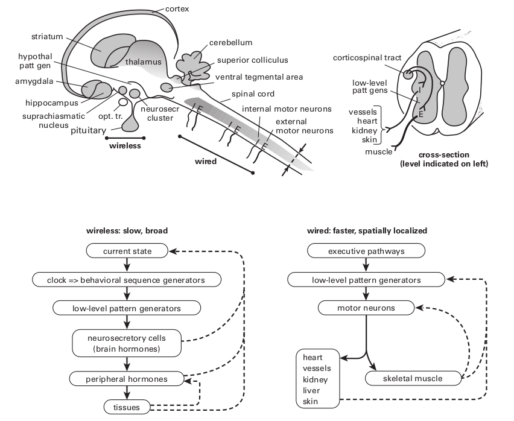
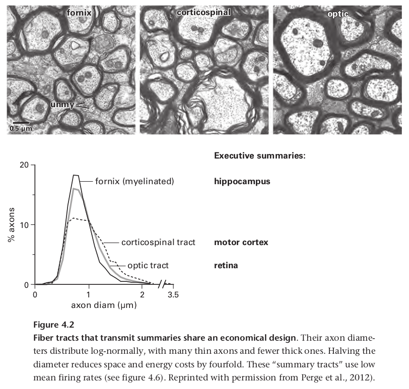

## How Bigger Brains Are Organized
>我感觉地球正在慢慢变暗. 夜的影子像一条展开的黑纱一样笼罩着大地, 从这条经线到下一条经线的所有生物, 将在太阳落山后躺下, 一个人可能正在观察着落日中的地球, 然后只看到一排排不断躺倒的身体，好像被土星的金色镰刀夷为平地了一般. 
>
>— W. G. Sebald, paraphrasing Sir Thomas Browne (edited for brevity)

前一章确立了大脑发送信息需要能量和空间，此外，更高的速率（每秒更多的比特）需要更多的能量和空间，因为它们需要更厚的轴突——空间和能量都随着直径的平方而增加。因此，最有效的设计将只发送必要的信息，并以允许服务于给定目的的最低速率发送。如果信息可以在没有任何电线的情况下发送，那是最好的，如果绝对需要电线，它们应该尽可能短和细。这些原则可以让我们深入了解更大的大脑是如何组织的。

一项设计决策无处不在，以至于需要立即提及，大脑将彼此之间连接的局部电路与远距离连接的电路隔离开来，原因很简单，也很根本：将电线与电路混合会增加电线的总长度和厚度——这违反了最小化电线的原则（第 13 章）。在哺乳动物中，如果轴突移动超过几毫米，它们就会分离，原因是增加距离需要增加传导速度以避免计算延迟，而这需要更粗的轴突。当轴突直径超过约 0.5 μm 时，轴突被髓鞘包裹，这导致直径每增加1μm，神经信号传导速度将增加6mm/ms(每毫秒6毫米)。因为活体大脑中的髓鞘发出白色的光，延伸的有髓轴突片被称为白质。

#### Saturn ’ s scythe sets brain design

地球上所有生命最深刻的条件，即独特地塑造每个有机体中每个细胞的条件，就是我们的星球每天围绕其轴心旋转。这种运动在 24 小时内将到达的太阳辐射强度改变了$10^{10}$倍，这一行为的影响是如此深远，以至于对于对于许多文化来说，它开启了创造的故事。一个熟悉的例子圣经中是：“上帝 将 光明与黑暗 分开 . . . 有晚上，有早晨，总有一天“  ---（创世记 1：4-5）。

动物当然可以在没有光的情况下生存（例如，在洞穴中），但是那些能够接触到光的动物通常会选择一天中的特定时间来觅食，从而选择特定范围的光强度。基本的选择是白天、夜间、昼夜交替间(黎明和黄昏)，这决定了他们对传感器的投资：具有色彩的精细空间的视觉与可能具有回声定位的敏锐的听觉，与嗅觉，加上胡须。觅食期也决定了它们对付占据同一位置的掠食者的策略：伪装、躲避飞行或潜行行为。

在其活跃期间，身体消耗化学能来支持外部行为，例如觅食，以及内部活动，例如消化和吸收，有些需要依赖于内部和外部的行为，例如体温调节。因此，活跃阶段涉及广泛的分解代谢模式：（1）将大聚合物分子（蛋白质、脂肪、碳水化合物、核酸）分解成它们的单体结构单元（氨基酸、脂肪酸、糖、核苷酸）；(2) 将单体分配到代谢活跃的组织；(3) 将单体转化为能驱动细胞过程的能量分子，例如 ATP；(4) 使用有氧（需要氧气）途径产生 ATP，因为它比厌氧途径的效率（每个葡萄糖单体的 ATP）效率高 16 倍。

在其不活动期间，身体转变为更新、合成代谢的广泛模式：(1) 组装新的聚合物用于生长、修复、重塑和免疫；(2) 通过将剩余单体储存为重新合成的聚合物来补充储备。因此，肝脏将多余的葡萄糖转化为储存的聚合物糖原；脂肪细胞将多余的葡萄糖转化为单体脂肪酸，然后用于构建储存聚合物脂肪。因为分解代谢和合成代谢涉及相反的生化反应组，同时运行它们是低效的。因此，自然选择将内部过程分离为日常周期不同部分的互补模式。

大脑本身参与分解代谢与合成代谢的循环。在清醒期间，它收集、处理和分发大量信息；在睡眠期间，大脑通过特定的调节酶切换到合成代谢，并使用此阶段来存储最近获得的信息（Dworak 等，2010）。这包括通过缩回某些突触并添加新的突触来重塑局部回路，在某些情况下，还会产生新的神经元（第 14 章）。

分解代谢和合成代谢之间的强制性交替涉及限制一组生化途径并加速另一组——这两者都需要时间。因此，每种模式都需要预测环境变化——以便最佳匹配睡眠和觅食的关键时间窗口。因此，在图 3.3 中看到的模式，即血压随睡眠而下降并随醒来而上升，是完全普遍的：身体和大脑中的所有过程都在这个循环中移动。因此，它们共享相同的广泛信号是有效的，虽然有些过程在黑暗中停止，而另一些在光明中停止，但所有过程都必须遵循土星的镰刀。

#### Brain clock

许多体细胞包含一个内在的时钟，由相互作用的蛋白质的振荡建立，周期约为 24 小时（昼夜节律）。但是如果没有一种机制来调整它们，这些时钟很快就会出现异相。因此，需要一个主时钟来跟踪这一天，包括它在绕太阳每年公转期间由于地球的轴向倾斜而不断发生的变化。主时钟包括一个离散的神经元簇（人类大约有 8,600 个），即视交叉上核 (SCN)。SCN 神经元的一个亚组包含一个生物钟，该生物钟每天根据来自视网膜的信号进行重置，该信号跟踪一天和季节中光强度的缓慢变化（图 4.1）。

主时钟既不需要颜色，也不需要空间信息，也不需要精细的时间信息——只需要缓慢的强度变化。因此，遵循两个设计原则，这块视网膜发送尽可能少，发送尽可能慢。它仅使用一小部分视网膜输出神经元 (0.2%)，这些神经元稀疏地覆盖视网膜并以非常低的速率发射，一天内平均只有几赫兹 (Crook 等人，2013；Wong，2012)。SCN 神经元本身在大约 8 Hz（白天）和大约 1 Hz（夜晚；Häusser 等人，2004）之间发射。为了遵循另一个原则，最小化导线，SCN 准确定位视束连接大脑的位置（见图 4.1）。但是主时钟如何控制整个身体和大脑的模式呢？

SCN 的相对较少的神经元，在老鼠中约为$10^4$个，无法想象它直接接触所有其他细胞（Güldner，1983）。他们的工作不是对每个细胞进行微观管理，而是主要是为了保持时间。除了时间，SCN 相当无知——基本上不知道内部生理和外部行为，因此，它无法负责任地告诉身体或大脑何时改变广义模式。例如，老鼠通常在晚上觅食，但如果食物在晚上变得稀少而在中午变得丰富怎么办？如果 SCN 直接指示指挥中心发布觅食命令，它可能会在没有晚餐的情况下让老鼠入睡。

#### Coupling clock to behavior: A hypothalamic network(耦合时钟与行为: 下丘脑网络)

相反，SCN 耦合到相邻区域，即下丘脑，由于其相对较小的范围，其信息非常丰富（图 4.1；Saper 等，2005；Thompson 和 Swanson，2003）。该区域监测无数内部参数，包括温度、血液中的盐分和代谢物水平、饱腹感、饥饿、口渴、疼痛、恐惧和性状态的荷尔蒙信号。它的一些神经元簇表达自己的内源性振荡器，其中至少有一个对食物供应的变化做出反应（Guilding et al., 2009）。该区域还监控存储的模式——例如最佳觅食地点和时间以及过去的危险。它使用各种感官监控外部环境。综合所有这些数据，加上 SCN 时钟时间，该区域计算出哪些需求是紧急的。然后，在机会和危险之间平衡紧迫性，它告诉老鼠是觅食、交配、战斗还是睡觉。执行时，它不会进行微观管理，而是调用适当的行为模式（Saper 等人，2005；Thompson & Swanson，2003）。

下丘脑网络，被设计去预测即将到来的需求，然后生成信号去引出各种行为，即引发各种有动机的行为，这些行为包括但不限于觅食、饮水和性行为。当这些激励信号被广播到其他大脑区域时，就会出现我们（在其他动物中）体验为欲望的主观成分。如果一个区域可以被认为是无意识欲望的源泉，那就是它。如此小的区域能够访问和整合如此多的信息并唤起如此多样的核心行为，这似乎令人惊讶。下丘脑网络怎么可能有足够的空间来做这么多呢？

部分答案是这个消息灵通的区域决定了低级模式的序列。例如，进食行为需要按以下顺序：嗅→咬→咀嚼→吞咽。这些组件由位于脑干下方效应器肌肉附近的专用模式发生器来详细编程。局部模式生成器管理协调行为所需的肌肉收缩的确切时间。平滑地调用每个组件的广泛序列可以通过简化的指令集指定给本地模式生成器 - 就像音乐指挥跟随乐谱从 80 名低水平演奏者手中召唤贝多芬交响曲一样，只有一根细长的指挥棒。这个类比并没有解释这两种情况的神奇之处，但它确实强调了设计原则：发送简单的指令并在本地计算复杂的细节（Büschges et al., 2011）。

这种经济的设计允许下丘脑区域为每种行为模式提供专用连接网络，它们足够紧凑，细电极可以单独刺激它们，表明每个网络都会唤起完整的行为模式，以及适当匹配的内脏模式（Hess，1949；Bard & Mountcastle，1947）。例如，一只猫的电极被放置以引发“愤怒的攻击”，它的背部拱起，发出嘶嘶声，并用裸露的爪子和牙齿进行攻击（躯体模式）。同时，它可以扩大瞳孔、竖起皱纹并增加心血管活动（内脏模式；Bü schges 等人，2011 年；Hess，1949 年）。将电极移动几毫米可以激活其他行为的电路：喂食或饮水，交配或蜷缩着睡觉。简而言之，许多连接网络适合一个小空间，因为它们的输出信息很简单。

每个行为的连接网络都明显地由一组丰富的输入信号引导。例如，受到电刺激进食行为网络的猫会攻击模仿老鼠的棉花球，但只是短暂的，而它会持续攻击真正的老鼠，直到电流停止。如果老鼠被一只大老鼠代替，猫就会退回到它的家角落。显然，喂食行为连接网络由识别猎物、区分真假猎物和识别危险猎物的输入调制——所有这些都基于与存储模式的比较。此外，每一种行为都充满了激励成分——当动物受到刺激进食时，很明显会寻找隐藏的食物并努力获取它（按下杠杆）。

这个小区域，即下丘脑，是如何进入大脑的感知、空间记忆、危险、经济价值和紧迫性的核心系统的？同样，它依赖于其他地方计算的细节，并且仅作为结论提供：来自 SCN 的时间；来自定义内部状态的无数来源的综合生理数据；从海马体和杏仁核中选择的位置和危险记忆；纹状体系统奖励价值的近期历史；前额叶皮层选择的高级分析。因为这些下丘脑区域的输入都发送摘要，所以它们可以使用低信息率和细纤维，从而大大节省空间（图 4.1）。能量也是守恒的，这使得这个关键区域的代谢率处于最低水平（Sokoloff，1977）。

这种策略允许主要的记忆器官海马体访问动物生活史的关键方面，但只发送适度的剪辑来指导特定的行为。这或许可以解释为什么海马体的输出束（穹窿）可以处理大部分细纤维，类似于视神经，它本身会从视网膜发送经过强烈编辑的摘要（第 11 章）。一个明显相似的策略允许大脑皮层的感觉运动区域通过类似精细结构的输出束（皮质脊髓束）为运动行为提供速度和敏捷性（图 4.2；Quallo 等人，2012 年）。简而言之，下丘脑网络旨在接收执行摘要作为输入，并提供广泛的备忘录作为输出（Perge 等，2012）。

#### Resurrection(复活)

