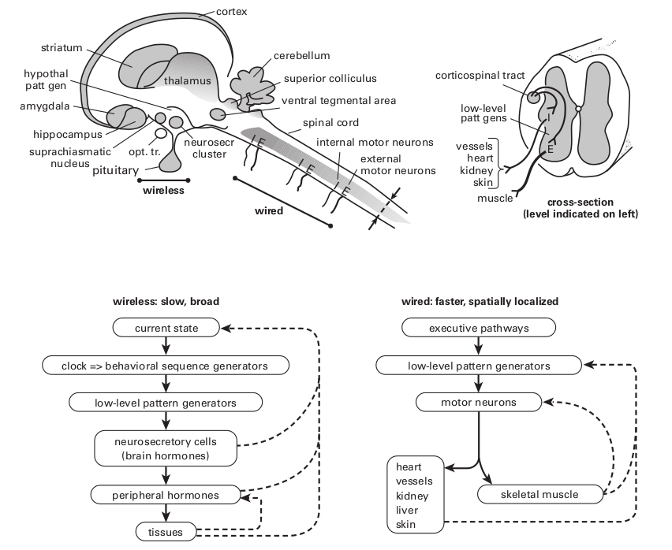
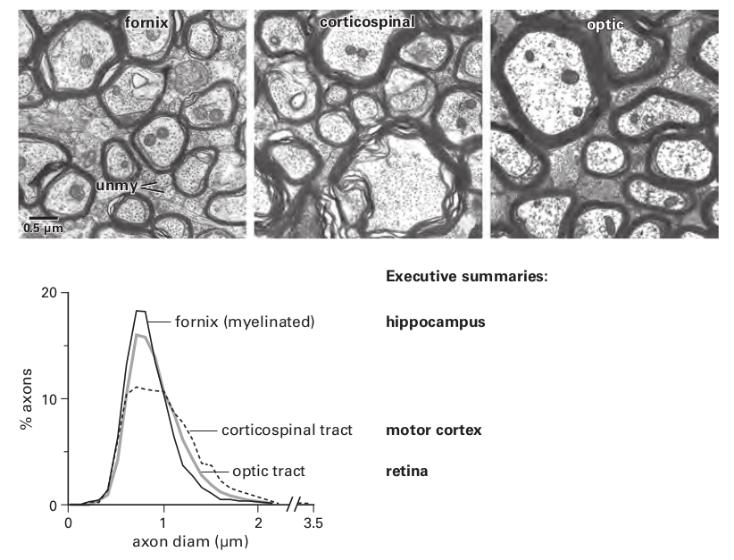
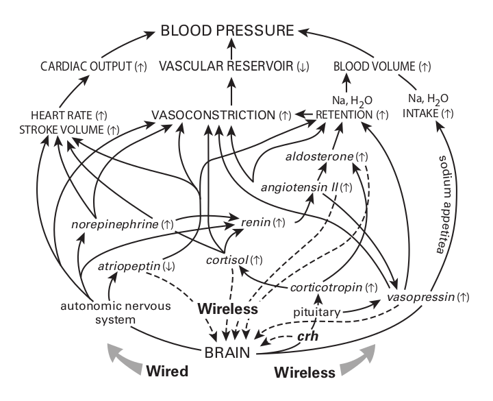
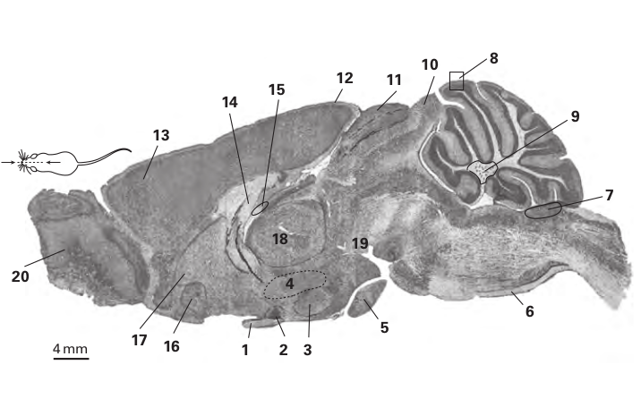
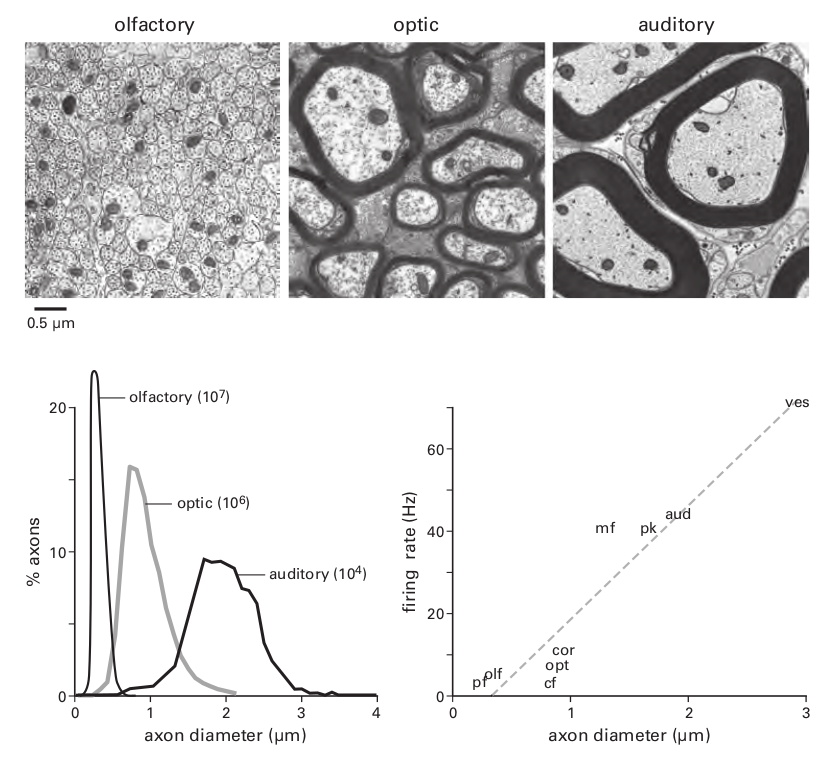
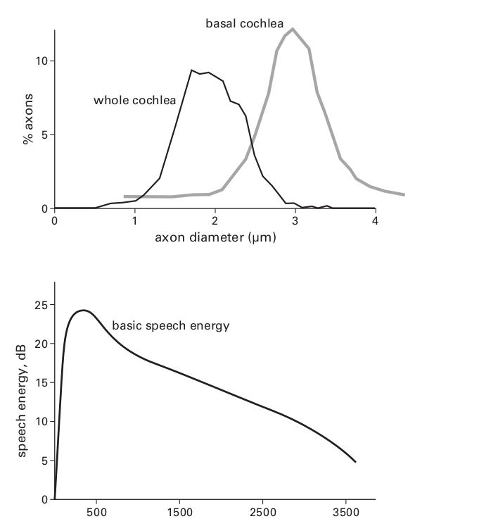
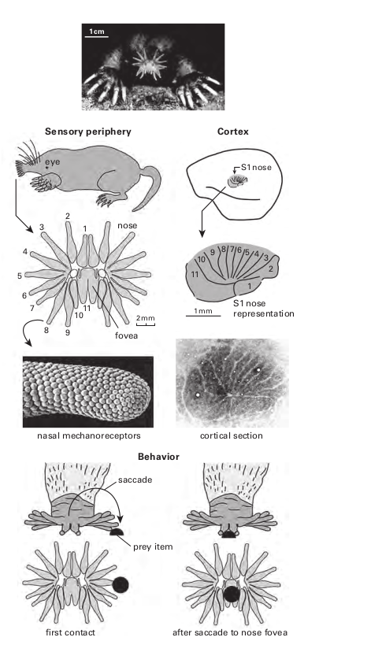

## Chapter 4. How Bigger Brains Are Organized
>我感觉地球正在慢慢变暗. 夜的影子像一条展开的黑纱一样笼罩着大地, 从这条经线到下一条经线的所有生物, 将在太阳落山后躺下, 一个人可能正在观察着落日中的地球, 然后只看到一排排不断躺倒的身体，好像被土星的金色镰刀夷为平地了一般. 
>
>— W. G. Sebald, paraphrasing Sir Thomas Browne (edited for brevity)

前一章确立了大脑发送信息需要能量和空间，此外，更高的速率（每秒更多的比特）需要更多的能量和空间，因为它们需要更厚的轴突——空间和能量都随着直径的平方而增加。因此，最有效的设计将只发送必要的信息，并以允许服务于给定目的的最低速率发送。如果信息可以在没有任何电线的情况下发送，那是最好的，如果绝对需要电线，它们应该尽可能短和细。这些原则可以让我们深入了解更大的大脑是如何组织的。

一项设计决策无处不在，以至于需要立即提及，大脑将彼此之间连接的局部电路与远距离连接的电路隔离开来，原因很简单，也很根本：将电线与电路混合会增加电线的总长度和厚度——这违反了最小化电线的原则（第 13 章）。在哺乳动物中，如果轴突移动超过几毫米，它们就会分离，原因是增加距离需要增加传导速度以避免计算延迟，而这需要更粗的轴突。当轴突直径超过约 0.5 μm 时，轴突被髓鞘包裹，这导致直径每增加1μm，神经信号传导速度将增加6mm/ms(每毫秒6毫米)。因为活体大脑中的髓鞘发出白色的光，延伸的有髓轴突片被称为白质。

#### Saturn ’ s scythe sets brain design(昼夜交替与大脑的设计)

地球上所有生命最深刻的条件，即独特地塑造每个有机体中每个细胞的条件，就是我们的星球每天围绕其轴心旋转。这种运动在 24 小时内将到达的太阳辐射强度改变了$10^{10}$倍，这一行为的影响是如此深远，以至于对于许多文化来说，它开启了创造的故事。一个熟悉的例子是圣经中提到的：“上帝将光明与黑暗分开 . . . 有晚上，有早晨，总有一天“  ---（创世记 1：4-5）。

动物当然可以在没有光的情况下生存（例如，在洞穴中），但是那些能够接触到光的动物通常会选择一天中的特定时间来觅食，从而选择特定范围的光强度。基本的选择是白天、夜间、昼夜交替间(黎明和黄昏)，这决定了他们对传感器的投资：具有色彩的精细空间的视觉与可能具有回声定位的敏锐的听觉，与嗅觉，加上胡须。觅食期也决定了它们对付占据同一位置的掠食者的策略：伪装、躲避飞行或潜行行为。

在其活跃期间，身体消耗化学能来支持外部行为，例如觅食，以及内部活动，例如消化和吸收，有些需要依赖于内部和外部的行为，例如体温调节。因此，活跃阶段涉及广泛的分解代谢模式：（1）将大聚合物分子（蛋白质、脂肪、碳水化合物、核酸）分解成它们的单体结构单元（氨基酸、脂肪酸、糖、核苷酸）；(2) 将单体分配到代谢活跃的组织；(3) 将单体转化为能驱动细胞过程的能量分子，例如 ATP；(4) 使用有氧（需要氧气）途径产生 ATP，因为它比厌氧途径的效率（每个葡萄糖单体的 ATP）效率高 16 倍。

在其不活动期间，身体转变为更新、合成代谢的广泛模式：(1) 组装新的聚合物用于生长、修复、重塑和免疫；(2) 通过将剩余单体储存为重新合成的聚合物来补充储备。因此，肝脏将多余的葡萄糖转化为储存的聚合物糖原；脂肪细胞将多余的葡萄糖转化为单体脂肪酸，然后用于构建储存聚合物脂肪。因为分解代谢和合成代谢涉及相反的生化反应组，同时运行它们是低效的。因此，自然选择将内部过程分离为日常周期不同部分的互补模式。

大脑本身参与分解代谢与合成代谢的循环。在清醒期间，它收集、处理和分发大量信息；在睡眠期间，大脑通过特定的调节酶切换到合成代谢，并使用此阶段来存储最近获得的信息（Dworak 等，2010）。这包括通过缩回某些突触并添加新的突触来重塑局部回路，在某些情况下，还会产生新的神经元（第 14 章）。

分解代谢和合成代谢之间的强制性交替涉及限制一组生化途径并加速另一组——这两者都需要时间。因此，每种模式都需要预测环境变化——以便最佳匹配睡眠和觅食的关键时间窗口。因此，在图 3.3 中看到的模式，即血压随睡眠而下降并随醒来而上升，是完全普遍的：身体和大脑中的所有过程都在这个循环中移动。因此，它们共享相同的广泛信号是有效的，虽然有些过程在黑暗中停止，而另一些在光明中停止，但所有过程都必须遵循土星的镰刀。

#### Brain clock(主时钟)

许多体细胞包含一个内在的时钟，由相互作用的蛋白质的振荡建立，周期约为 24 小时（昼夜节律）。但是如果没有一种机制来调整它们，这些时钟很快就会出现异相。因此，需要一个主时钟来跟踪这一天，包括它在绕太阳每年公转期间由于地球的轴向倾斜而不断发生的变化。主时钟包括一个离散的神经元簇（人类大约有 8,600 个），即视交叉上核 (SCN)。SCN 神经元的一个亚组包含一个生物钟，该生物钟每天根据来自视网膜的信号进行重置，该信号跟踪一天和季节中光强度的缓慢变化（图 4.1）。

> **Figure 4.1**
> **Brain ’ s master clock (suprachiasmatic nucleus) informs a network of high-level pattern generators in hypothalamus.** These coordinate internal physiology and external behavior. Their network selects a behavior, plus the endocrine and autonomic patterns needed to support it, and communicates the orders to low-level pattern generators, both wireless and wired. 
>
> **Upper left:** Longitudinal section (diagrammatic) shows the spatial layout of this hierarchy. Opt. tr., optic tract; hypothal patt gen, hypothalamic pattern generator. 
>
> **Upper right:** Cross section through spinal cord indicates that corticospinal tract tells local pattern generators to match internal physiology to external behavior. 
>
> **Lower:** Schemes for wireless and wired control.

主时钟既不需要颜色，也不需要空间信息，也不需要精细的时间信息——只需要缓慢的强度变化。因此，遵循两个设计原则，这块视网膜发送尽可能少，发送尽可能慢。它仅使用一小部分视网膜输出神经元 (0.2%)，这些神经元稀疏地覆盖视网膜并以非常低的速率发射，一天内平均只有几赫兹 (Crook 等人，2013；Wong，2012)。SCN 神经元本身在大约 8 Hz（白天）和大约 1 Hz（夜晚；Häusser 等人，2004）之间发射。为了遵循另一个原则，最小化导线，SCN 准确定位视束连接大脑的位置（见图 4.1）。但是主时钟如何控制整个身体和大脑的模式呢？

SCN 的相对较少的神经元，在老鼠中约为$10^4$个，无法想象它直接接触所有其他细胞（Güldner，1983）。他们的工作不是对每个细胞进行微观管理，而是主要是为了保持时间。除了时间，SCN 相当无知——基本上不知道内部生理和外部行为，因此，它无法负责任地告诉身体或大脑何时改变广义模式。例如，老鼠通常在晚上觅食，但如果食物在晚上变得稀少而在中午变得丰富怎么办？如果 SCN 直接指示指挥中心发布觅食命令，它可能会在没有晚餐的情况下让老鼠入睡。

#### Coupling clock to behavior: A hypothalamic network(耦合时钟与行为: 下丘脑网络)

相反，SCN 耦合到相邻区域，即下丘脑，由于其相对较小的范围，其信息非常丰富（图 4.1；Saper 等，2005；Thompson 和 Swanson，2003）。该区域监测无数内部参数，包括温度、血液中的盐分和代谢物水平、饱腹感、饥饿、口渴、疼痛、恐惧和性状态的荷尔蒙信号。它的一些神经元簇表达自己的内源性振荡器，其中至少有一个对食物供应的变化做出反应（Guilding et al., 2009）。该区域还监控存储的模式——例如最佳觅食地点和时间以及过去的危险。它使用各种感官监控外部环境。综合所有这些数据，加上 SCN 时钟时间，该区域计算出哪些需求是紧急的。然后，在机会和危险之间平衡紧迫性，它告诉老鼠是觅食、交配、战斗还是睡觉。执行时，它不会进行微观管理，而是调用适当的行为模式（Saper 等人，2005；Thompson & Swanson，2003）。

下丘脑网络，被设计去预测即将到来的需求，然后生成信号去引出各种行为，即引发各种有动机的行为，这些行为包括但不限于觅食、饮水和性行为。当这些激励信号被广播到其他大脑区域时，就会出现我们（在其他动物中）体验为欲望的主观成分。如果一个区域可以被认为是无意识欲望的源泉，那就是它。如此小的区域能够访问和整合如此多的信息并唤起如此多样的核心行为，这似乎令人惊讶。下丘脑网络怎么可能有足够的空间来做这么多呢？

部分答案是这个消息灵通的区域决定了低级模式的序列。例如，进食行为需要按以下顺序：嗅→咬→咀嚼→吞咽。这些组件由位于脑干下方效应器肌肉附近的专用模式发生器来详细编程。局部模式生成器管理协调行为所需的肌肉收缩的确切时间。平滑地调用每个组件的广泛序列可以通过简化的指令集指定给本地模式生成器 - 就像音乐指挥跟随乐谱从 80 名低水平演奏者手中召唤贝多芬交响曲一样，只有一根细长的指挥棒。这个类比并没有解释这两种情况的神奇之处，但它确实强调了设计原则：发送简单的指令并在本地计算复杂的细节（Büschges et al., 2011）。

这种经济的设计允许下丘脑区域为每种行为模式提供专用连接网络，它们足够紧凑，细电极可以单独刺激它们，表明每个网络都会唤起完整的行为模式，以及适当匹配的内脏模式（Hess，1949；Bard & Mountcastle，1947）。例如，一只猫的电极被放置以引发“愤怒的攻击”，它的背部拱起，发出嘶嘶声，并用裸露的爪子和牙齿进行攻击（躯体模式）。同时，它可以扩大瞳孔、竖起皱纹并增加心血管活动（内脏模式；Bü schges 等人，2011 年；Hess，1949 年）。将电极移动几毫米可以激活其他行为的电路：喂食或饮水，交配或蜷缩着睡觉。简而言之，许多连接网络适合一个小空间，因为它们的输出信息很简单。

每个行为的连接网络都明显地由一组丰富的输入信号引导。例如，受到电刺激进食行为网络的猫会攻击模仿老鼠的棉花球，但只是短暂的，而它会持续攻击真正的老鼠，直到电流停止。如果老鼠被一只大老鼠代替，猫就会退回到它的家角落。显然，喂食行为连接网络由识别猎物、区分真假猎物和识别危险猎物的输入调制——所有这些都基于与存储模式的比较。此外，每一种行为都充满了激励成分——当动物受到刺激进食时，很明显会寻找隐藏的食物并努力获取它（按下杠杆）。

这个小区域，即下丘脑，是如何进入大脑的感知、空间记忆、危险、经济价值和紧迫性的核心系统的？同样，它依赖于其他地方计算的细节，并且仅作为结论提供：来自 SCN 的时间；来自定义内部状态的无数来源的综合生理数据；从海马体和杏仁核中选择的位置和危险记忆；纹状体系统奖励价值的近期历史；前额叶皮层选择的高级分析。因为这些下丘脑区域的输入都发送摘要，所以它们可以使用低信息率和细纤维，从而大大节省空间（图 4.1）。能量也是守恒的，这使得这个关键区域的代谢率处于最低水平（Sokoloff，1977）。

这种策略允许主要的记忆器官海马体访问动物生活史的关键方面，但只发送适度的剪辑来指导特定的行为。这或许可以解释为什么海马体的输出束（穹窿）可以处理大部分细纤维，类似于视神经，它本身会从视网膜发送经过强烈编辑的摘要（第 11 章）。一个明显相似的策略允许大脑皮层的感觉运动区域通过类似精细结构的输出束（皮质脊髓束）为运动行为提供速度和敏捷性（图 4.2；Quallo 等人，2012 年）。简而言之，下丘脑网络旨在接收执行摘要作为输入，并提供广泛的备忘录作为输出（Perge 等，2012）。

> **Figure 4.2**
> **Fiber tracts that transmit summaries share an economical design.** Their axon diameters distribute log-normally, with many thin axons and fewer thick ones. Halving the diameter reduces space and energy costs by fourfold. These "summary tracts" use low mean firing rates (see figure 4.6). Reprinted with permission from Perge et al., 2012).

#### Resurrection(苏醒)

从沉睡中醒来感觉很可怕，也难怪，身体和大脑中的每个细胞都在努力根据其分解代谢阶段发挥作用——违背所有保持在合成代谢阶段的中央指令。但是当合成代谢完成时——当身体补充了储备、治愈了伤口、重建了肌肉和免疫系统，当大脑的分类机制完成了“删除”或“保存”时——所有的细胞和组织最终都苏醒了。

SCN 向下丘脑网络发出“黎明”信号，然后由下丘脑网络根据许多因素决定是否是顺畅地苏醒，如果是这样，网络会向附近的神经元簇（大小与 SCN 相当）发出信号，以分泌肽递质食欲素。食欲素神经元在大脑上广泛投射，以激活一系列调节唤醒的系统（Sakurai，2007）。由于食欲素神经元将时钟与大脑的唤醒系统相结合，缺乏食欲素的动物往往会意外地陷入睡眠。

食欲素簇专门唤醒嗅觉传感器，增强其敏感性，并唤醒觅食的运动机制（Julliard 等，2007）。在主时钟的通知下，食欲素集群使用下丘脑模式生成器网络来协调警觉性、嗅觉敏感性和饥饿感——所有这些都是为了在适当的时间开始觅食。现在是大脑信号恢复广泛分解代谢模式的时候了：调动来自肝脏的能量储存和来自脾脏和骨髓的氧载体（红细胞）；用来自肾脏的盐水重新扩张血管水库。现在是解除合成代谢过程以促进生长、修复和免疫的时候了。

总之，下丘脑网络管理着整个大脑及其所有功能——没有微观管理。但是现在，微观管理呢？指挥家很好，但必须有人演奏巴松管。那么，涉及微观管理的过程是如何受这里考虑的设计原则控制的呢？

#### Distributing output patterns

**Wireless signaling**

设计原则规定，最慢的过程应该由最慢的效应器和最少的线路控制。在可以不通过连线发送信号的地方，那是最好的。因此，对广泛的分解代谢和合成代谢模式进行微观管理的效应器是内分泌腺。例如，肾上腺分泌一种类固醇激素，可以增强肾脏对钠的吸收，另一种可以增强分解代谢，调动能量，抑制生长和修复。睾丸分泌增强肌肉的合成代谢类固醇，肝脏分泌刺激红细胞生成的激素。是什么协调了这些低级效应器？来自垂体的更高水平的内分泌信号又受大脑激素的控制。图 4.3 总结了两种特定功能（血压和肌肉收缩）的无线调节。

脑激素由神经分泌神经元直接分泌到循环中，神经分泌神经元的簇与模式发生器的下丘脑网络相邻。模式生成器通过非常细、非常短的电线（图 4.1）交付他们消息灵通但简单的订单。下丘脑网络中的每个节点都可以调用特定模式的大脑激素释放到垂体上游的血液中，从而刺激它将自己的激素释放到全身循环中。整个内分泌网络在几秒钟内到达身体的每个细胞。速度不是非常快，但另一方面，消息是在没有任何电线的情况下广播的，并且比心脏已经在做的能量成本为零。

这个无线系统的天才部分在于接收器。尽管所有体细胞都暴露给了全部激素，但只有某些细胞类型才会下载给定的信息。为此，它们会产生一种特定的分子受体，该受体结合特定的激素并触发特定的细胞内反应。因此，扩散到全身的信息可以被有限数量的细胞类型读出——它们对信号的反应是协调的。第 5 章描述了它如此经济的分子机制和原因。

另一个聪明的特点是受体细胞可以表达分子受体的不同亚型，每个亚型都可以在细胞内以自己的刻板印象与特定的第二信使耦合。例如，一个信使可以极大地放大激素信号，并用它来激活或抑制某些细胞内过程。因此，无线广播的单个消息可以在不同组织之间引起复杂的响应模式，包括负相关和正相关。

例如，骨骼肌通过粗电线上的快速信号迅速作用于外部世界。然而，它也是体内的一种组织，因此受到各种激素的无线调节，包括合成代谢类固醇、胰岛素、生长激素和甲状腺素（图 4.3，下图）。因此，无线信号有助于大脑有效地耦合内部和外部世界。

> **Figure 4.3**
> **Wireless regulation broadcasts slow signals to efficiently couple inner and outer worlds.** 
>
> **Upper:** To adjust blood pressure rapidly and locally, the brain uses wires (autonomic nerves). But to shift pressure slowly and broadly, it uses wireless signals (hormones) ( italicized ). Dashed lines indicate wireless feedbacks to brain. Feedbacks by wire are used by certain sensors, such as for oxygen and pressure, but are not shown. CRH, corticotropin releasing hormone . 
>
> **Lower:** Catabolism in muscle activates rapidly to support contraction; so to rapidly activate catabolism, the brain uses wires. But anabolism in muscle is slower, so the brain activates those processes with wireless signals ( italicized ).

**Wireless collecting**

大脑还使用无线接收器，这是一组位于大脑和血管之间专门接口的脑室周围器官。血液和大脑部分之间存在正常屏障，从而使神经元暴露于循环化学物质中。这些神经元通过表达适当的分子受体来选择它们需要的东西。例如，穹窿下器官位于调节对盐和水的食欲的下丘脑模式发生器附近（图 4.4）。神经元感知血液中的钠含量，以及告诉肾脏保存钠的激素（血管紧张素 II 和醛固酮）水平（图 4.3，上图）。因此，这个无线接收器关闭了预期调节的循环：大脑向肾脏发送有关盐和水的指令，而大脑的穹窿下器官无线接收有关当前钠平衡状态的信息。

#### Need for wires: Faster, spatially directed signaling

神经分泌物缓慢扩散（几秒钟内）并缓慢调节靶细胞，因为释放到庞大血管系统中的激素分子包被大大稀释（浓度约为 10 – 9 M）。因此，分子受体需要高亲和力来捕获激素，因此它们的解除结合速度很慢（第 6 章）。然而，这种延迟是无关紧要的，因为它们调节的细胞内过程通常跨越几分钟或几小时。因此，无线信号的缓慢节奏与它们的目标相匹配，即缓慢上升和下降的生理过程。

在需要更快反应的情况下，激素被释放到直接通向下游目标的门静脉中。由于激素稀释程度较低，它可以被较低亲和力的受体捕获，这些受体解结合得更快，并在结合/反应曲线的陡峭部分上起作用。例如，大脑激素促肾上腺皮质激素释放激素被分泌到通向垂体的门脉血管中；肾上腺皮质将类固醇激素分泌到通向肾上腺髓质的门静脉中。然而，某些内部过程必须更加智能地进行，这需要电线。

例如，为了让大脑开始改变身体姿势，它必须改变肌肉收缩的模式。这将需要改变氧气的分布，从而改变血管舒缩模式以重新分配血液。此外，活跃的肌肉需要吸收葡萄糖，这需要触发胰腺细胞分泌胰岛素。这些血管和内分泌调整需要与肌肉活动一起启动，而这些更快、空间定位的信号需要电线。

这种需求由自主神经元提供，其轴突接触每个内部器官和血管。它们的平均发射率小于 1 Hz，因此在香农的意义上，它们以低信息速率传输。这看起来很直观，因为一条信息——“分泌一些胰岛素”或“收缩这个血管”——在某种程度上超出了“是”或“否”（一点点），但不是很多，因此只需很少的尖峰就可以完成。以低于 1 Hz 的速率传输的信号使用最好、最便宜的轴突。

是什么管理这些自主效应器？ 答案：低水平模式发生器位于输出簇附近的脑干和脊髓（图 4.1，右）。 后者形成两个子系统（交感神经和副交感神经），它们使用不同的发射器。 每个发射器耦合到几种受体类型，这些受体又耦合到不同的第二信使。 因此，自主效应器可以产生丰富的内部模式。 他们是管弦乐手——准备好并等待指挥选择下一个模式和节奏。

是什么管理着改变身体姿势的肌肉？同样，答案是位于运动神经元簇附近的低级模式生成器。这些模式生成器必须增加某些肌肉的力量并减少其他肌肉的力量——以恰到好处的数量和恰到好处的时刻。精确的时序需要大电流、快速积分（短时间常数）和高平均放电率（第 7 章）。因此，这些模式生成器需要具有厚树突和厚轴突的大型神经元。为了降低成本，它们位于效应器附近。这延长了监督它们的下行路径，但如前所述，这些路径更便宜（图 4.2）。

电机控制需要快速反馈。 来自皮肤和关节感受器的最快信号传播速度约为$50ms^{-1}$，而来自肌肉感受器的信号传播速度约为$100ms^{-1}$。 这些速度需要非常厚的、有髓鞘的轴突，直径为 8 – 17 μ m。 这些纤维比下行束粗 10 倍，因此体积大 100 倍。 如果模式发生器位于大脑的较高位置，例如，靠近下丘脑模式发生器，即使这些轴突很大，反馈也会延迟。 因此，对快速输出和快速反馈的综合需求将运动模式的低级生成器限制在其效应器附近，即运动神经元（图 4.5）。

#### Arrangement of effector clusters

> 1. optic nerve
>
> 2. suprachiasmatic nucleus (clock)
>
> 3. hypothalamic neuroscretory cluster (brain hormones)
>
> 4. hypothalamic pattern generators (high-level)
>
> 5. pituitary gland (wireless signals → periphery)
>
> 6. corticospinal tract (summaries from motor cortex to low-level pattern generators)
>
> 7. area postrema (monitor blood chemistry)
>
> 8. cerebellar cortex (correct errors of intention)
>
> 9. cerebellar output clusters (integrates cerebellar output)
>
> 10. inferior colliculus (early auditory processing)
>
> 11. superior colliculus (orient head and eyes toward key information sources)
>
> 12. primary visual cortex (far from long-term storage sites)
>
> 13. frontal cortex (near long-term storage sites)
>
> 14. fornix (summaries from hippocampus to hypothalamic pattern generators)
>
> 15. subfornical organ (monitor blood sodium and related hormones)
>
> 16. amygdala (tag high-level patterns for storage)
>
> 17. striatum (evaluate predictions of reward)
>
> 18. thalamus (process signals for economical transfer to cerebral cortex)
>
> 19. ventral tegmental area (dopamine neurons → frontal cortex + striatum)
>
> 20. olfactory bulb
>
> **Figure 4.4**
> **Longitudinal section through rat brain.** This section shows relative size and location of various structures discussed in this chapter. From 
>
> http://brainmaps.org/ajax-viewer.php?datid=62&sname=086&vX=-47.5&vY=-22.0545&vT=1 
>
> © The Regents of the University of California, Davis campus, 2014.    

神经分泌簇位于下丘脑网络附近，因此可以用很少的导线调节它们（图 4.1）。 但自主神经和躯体运动神经元簇远离下丘脑网络，从中脑向下分布通过脊髓。 这种扩展的分布为它们的低级模式生成器提供了空间。 自主效应器及其模式发生器的总体积，在脊髓长度上的总和，比下丘脑网络的总体积大约 100 倍。 这种对空间的需求很容易证明将大脑向后延伸是合理的，并有助于解释为什么这种设计被保存下来。 此外，扩展允许额外的效率。

共享来自本地模式生成器的输入的神经元应该聚集在一起。 因此，调节内部器官和内分泌细胞的自主效应神经元排列成一列，允许它们共享来自自主模式的柱状低水平发生器的输入。 躯体运动神经元也排列成列——平行于自主神经列并靠近它； 因此，内部生理和外部行为的电路可以通过短线在本地进行协调（图 4.1）。

因为用于内部生理和行为的低级模式发生器位于一起，下行束可以一起调节它们而无需额外的电线。 例如，皮质脊髓束将一个简化的指令集从运动皮层发送到肌肉的低级模式生成器（Yak-ovenko 等人，2011 年）以及相邻的肾脏自主模式生成器（见图 4.1）。 因此，下行的信息，“起来！ ”可以有效地发送到两个效应器（Levinthal & Strick，2012）。

躯体运动神经元将这种设计扩展到更精细有效的组件放置（图 4.5）。给定肌肉的运动神经元经常一起发射，这意味着共享输入，因此它们会聚集在一起。通过关节协同作用的肌肉运动神经元也经常一起发射，这也意味着共享输入，因此它们的集群保持紧密。跨多个关节合作的肌肉的运动神经元也会同时发射，但频率较低，因此它们的簇相距较远，纵向分布，其间隔大致对应于它们的共激活频率。最后，拮抗肌的运动神经元倾向于相互激发，屈肌兴奋/伸肌被抑制。这种互惠依赖于一个共享回路（交叉抑制，如蠕虫），因此拮抗运动神经元的簇也保持紧密 - 在沿着脊髓延伸的平行列中（Sterling & Kuypers，1967；图 4.5）。

简而言之，躯体运动神经元根据一个广泛的设计规则分布：一起激发的神经元应该定位在一起。 这条规则也适用于感觉图和大脑所有有序的地形连接（第 12 章和第 13 章）。

#### Design for an integrated movement

运动神经元在纵向列中的放置允许模式生成器经济地唤起整合的肢体运动（Bizzi & Cheung，2013）。任务是激发跨多个关节的数十块肌肉的收缩单位并抑制它们的拮抗剂（Sherrington，1910；Creed & Sherrington，1926）。关键是运动神经元在长距离（约 1 毫米）的柱内纵向发送其树突，以便协同剂的树突重叠。然后，输入轴突可以简单地通过在列内分支为 T 并定期分布突触来共同激活协同作用。强协同剂将大大重叠它们的树突，因此比重叠较少的弱协同剂共享更多输入（图 4.5，下图）。运动神经元列的所有输入都遵循此规则，包括来自感觉受体的轴突、来自局部模式发生器的轴突和来自皮层的轴突（图 4.5，下）。这种设计比任何其他可能的几何形状使用的线更少，因此它是最佳的（第 13 章）。

模式生成神经元使用厚的有髓轴突同步激活运动神经元列不同水平的运动神经元。 为了做到这一点，同时对突触电路的干扰最小，轴突被引导到白质中，在达到适当的水平后，它们重新进入运动柱并连接（图 4.5）。

这种架构的一个好处是来自同一位置的不同感觉受体可以有效地引起相反的反应。在这里，来自足部的压力感受器连接到伸肌模式发生器，因此当重量转移到足部时，所有伸肌都被激发以支撑肢体。疼痛感受器连接到屈肌模式发生器，因此当重量转移到那只脚时，所有的屈肌都被激发（而伸肌被抑制）以收回肢体。这些替代决策在最低级别完成，从而避免了咨询更高级别的时间、空间和精力成本。皮质脊髓束将“执行摘要”从运动皮层传递到模式发生器。所以皮质脊髓轴突可以简单地说“Flex！”，剩下的就是本地电路（Bizzi & Cheung，2013）。

#### Collecting input patterns

> **Figure 4.5**
> **Efficient wiring for integrated movement.**
>
> **Upper:**  Cross section through the spinal cord. Flexor and extensor motor neurons for the leg form separate clusters, which locate near each other and also near to the pattern-generator neurons that reciprocally excite and inhibit them. The flexor and extensor clusters form parallel columns extending over several segments of spinal cord. Each column is structured as a motor map: motor neurons for thigh muscles locate at higher spinal levels, then in descending order: knee, ankle, and toes. Within a column, the motor neuron dendrites extend longitudinally for about 1 mm in both directions; consequently motor neuron dendrites for synergistic muscles overlap. Their overlap allows a pattern-generator axon to excite motor neurons for synergistic muscles simply by spreading its axon arbor longitudinally within the dendritic plexus. This uses the least possible wire to excite motor neurons for several muscles. The longitudinal dendrites appear in this plane as dots scattered within the motor neuron clusters. Motorneuron clusters for hip muscles locate separately, near the midline. Patt gen, pattern generator.
>
> **Lower:** Longitudinal section through spinal cord in the plane indicated by arrows in upper diagram. This plane reveals the motor neurons ’ longitudinal dendritic plexus that spans the motor map from hip to toe. This plane shows the pattern generator axons leaving the white matter to enter a flexor or extensor dendritic plexus where they encounter overlapping dendrites of synergistic motor neurons. The pattern generator neurons do not orient longitudinally and thus do not overlap. Consequently, a sensory axon or a corticospinal axon, coursing longitudinally within the pattern-generator columns, can efficiently access a discrete subset of pattern-generator neurons and thus a subset of motor neurons for a particular integrated limb movement.

**Different senses, different costs**

使更大的大脑成为如此好的投资的更广阔的世界包含由各种形式的能量携带的看似无限的模式：电磁（光），热，空气的机械振动（声音），直接的机械接触，挥发性分子（气味），溶液中的分子、电模式、磁场和重力。动物进化出机制来收集所有这些形式所携带的信息——并用它们来寻找食物和配偶，避开掠食者，并在空间和时间上定位。挑战在于决定投资哪些形式以及投资多少。有些本质上很便宜，而另一些本质上很昂贵。然而，对于某些生活方式来说，便宜是行不通的，而昂贵的却是得到了很好的回报。因此，动物根据其谋生方式以及地球日常自转的哪个阶段从模式的宇宙中进行选择。

白天觅食的动物大量投资于对 300 – 700 nm 波长敏感的光感受器。夜间觅食的动物大量投资于其他受体。捕食老鼠的蛇使用温度感受器将其范围扩展到红外线（约 800 nm）。飞蛾和食果蝙蝠大量投资于嗅觉受体，但某些蝙蝠更喜欢飞蛾而不是水果，因此大量投资于产生、检测和处理超声波（频率高达 180 kHz）的声纳系统。

栖息在清水中的鱼会投资于感光器，因为光谱内容随着深度向蓝色移动，那些栖息在较深水域的鱼也会相应地改变其峰值感光度。居住在洞穴中的鱼不投资感光器并且基本上是盲目的。某些生活在富饶但浑浊的热带河流中的鱼类投资于电感应系统，这些系统通过发射高达 2 kHz 的短暂电脉冲或正弦波来询问周围环境，并用电感受器测量电场。

传感器的成本差异很大。 嗅觉传感器很慢并且以较低的平均速率传递信息，因此它们的轴突非常精细，接近通道噪声设定的极限（第 7 章）。 视觉更快，因此视网膜神经节细胞轴突（视神经）以更高的平均速度发射并且稍微厚一些； 并且听力仍然更快，因此听觉轴突要粗得多（图4.6)。 轴突口径的这种进展对应于发射率的线性进展（图 4.6）。 然而，由于空间和能源成本随着直径和发射率而急剧上升，最粗的听觉轴突的成本是嗅觉轴突的 100 倍（Perge 等人，2012 年）。

皮肤感应系统遵循类似的设计规则。机械传感器采用各种机制来转换和过滤压力和触摸。有些感知高频（振动）并通过粗轴突传输（图 10.3）；其他机械传感器感知较低频率并通过更精细的轴突传输。疼痛和温度传感器以最低的峰值速率发送并使用最好的轴突。在中心，快速和慢速系统并行处理，并且在很大程度上通过不同的区域到达它们的丘脑中继（Willis & Coggeshall, 1991; Maksimovic et al., 2013; Boyd & Davey, 1968）。

当然，收集初级图案的这些成本仅仅是首付。 以高速率到达的听觉模式必须以高速率处理——因此它们的初始中央电路使用粗线和快速（昂贵）突触（Carr & Soares，2002）。 哺乳动物大脑中最昂贵的部分是那些致力于早期听觉处理的部分，例如上橄榄核和下丘（见图 4.4；Mogensen 等，1983；Borowsky & Collins，1989）。 因此，食虫蝙蝠的超声成像系统本质上比食果蝙蝠的嗅觉系统更昂贵。

对于使用电信号的鱼来说，成本是巨大的。 一组神经元需要产生高频脉冲； 另一个需要检测它们并向大脑发出信号。 那么，食虫蝙蝠的超声成像过程代价是很高的。 该系统所需的计算由小脑电路执行，因此小脑大大扩展（图 4.7）。 因此，与体型相当的鳟鱼（图 4.7）相比，使用电信号的鳐鱼的大脑是巨大的（图 4.7），并且需要占用动物 60% 的能量预算！ 这强调了大脑设计的目的不一定是为了廉价运行——因为那样会限制功能。 相反，它是为了确保大脑的投资得到回报。

> **Figure 4.6**
> **Unit cost of sending information differs greatly across senses.** 
>
> **Upper row** : Electron micrographs of cross sections through the olfactory, optic, and cochlear nerves
> shown at the same magnification. 
>
> **Lower left** : Distributions of axon diameters. The auditory axons are nearly sevenfold thicker than the olfactory axons, so their unit volume and energy cost are nearly 50-fold greater. In parentheses are the number of axons serving that sense. The relation is reciprocal: low unit cost allows a many-unit design (olfactory) whereas high unit cost restricts the design to fewer units (auditory). 
>
> **Lower right** : Higher mean firing rates require thicker axons. Vestibular axon unit cost is 100-fold greater than that unit cost of an olfactory axon. Reprinted with modifications and permission from Perge et al., 2012.

**Design and usage of sensor arrays**

在哺乳动物的耳朵中，每个听觉毛细胞都被调谐到一个特定的频率范围——这些细胞沿着耳蜗的基底膜映射，从顶端的最低频率（人类为 20 Hz）到底部的最高频率（20,000 Hz）。 服务于最高频率的轴突以更高的平均速率发射，并且比最低频率的轴突厚大约三倍。 因此，它们使用了将近 10 倍的体积和能量（图 4.8）。 对人类来说，最关键的频率是说话的频率——峰值低于 500 赫兹，然后逐渐下降到 3500 赫兹（图 4.8）； 从大脑经济的角度来看，幸运的是，自然选择将人类语言置于听觉神经频率范围的低端，这是最经济的（图 4.8）。 这一设计决策还为中央处理节省了下游成本。

事实证明，音乐使用与人类语音相同的频率。音乐中最频繁的间隔对应于人类语音的标准化频谱中的最大功率集中。此外，音阶的结构、半音音阶间隔的首选子集以及协和与不协和的顺序都可以从语音中的幅度 - 频率配对的分布中预测（Schwartz 等，2003）。因此，音乐的音调特征与人类发声相匹配，后者是音调刺激的主要自然来源。鉴于音乐用于表达和交流情感，这种匹配似乎是可以理解的。蓝调似乎唤起了悲伤，因为这些是古代人类在表达悲伤时发出的声音（Bowling 等人，2012；Han 等人，2010）。

音乐由右半球的听觉区域处理，该区域专门用于感知和表达情感； 语言由左侧的相应区域处理。 在两个半球分析具有相同频率和结构的声音似乎是多余的，但计算方式却大不相同，因此将电路分开是经济的。 投入如此大量的神经资源有什么回报？ 人类的生存和繁衍需要社会合作——这取决于情感和认知上的交流。 简而言之，音乐有助于社区生活，让大脑变得困难，至少可以忍受，偶尔也很快乐（Chanda & Levitin, 2013）。

> **Figure 4.7**
> **Mormyrid brain greatly expands cerebellar structures.** 
>
> **Upper**:  Electrosignaling Mormyrid from turbid waters resembles trout in body size but requires a far larger brain,most of which is a highly elaborated cerebellum. 
>
> **Lower**:  Longitudinal section shows that the cerebellum (outlined) occupies most of the brain, completely obscuring the cerebrum. Central processors of high temporal frequencies often use a cerebellar-like design, including, in mammals, the dorsal cochlear nucleus (Oertel & Young, 2004; Bell et al., 2008). Reprinted from Nieuwenhuys & Nicholson (1969).

> **Figure 4.8**
> **Speech uses lower frequencies and thus finer axons.** 
>
> **Upper**: Axons from the highfrequency end of cochlea (basal) are thicker and cost more space and energy than axons from the low-frequency end. 
>
> **Lower**: Human speech occupies mostly frequencies below 500 Hz — the cheaper end. Upper, reprinted with permission from Perge etal., 2012); lower, after Freeman (1999).

传感器阵列必须足够精细，以解决对其任务至关重要的细节。例如，人类视觉解析每度 60 个周期的空间模式，这需要每度 120 个视锥细胞（奈奎斯特规则）。在二维中，这相当于 200,000 个锥体$mm^{-2}$ (Packer et al., 1989)。同样，这只是首付——为了保持这种空间分辨率，从每个锥体到视觉皮层的通信线路必须保持独立。所有设计都必须预见后续成本。

一般的解决方案是对数组的一小部分进行密集采样，而对其余部分进行更稀疏的采样。 因此，我们的视网膜将一半的视锥细胞密集地包裹在一个小斑块（中央凹）中，该斑块仅占视网膜表面的 1%。 在这种设计中，视觉皮层将其一半的体积用于处理中央凹所传递的内容——从而允许进行精细分析，而不会不可接受地扩大皮层。

为了使这种策略发挥作用，通常需要使采样阵列移动——这样它就可以针对任何具有潜在重要性的特征进行训练。因此，中央凹需要一个肌肉系统来移动眼睛，加上一个控制系统来指导其不断的探索，以及一个更高级别的系统来选择要跟踪的对象。效果是稳定中央凹上的物体，使其能够以高空间分辨率进行采样。稳定带来了额外的经济性：它减少了中央凹的时间频率范围，允许中央凹神经元（及其后续处理器）以较低的信息速率运行，即在空间和能量利用效率的成本曲线的陡峭部分上运行。

这种策略也适用于触觉——指尖、嘴唇和舌头的传感器密集分布——并解释了人类皮层地图中扭曲的*homunculus*，以及代表胡须的小鼠皮层中的桶形场（Pammer 等人，2013 年） ) 和星鼻鼹鼠怪异的面容（图 4.9）。

> **Figure 4.9**
> **Design of sampling arrays.** Fine sampling required for spatial acuity requires large areas of cortex. Shown here is the mechanosensory system of the star-nosed mole.
>
> **Upper**: Frontal view shows tip of nose surrounded by 22 fleshy appendages. 
>
> **Middle left**: Each nostril surrounded by 11 appendages, all covered by mechanoreceptors. No.11 bears the densest distribution of receptors and thus serves as a mechanosen-sory fovea. 
>
> **Middle right**: Each appendage is represented separately in somatosensory cortex (S1), with no.11 occupying the greatest area. 
>
> **Lower**: When a lateral append-age contacts an object of interest, the nose shifts to touch it with no.11, the foveal appendage. Reprinted with permission from Sachdev and Catania (2002).

#### Motorizing the sensors

对精细的移动采样器的战略选择引发了另外两个设计问题：首先，如何将传感器指向需要它的地方，其次，如何告诉大脑传感器正在被指向。 这两个设计问题都需要一个专用部分，即上丘脑（图 4.4）。

选择传感器指向何处的机制需要视觉输入。 当中央凹外的视网膜区域感应到移动的物体时，视网膜信号会驱动一个运动机制，将中央凹巧妙地移动到该物体上并跟踪它。 上丘通过将视网膜图与运动图对齐来有效地做到这一点，这样每个视网膜点，使用极短的轴突（约 0.1 毫米）可以激发运动图中的相应点并将眼睛驱向该位置。 其他感官也与同一个运动图耦合，因此它们中的任何一个——闪光、砰砰、拍打——都可以宣布哪个区域的空间需要大脑立即关注。

当然，我们也会关注与某些存储模式相匹配的较温和的刺激，尤其是当被内在的欲望信号（食物、性）唤醒时。 因此，用于定位传感器的碰撞机制需要了解许多问题。 关于看哪里的决定是在皮层水平上做出的，这需要大脑皮层与上丘脑进行沟通。

上丘层接收视觉模式并向上传递以供与运动相关的皮层区域进行进一步处理，并且它们接收来自相同区域的信号（Berman & Wurtz，2010）。 更深的丘层收集来自最高执行层——额叶和顶叶皮层——的信号，这些信号传达了关于去哪里看的高度明智的决定。 做出该决定所需的计算量很大，涉及大脑的大部分。 但是这个决定可以通过一个相当适中的通道传递给上丘，该通道只需要 6% 的皮质丘通路（Collins 等，2005）。

简而言之，下丘脑的深层知道眼睛的方向——该电路在运动图和协调眼部肌肉的低级模式发生器之间硬连线。更深层通过将原始感觉输入与从皮层下降的经过处理的信号相结合来学习是否移动眼睛以及何时移动眼睛。集成输出向脑干中用于微观管理眼球运动的模式生成器和上脊髓中用于微观管理头部运动的模式生成器提供有关矢量和时间的指令。因此，降丘束与其他各种束相似，如穹窿、下丘脑、视神经和皮质脊髓，被组织起来发送最少的指令。

上丘脑的运动层代表一个中级模式发生器。它通过来自上面的简洁执行决策进行调整，并向低级模式生成器提供简洁的指令。但它还必须履行另一项责任——通知更高层，它的命令是：“看！“ 已经发送。这个信号，称为推论放电(corollary discharge)，通知额叶皮层传感器正在重新定位。为什么需要这个信号？

#### Corollary Discharge

当视网膜被动地扫过场景时，场景似乎在移动。读者可以通过闭上一只眼睛并用食指晃动另一只眼睛来确认这一点（轻轻地！）。然而，当上丘层命令眼球主动扫视时，场景却显得稳定。当大脑移动眼睛时稳定场景的诀窍是传达“移动！”的命令到大脑区域，在这个区域，小的模式最终汇聚成大的和连贯的模式---对应于综合感知，这些位于顶叶和前额叶皮层（额叶区）前方的区域知道眼睛在看哪里——但它们也需要知道眼睛将要看哪里，以便在运动发生之前提前补偿。这一预测通过允许补偿来稳定感知——当我们移动眼睛时，世界似乎保持静止，正如它应该的那样（Sommer & Wurtz, 2008; Wurtz et al., 2011）。

前额叶皮层远离上丘脑，所以人们想知道为何需要花费如此多的线路，一个原因是大的模式是由不断推进的皮层区域逐步组装的（第12章）。已经组装了行为相关模式并准备用于选择动作的阶段，前额叶几乎是可用空间的最后一点。此外，因为这个皮层区域决定了往哪里看，正是这个部位需要推论放电来补偿自我运动。

在前额叶控制眼球运动的另一个原因是，除了有助于感知之外，眼球运动还有助于社交交流。当有人看着我们的眼睛（或没有看着我们）时，我们会注意到。即使是狗在被不熟悉的人盯着看时也会注意到并变得具有攻击性。因此，随着用于社交交流的皮层区域在额叶和颞叶中扩展（第 12 章），它们需要一种将执行摘要发送到上丘脑的机制。因此，设计再次通过使用长路径发送适度的信息来节省开支：“看这里！”或“别看这里！ ”——跳过冗长、昂贵的解释。

总之，为了构建高效的传感器，大脑使它们移动。它还可以补偿自我诱发的运动，针对选择和行动的最高级别。然后，这些高级机制可以有效地引导生成刻板运动模式的低级电路。这个主题驱动定向运动：灵长类动物的眼睛、猫的外耳、啮齿动物的胡须和嗅探。这些电路使用适度的束来控制位于相关运动神经元簇附近的低级模式发生器。这与调节内部系统和行为的主题相同。

**Processing and storage of input patterns**

模式化输入与模式化输出遇到相同的约束，为了节约，它们遵循相同的原则。 首先，输入提供可以在本地计算的内容； 其次，它们只向上传递组装更大模式所需的东西。 处理的每个连续阶段都会丢弃不需要的信息。 这些原则也适用于存储：只保存需要的东西，只要需要，以最紧凑的形式保存。

#### Compute locally

经济始于感官转导。由于以高速率发送信息的成本更高（图 3.6），传感器使用不同的线路来实现不同的速率。例如，皮肤中的某些机械传感器被包裹在洋葱状胶囊中，该胶囊过滤掉缓慢变化并将快速变化传递到洋葱核心神经末梢中的机械敏感阳离子通道（图 10.3）。其他类型的不同胶囊位于皮肤内的不同深度，以帮助过滤掉快速变化并捕获较慢的变化。温度、有害压力和有害化学物质的皮肤传感器运行得更慢——这使得峰值速率和轴突更细。因此，感觉神经纤维直径的分布类似于中央束的分布：细纤维较多，粗纤维较少。

举例来说，本地计算(compute locally)是位于脚上的两种类型的压力感受器。每个都需要快速的行为响应，而无需等待 200 毫秒并花费更多的电线来咨询更高的处理器。反应是相反的：一个是伸展肢体来支撑身体；另一个弯曲肢体以使其不与地面接触。

例如，将您的赤脚压在光滑的表面上会激活一系列低频压力感受器，这些感受器会激发模式发生器以进行肢体伸展以支撑您的体重。但是将你的脚压在一个尖点上会激活更高频率的压力感受器，这些感受器会激发模式发生器，让肢体弯曲以减轻你的体重，并让肢体在另一侧伸展以支撑你的体重。这种情况发生的速度比你感觉到"哎呀！"的时候要快，因为较高频率的压力响应通过直接耦合到本地模式发生器的粗而快速的导线传播（图 4.1）。

特定感觉输入和特定运动输出之间的这种直接功能联系在历史上被称为反射（Sherrington，1906）。到目前为止，该设计被视为将每种受体类型耦合到适当的模式生成器。这种设计节省时间，电线。 . . 和悲伤。

#### Relay to cortex

由单个感觉轴突携带的小模式类似于一块拼图，可与其他部分组装成一个体量足够大的模式，以便与存储的模式进行比较。组装是大脑皮层的一项任务，但要达到这个水平，输入阵列需要串行“预处理”，以通过去除冗余和不需要的信息来降低发射率。这要求分别转导的慢速和快速信号分量通过平行路径一直到皮层保持它们的分离。因此，以低平均速率发出疼痛和温度信号的皮肤传感器由靠近其入口点（脊髓和下脑干）的一组电路处理，而以高平均速率发出关节角度、肌肉长度和胡须偏转信号的传感器则由下脑干的不同电路进行处理。

对于大多数传感器来说，尖峰速率仍然太高，无法直接传递到皮层，因此插入了一个中央积分器（丘脑）来集中信息，即每个尖峰有更多的比特（图 3.5C）。这使得通往皮层的平均峰值率降低了两到四倍。丘脑也被小脑、纹状体和上丘等其他大脑区域用于相同的功能（Bartlett & Wang，2011；Sommer & Wurtz，2004）。第 12 章描述了实现该功能的计算策略和突触机制。这种设计的例外是嗅觉传感器，它以如此低的速率发出信号，以至于在嗅球中经过一个单一的预处理阶段后，它们可以跳过丘脑中继并直接上升到皮层（Friedrich & Laurent，2001）。

#### Cortex finds larger patterns

感觉皮层的任务是从丘脑传递的局部相关性阵列中快速捕获更高阶的相关性。这分阶段进行，首先跨越每个主要区域（V1、S1、A1）的层，然后跨越连续区域，直到单个神经元最终报告通过视觉、触觉或声音识别对象的清晰行为相关模式（图 12.11）。这种模式出现在专门的斑块中，大多数神经元只对那个模式做出反应，而不是对组成它的片段做出反应，因此是一个用于面部、物体、场景等的区域（第 12 章）。

读者可能会担心，世界上无限的类别需要相应的无限皮层区域，但实际上，这个数字只需要与对动物最重要的类别相匹配。较小的大脑以较少的类别运作，因此整个小鼠皮层分为大约 20 个区域，而人类皮层大约有 200 个（Kaas，2008 年）。随着区域达到更高的抽象级别，每个区域包含的信息更少，因此需要的空间也更少。因此，首先处理丘脑输入的早期皮质区域很大，而用于高级模式的后期区域很小（图 12.11）。

这种设计 --- 许多小区域并行运行，延续了经济原则，根据对动物最重要的事情来分配资源，处理可以以最低可接受的速率和最低可接受的空间分辨率进行。例如，与需要更多细节的对象识别区域相比，只需要粗略模式的对象抓取区域可以在更早的阶段下载它们（Srivastava 等人，2009；Fattori 等人，2012）。通过定位在使用它们的区域附近组合模式的来节省通讯线路（第 12 章和第 13 章），例如，脸区域位于颞叶前部，通向评估面部表情的区域。一个物体抓握区域位于顶叶的后方——在引导抓握的运动皮层的路径上。因此，皮质的整体处理方案反映了在较低级别看到的三个设计原则：只发送需要的东西；尽可能慢地发送；尽量减少电线。

#### Storing Patterns

要存储由丘脑神经元阵列编码的小而短暂的模式，成本会很高。如果模式都存储在这个级别，原则上可以重建高级图像。然而，随着视神经向丘脑提供 10 Mbit $s^{-1}$，存储需求将很快超过任何可以想象的容量。此外，如果数据是原始存储的，则只能按到达顺序归档——因此从存储的片段中检索图像将是一场计算噩梦，而且速度非常慢。因此，动物应该存储高级模式，并且只存储可以改善未来行为的特定模式。

每个物种都会存储对其经济战略至关重要的模式。例如，生活在高海拔地区的松鸦，在秋季会将坚果藏在许多地方，并在冬季飞到山谷中过活以度过冬季的严寒。当春天到来时，它会回想起无数个保存坚果的地方，依靠这些坚果，它能安稳的度过缺衣少食的春天，直到夏天的到来，新的坚果又重新长出。对于人类来说，最重要的是我们快速回忆一张脸的能力，以及我们可以赋予我们所面对的脸的任何历史意义。这为选择适当行为提供了最佳机会。

然而，我们不能存储在公园散步时遇到的每一张面孔——只存储那些可能被证明很重要的面孔。 因此，需要在认知上和情感上标记一张潜在重要的面孔，然后归档。 再次遇到时，原始图像被检索并保存在“工作记忆”中，用于与当前图像进行比较。 这些不同的过程需要几个神经结构之间的合作。 主要的皮质面部区域与杏仁核相连，杏仁核从其先天情绪表达目录中“标记”图像。 为了进一步注释图像，用于奖励预测的纹状体系统通过一个长循环连接到面部区域和杏仁核（Middleton & Strick，1996）。 然后，它们都连接到前额叶皮层的工作记忆和行为选择位点。

这些用于模式识别、存储、评估和行为选择的器官紧密相连；因此，通过彼此靠近，减少了电线。它们在颞叶和额叶前部的位置并不神秘：后部区域已经被与模式组装有关的区域占据。因此，在更高程度的社交性需要大脑扩大的哺乳动物中，大脑的扩大不成比例地发生在认知和情感表达的前部区域（Dunbar & Shultz，2007）。因此，尽管人类和猕猴收集的感觉信息量相似（例如，它们的视网膜几乎相同），但人类大大扩展了皮层区域的数量和大小，以组装更高阶的模式。这尤其发生在包括杏仁核、前额叶皮层和海马体在内的前部区域。

#### Correcting errors

**Evaluating behavior: Two kinds of prediction error**

直接产生和分配最终输出模式（行为）的运动系统部分只需要总脑容量的一小部分。然而，形容词“final”有点误导。每一个运动动作也是一个开始：它是对某些预期需求的临时回答。由于需求反复出现，如果可以评估其有效性，则可能会改进输出模式。因此，大脑在几个系统上投入巨资进行评估和纠错。

一个系统问：“实际输出模式与预期模式的匹配程度如何？” 该系统计算预期模式与实际模式之间的差异；然后它将错误反馈给逐渐提高性能的命令结构。这有助于运动学习——从练习钢琴或挥杆中获得的东西。有意识的重复提高了速度和准确性——也提高了效率——因为一个开始笨拙的动作最终会获得优雅并节省能量（Huang et al., 2012）。该系统还服务于认知和情感过程：它将预期的认知和情感模式与实际发生的情况进行比较，然后反馈以改善后续表现。因此，运动学习是意图学习(intention learning)的子集。

另一个系统会问：“行为，无论执行得多么出色，值得付出精力和冒险吗？” 该系统将特定行为的预期收益与实际获得的收益进行比较。神经机制通过在大脑关键部位释放多巴胺脉冲来奖励更好的结果，并通过减少多巴胺和增强其他化学信号来惩罚较差的结果。这是奖励预测学习，人们可以很容易地想象它的无数后果。奖励预测学习评估每一个选择，从而描绘出我们的生活轨迹：谷物或吐司；法律或医学；配偶、朋友和退休基金的选择（第 14 章）。

意图学习和奖励预测学习采用不同的大脑结构，而且都很大（Doya，2000）。意图学习的器官是小脑，而奖励预测学习的器官是纹状体（图 4.10）。两种结构都不会直接调制最终输出：它们不会将线路发送到低级模式生成器。相反，它们将错误信号返回给特定的高级行为组织者。例如，服务于运动学习的小脑区域（前叶）将其更新信号返回给运动皮层。服务于感知、认知和情感学习的小脑区域将它们的更新返回到皮质区域，用于颞叶和顶叶皮层的模式识别，以及用于行为选择的区域，例如前额叶皮层（Strick et al., 2009; Schmah-mann & Pandya,2008）。

小脑和纹状体输出束都使用需要粗轴突的高尖峰率。事实上，纹状体的名字来源于由厚厚的有髓轴突束形成的条纹（图 4.10）。在广播消息之前，应降低高峰值率。如前所述，这两个电路都是通过丘脑中继完成的。小脑和纹状体设计将在第 13 章中进一步讨论。

> **Figure 4.10**
> **Rat brain in horizontal section.** Note that striatum lies nearest to the anterior cerebral
> cortex. Striatum contains dense bundles of myelinated axons (pale) whose large cali-
> ber reflects their high spike rates. Note also the deep cerebellar clusters which reduce
> the number of high-rate axons before projecting to thalamus where rates are reduced
> before relay to cerebral cortex. Left optic tract is dark because a protein tracer injected
> into the eye was taken up by ganglion cells and transported inside their axons to the
> brain. Tracer is visualized here by a specific chemical reaction. Image courtesy of H. J.
> Karten and reprinted with permission; © The Regents of the University of California,
> Davis campus, 2014.
>
> **水平剖面中的大鼠大脑**. 注意纹状体最靠近大脑前皮层。 纹状体包含密集的有髓轴突束（苍白），其大口径反映了它们的高尖峰率。 还要注意深部小脑簇，它在投射到丘脑之前减少了高速率轴突的数量，而在传递到大脑皮层之前速率降低了。 左视束是黑暗的，因为注入眼睛的蛋白质示踪剂被神经节细胞吸收并在它们的轴突内运输到大脑。 示踪剂在这里通过特定的化学反应可视化。 图片由 H. J. Karten 提供，经许可转载； © 加州大学戴维斯分校校董会，2014 年。

#### Conclusions regarding organization of mammal brain

本章概述了三个原则（仅发送需要的内容；以可接受的最低速率发送；最小化线路）如何塑造大脑设计以完成其七大任务（见图 3.2）。这里解释的布局从毫米级向上延伸。它没有解释分析和集成输入模式或生成输出模式的本地电路的设计。这些计算在纳米到微米的范围内，是第 7 章到第 11 章的主题。本章也没有解释大脑在微米到毫米尺度上的惊人结构多样性，例如小脑与大脑皮层的不同结构以及专门 大脑皮层的亚结构。 这些将在第 13 章中讨论。

#### Insect Brain(昆虫的大脑)

我们现在考虑昆虫大脑，着重看下果蝇，因为它对基因分析很重要——就像老鼠一样。但我们也包括其他昆虫，例如蝗虫、黄蜂、蟋蟀和蜜蜂，它们具有多种广泛的体细胞和神经设计特征，并且非常适合特定的生活方式和栖息地（Burrows，1996；Strausfeld，2012）。正如我们在前几节中提到“哺乳动物”的大脑一样，我们将在本节中提到“昆虫”的大脑。

第一点是昆虫大脑需要完成与哺乳动物大脑相同的基本任务（图 3.2）。其次，它受到相同的约束：收益递减规律（图 3.6），加上最小化电线的需求（图 4.1）。第三，昆虫大脑还可以预测性地调节内部环境并有效地耦合内部器官（见图 3.4）。最后，昆虫大脑将内部世界和外部世界结合起来（图 3.2 和 4.3），并且随着土星的镰刀，遇到相同类型的信息，它必须分析和整合这些信息以满足类似的行为需求。所以我们应该期待宏观组织的相似性。事实上，它们数量众多且引人注目（图 4.11）。

与哺乳动物一样，昆虫的大脑被组织成具有局部密集连接的特定神经簇，以及用于更远距离连接的不同区域（Chiang et al., 2011）。大脑输出包括一个丰富的无线信号系统，从大脑后部的两个神经分泌体（cardiaca体和allata体）开始，它们的神经元将神经调节剂和激素分泌到循环中（类似于下丘脑神经分泌簇）。这些神经调节剂和激素包括 50 多种神经肽，通过作用于能量代谢、盐和水平衡、生长/蜕皮和繁殖来控制昆虫的内部环境。自主神经元与这些激素合作以协调内脏功能与行为（Cogigni 等，2011）。例如，肠道神经元与激素相互作用以增加肠道吞吐量以促进产卵并控制食欲。昆虫中无线和慢线过程的这些协同作用类似于脊椎动物下丘脑-垂体和自主系统的作用，并且似乎存在共同的进化起源（Arendt，2008）。

> **Figure 4.11**
> **Frontal view of fly brain shows prominent areas devoted to specific functions.** Vision:
> Compound eye, hexagonal array of optical sampling units passes information se-
> quentially to lamina — collect and sort inputs, medulla — detect local patterns, lobula
> (and lobula plate not seen in this view) — assemble small patterns into larger patterns,
> anterior optic tubercule — associate larger patterns. Olfaction: Glomeruli in antennal
> lobe — collect and sort inputs and project to mushroom bodies, which identify pat-
> terns. Learning : mushroom bodies — integrate diverse information, learn patterns
> and associate with punishment and reward. Integration: Pars intercerebralis connects
> two sides of brain. Distribution: Suboesophageal ganglion — integrate information for
> wired and wireless output to body. View of a three-dimensional reconstruction of a
> Drosophila brain stained with antibody for synapses to show areas where processing
> takes place. Image courtesy of Ian Meinertzhagen. Reconstruction can be rotated and
> viewed from different angles at h ttp://flybrain.neurobio.arizona.edu/Flybrain/html/
> contrib/1997/sun97a/.

昆虫大脑使用这些系统来协调内脏、行为和对压力的免疫反应，但昆虫使用章鱼胺而不是脊椎动物的肾上腺素（epinephrine）（Verlinden 等，2010）。因此，在紧急情况下，“战斗或逃跑”，章鱼胺能神经元提高血淋巴中的章鱼胺浓度（如脊椎动物血液中的肾上腺素），其广泛作用于内分泌细胞和脂肪体（与脊椎动物肝脏相似）以动员能量储备，作用于肌肉以增加功率，以及感觉受体和电路，以提高灵敏度和响应速度。章鱼胺神经元还直接接触内分泌腺、心脏、肌肉和某些大脑区域以用于特定目的。例如，在蝗虫中，40 个已识别的神经元 (DUM) 支配飞行肌肉以调节燃料供应 (Burrows, 1996)。在休息时，神经元稳定地触发，维持起飞所需的“快速燃烧”糖的供应。在稳定的飞行过程中，DUM 被静音，能量供应切换到更大的燃烧速度较慢的脂肪储备。 DUM 的低平均放电频率为 0.5 – 1 Hz，类似于哺乳动物的自主神经。

昆虫的大脑也有由光设定的时钟——事实上，动物时钟的分子机制首先是在果蝇中确定的 (Weiner, 1999)。果蝇的大约 150 个时钟神经元形成一个分布式系统，控制分解代谢/合成代谢阶段，包括用于巩固神经处理的睡眠阶段（Allada & Chung, 2010; Crocker & Sehgal, 2010）。一些时钟神经元形成小簇，即微型 SCN，它们从复眼、单眼 (ocelli) 和大脑内的一对感光细胞收集特定的夹带输入。其他时钟神经元表达自己的光色素，因此可以通过半透明的角质层收集光子。因此，苍蝇的时钟可以定位在需要它们的任何地方。我们推测这种分布式设计可以节省小型大脑中的电线。

#### Collecting patterns

对收集模式的传感器的投资与社会和经济战略密切相关。果蝇的复眼相对较小，光感受器以较低的速度收集信息——足以悬停在腐烂的水果上。然而，Coenosia 是一种体型相似的近亲，是一种空中捕食者，为了分辨和追踪它的猎物，需要三倍大的眼睛和四倍高比特率的感光器（Gonzalez-Bellido 等，2011）。根据光感受器的收益递减规律，Coenosia 的高速眼每比特消耗更多的空间和能量（第 8 章）。

为了识别腐烂的水果并检测信息素（触发社会反应的分泌化学因子），果蝇投资了大约 50 种嗅觉受体。这些比寄生于人类的虱子 (10) 使用的要多，但比蜜蜂 (160) 和火蚁 (400) 广泛的觅食和化学交流所使用的要少。某些昆虫还投资于机械设备，以提高它们在信息素检测方面的效率。例如，雄性飞蛾通常使用宽大的触角作为分子筛，它们将其推过空气以捕获雌性引诱剂分子。

与此同时，果蝇的触角专门记录的不是求爱的香气，而是它的音乐。 两性互相唱歌。 达到 500 Hz 的振动通过天线接收并传输到其基座，以激活大约 500 个机械传感器（约翰斯顿的器官）。 它们配备了机械反馈来提高增益，就像哺乳动物耳蜗中的毛细胞一样，在布朗噪声设定的灵敏度极限附近运行 (Immonen & Ritchie, 2011)。蝙蝠使用回声定位来捕杀飞蛾。 因此，飞蛾投资了一对简单的耳朵，每个耳朵只有一个或两个传感器，并将它们的输出耦合到一个简单的模式发生器以进行规避飞行。 当传感器检测到蝙蝠的超声波唧唧声时，就会进行规避飞行，飞蛾会俯冲到地面（Roeder，1967 年）。 该系统为蝙蝠的高科技、超昂贵的声纳提供了廉价的解决方案。

昆虫传感器阵列，与哺乳动物传感器阵列一样，都遵循采样定理（奈奎斯特规则）。为了以可接受的成本实现高分辨率，它们也在空间和时间上将广泛的粗略采样与局部精细采样相结合。昆虫传感器阵列，与哺乳动物传感器阵列一样，都遵循采样定理（奈奎斯特规则）。 为了以可接受的成本实现高分辨率，它们也在空间和时间上将广泛的粗略采样与局部精细采样相结合。 例如，一只雄性家蝇以高角速度追赶一只躲避的雌性，它的视觉爱点有助于它。 前向光感受器特别密集以提高空间分辨率，它们产生特别快速的电响应以提高时间分辨率——这两者都需要跟踪快速的雌性（Burton & Laughlin，2003）。 但爱情点，就像哺乳动物的中央凹一样，不能太宽，因为它很贵，所以苍蝇使用了相同的解决方案：将传感器电动化。 在追击过程中，专用的跟踪系统控制头部和身体的运动，以保持爱点以目标为中心。

简而言之，昆虫根据需要投资传感器，并将传感器放置在最有用的位置：触角上的嗅觉和听觉传感器，伸入气流中； 蟋蟀前腿上的听觉传感器将它们分开（从而改善声音定位），起落架上的味觉传感器（脚），机翼上的机械传感器。 每个感觉系统都用于通知其他系统； 例如，吸引果蝇的气味会提高其视觉系统引导其飞行的准确性（Chow 等人，2011 年）——哺乳动物也使用跨模式相互作用（Burge 等人，2010 年）。

#### Processing and storage

昆虫的感觉处理类似于哺乳动物在传感器收集的小模式的处理，小型模式被过滤，然后组装成更大的模式。为了组装视觉模式，苍蝇通过连续的神经层识别空间和时间相关性（图 4.12）。首先，层将相关输入相加，并消除与照明水平相关的冗余。然后髓质识别下一层（小叶和小叶板）用来检测更大和更复杂模式的局部特征。然后它们的输出分布到各个较小的区域（视肾小球），在那里它们被处理，然后向前投射到原大脑的综合中心。

然后髓质识别下一层（小叶和小叶板）用来检测更大和更复杂模式的局部特征。 然后它们的输出分布到各个较小的区域（视肾小球），在那里它们被处理，然后向前投射到原大脑的综合中心。 每个视肾小球都收集来自小叶中特定神经元集合的输入，这表明高阶模式正在被隔离。

苍蝇视觉系统的结构在几个方面类似于哺乳动物。 苍蝇通过将输出从一层逐点映射到下一层——跨越处理的多个阶段，来保持视网膜图像的空间连续性。 然而，在最后阶段，视肾小球放弃了视网膜组织，从而在整理“什么”的同时脱落了“哪里”信息，让人想起哺乳动物皮质通路的腹侧流（第 12 章）。

视觉早期阶段的图层和地图计算效率很高，因为视网膜图像中表示的对象的所有部分在空间和时间上都是连续的。 输入的这些属性允许在较低级别提取和映射局部特征（局部运动、局部边缘），然后在较高级别进行组合以定义对象和场景。 首先提取所有局部特征，就像昆虫髓质和哺乳动物视觉皮层一样，提供了一个公共数据集，供各种高阶机制共享，这样可以节省空间和能量。 局部处理、映射以及从每一层到下一层的有序投影也可以节省线路，区域内不同模式的有序地图也是如此（Niu 等，2013；第 13 章）。

尽管架构高效，但对形式、运动和颜色的视觉处理在计算上的要求很高。 视觉系统使用了果蝇 70% 的神经元，其中大部分位于髓质中，它使用大约 150 种不同类型的已识别神经元提取局部特征。 在髓质的 800 个视网膜主题列中复制了 35 种类型，询问图像的局部特征。 在这方面，苍蝇的髓质类似于哺乳动物的初级视觉皮层，也是最大的视觉区域（第 12 章）。

嗅觉系统的结构不同（图 4.12）。 视觉通过四层逐步组装模式，而嗅觉仅使用两层（Masse et al., 2009）。 第一层（触角叶）收集来自天线上 45 种嗅觉感受器的输入，将每种类型收集在一个单独的突触肾小球中，将这些相关输入相加以减少噪声并过滤以减少冗余。 结果被传递到第二个处理层，位于蘑菇体中，这是昆虫的学习基地（见下文）。 第二阶段的神经元比较所有 45 种嗅觉输入，并通过关联定义特定气味的肾小球输入的独特模式来学习。 哺乳动物的嗅觉系统采用了非常相似的结构（Wilson & Mainen，2006）。 它使用一个带有肾小球的嗅球，每种受体类型一个，过滤后，它直接投射到皮层进行联想和学习。

> **Figure 4.12**
> **The visual system is deep and maps spatial position. The olfactory system is shallow
> and processes globally, without reference to spatial position.**
>
> **Left:** Fly visual system
> processes retinal image in four successive layers. Lamina assembles and sums cor-
> related inputs and reduces redundancy (chapter 9); medulla extracts local features;
> lobula and lobula plate assemble larger patterns (lobula — color, form and motion;
> lobula plate — motion). The first three layers map retinal image (arrow) across col-
> umns of neurons. The last layer, optic glomeruli, does not map, it generalizes. Each
> glomerulus collects from all neurons coding the same pattern, irrespective of spatial
> position. 
>
> **Right:** Fly olfactory system processes information in just two layers. First
> the antennal lobe assembles and sums correlated inputs from receptor neurons. A
> glomerulus collects from neurons with same olfactory receptor and filters to reduce
> redundancy. Then 2500 Kenyon cells in mushroom body extract from all 45 glom-
> eruli the patterns that define odors. Each Kenyon cell associates synaptic input (tri-
> angles) from small subset of 10 glomeruli to form an efficient sparse code (2 associ-
> ated synapses shown on starred Kenyon cell). Diagrams simplified and not to scale.
> Visual based on Strausfeld (2012); olfactory based on Masse et al. (2009).

两阶段处理适用于嗅觉，因为与视觉不同，没有局部特征。 表征气味的分子或混合物在一定时间内到达一定体积的空气中，但没有更高阶的空间相关性来帮助识别它。 识别气味的相关性分布在受体中：每种类型结合一系列分子种类，每种分子种类具有不同的亲和力。 因此，一种气味剂，无论是来自单一分子种类还是混合物，都会在不同程度上激活几种受体类型，从而产生一种相关的受体激活模式——这就定义了一种气味。

肾小球阵列的模式转移到蘑菇体（Laurent，2002；图 4.12）。 因为每种气味剂都会刺激几种受体，并且每种受体都有助于编码许多气味剂，蘑菇体的任务是找到受体输入之间的相关性——定义特定气味的模式。 当遇到新的和显着的气味时，就会学习新的模式。 为了优化蘑菇体的 2500 个肯扬细胞可以表示的不同模式的数量，信息被稀疏编码，几乎没有尖峰（Jortner 等，2007）。

肾小球阵列的模式转移到蘑菇体（Laurent，2002；图 4.12）。 因为每种气味剂都会刺激几种受体，并且每种受体都有助于编码许多气味剂，蘑菇体的任务是找到受体输入之间的相关性——定义特定气味的模式。 当遇到新的和显着的气味时，就会学习新的模式。 为了优化蘑菇体的 2500 个肯扬细胞可以表示的不同模式的数量，信息被稀疏编码，几乎没有尖峰（Jortner 等，2007）。

简而言之，动物体内的传感系统之间存在巨大差异，而动物（昆虫与哺乳动物）之间的给定传感系统具有深刻的相似性。 嗅觉和视觉设计不同，因为它们收集的小模式呈现不同的统计数据，因此需要不同的处理。 嗅觉设计是相似的，因为昆虫和哺乳动物的输入统计数据是相同的，因此需要类似的处理。 视觉设计也是如此。

尽管如此，昆虫和哺乳动物的设计并不相同，可能是因为它们受到不同的约束。 例如，苍蝇视觉系统缺乏丘脑，哺乳动物需要它来降低峰值率。 许多苍蝇视觉神经元在小于 0.5 毫米的距离内集中连接，这意味着信号可以以分级（模拟）形式被动传播。 这通过两种方式节省了空间和能源：模拟可以廉价地传输高信息速率（第 5 章），并且可以避免昂贵的模拟→脉冲和脉冲→模拟转换。 因此，昆虫大脑使用了无法在更大的大脑中实现的更有效的设计。

#### Assembling patterns and choosing an action

苍蝇通过感觉模式评估其当前状态，将此状态与存储的模式进行比较，以了解其状态如何变化，并相应地调整行为。例如，它可以操纵飞行以保持相对于太阳的恒定方位，或者改变航向以接近有益的物体或避免厌恶的物体。中央复合体是一种紧凑的模块化结构，战略性地放置在大脑深处，在这些评估、决策和指导过程中发挥着关键作用（Strausfeld，2012；Strauss 等人，2011）。

中央复合体将感觉模式与身体方向框架内的运动指令联系起来（图 4.13）。 它的三个最大的结构，原脑桥、扇形体和椭球体是神经模块的线性阵列，用于映射飞行周围的方位角（水平面上的罗盘方位角）。 原脑桥的 16 个模块映射 16 个扇区，其中 8 个在飞行的左侧，8 个在其右侧（图 4.13），并投射到扇形体内的 8 个模块。 每个扇形身体模块接受来自左侧的原脑桥模块的输入，以及来自右侧相对数字的输入。 这种会聚建立了八个穿过苍蝇中心的水平轴。

然后八个扇形体模块直接连接到椭球体的八个模块，后者又连接到侧副叶。 在这里，中央复合体的输出与驱动节段神经节中的运动模式发生器的下行神经元接触。 简而言之，通过将信号明确链接到方位角（来自苍蝇驾驶舱的水平视线），中央主体将感觉模式的位置与主体的方向和运动方向联系起来。

感觉模式和存储模式的信息通过水平神经元投射到方向模块上。一些水平神经元建立记忆轨迹，这允许泛化。从一个方向观察到的模式收集的信息被分发，以便在一个位置学习的对象可以在另一个位置被调用。水平投影使扇形体分层，其中两层与视觉模式的特定组成部分相关联：一层与视觉轮廓的方向有关，另一层与地平线以上物体的高度有关。

中央复合体处理的一些模式用于导航。 中央复合体作为一个天空指南针，通过将身体与太阳方位角保持在给定的角度，使蝗虫和帝王蝶能够以恒定的方位飞行。 当太阳被遮挡时，会使用蓝天中的偏振光图案。 对于返回蜂巢的蜜蜂，特别是对于从加拿大迁徙到墨西哥 3,000 英里的帝王蝶而言，全天保持相同的真实方位（例如西南偏南 185 度）非常重要。 为此，天空罗盘机制使用时钟信息来校正太阳的运动，并涉及中央复合体中的神经元（Heinze & Reppert，2011）。

> Figure 4.13
> **Central complex maps horizontal lines of sight.** Protocerebral bridge ’ s 16 modules
> map 16 sectors viewed from head, 8 on insect ’ s left and 8 on its right. Projection to
> fan-shaped body ’ s 8 modules connects opposite sectors (e.g. Left 1 and Right 8) to
> establish and map axes that pass through centre of head. This map is projected to
> ellipsoid body ’ s 8 modules, for output to neurons that select and control motor pat-
> terns. The central complex then sends information about position of stimuli with
> respect to the head to neurons that control body orientation and the direction of
> locomotion. Figure based on Strausfeld (2012) and Strauss et al. (2011). Fly image
> from http://openclipart.org/image/800px/svg_to_png/120457/HouseFly2_.png.

简而言之，中央复合体的命名恰如其分，因为它既位于中央，又是图 3.2 所示大脑广泛任务的中心（组装更大的模式，与存储的模式比较，预测有希望的输出模式，并称为集成 输出）。 因此，在许多方面，中央复合体与哺乳动物的基底神经节是同源的（Strausfeld & Hirth，2013）。 中央复合体用不到 600 个神经元（最后一次计数为 592 个）实现了这一切似乎很了不起。 但是输出模式是如何实现的呢？

#### Distributing motor patterns

昆虫大脑将其运动神经元放置在需要它们的身体部位，并使用位于同一位置的模式发生器（如哺乳动物脊髓）驱动它们的详细发射序列。这些最终的模式生成器通过连接到其他段中的模式生成器的光纤跨段（例如，三对腿）进行协调。这些被组织成复杂的行为，大脑可以通过下行神经元调用或抑制这些行为。最著名的是，雄性螳螂要交配，他只需要摆脱一种下降的束缚——这发生在一个乐于助人的雌性螳螂身上，咬掉他的头。

值得注意的是，虽然可能有些虎头蛇尾，但连接束中纤维直径的分布与哺乳动物相似：许多细的轴突和较少的粗轴突（图 4.14）。

一些有节奏的和刻板的行为（如唱歌、交配、打斗等）的激活或解除抑制是由激活专用网络的少量命令神经元控制的（Hedwig，2000）。对于观察者来说，这些行为显得相当复杂和可塑性——例如，谷歌搜索“drosophila aggression(果蝇侵略)”，并观看类似于职业拳击比赛的 YouTube 电影。通过对单个命令神经元进行电刺激，可以从较大的昆虫大脑中唤起复杂的行为——回想起哺乳动物下丘脑的精细电极诱发的复杂行为。

昆虫的大脑和哺乳动物一样，需要将其自身的运动命令产生的活动与源自环境的活动区分开来，也就是说，它需要推论放电的机制。例如，发出响亮唧唧声的蟋蟀可能会降低其自身听觉系统的敏感性，这将阻止它检测到更柔和的外部声音（Poulet & Hedwig，2007）。为了避免脱敏，产生啁啾的小运动电路驱动一个神经元，直接阻断来自两只耳朵的输入（图 4.15）。这个简单的电路会在啁啾的持续时间内关闭听觉输入，让蟋蟀可以自由地聆听啁啾之间的响应。这种破坏性输入的精确消隐类似于在眼球跳动期间对视觉输入的抑制。这里的重点是，对于哺乳动物大脑需要完成的大多数任务，昆虫大脑也必须完成。此外，昆虫大脑经常使用类似的策略——但受益于更小的规模：更少的神经元和更短的距离（Chittka & Niven，2009）。

> **Figure 4.14**
> **Distribution of fiber diameters in insect nerve cord.** This distribution resembles
> many long pathways in mammalian brain. Reprinted with permission from Perge
> et al. (2012).

#### Correcting errors: Motor learning

哺乳动物大脑中小脑的突出可能预示着一种明显的昆虫类似物，但没有完全致力于运动学习的结构。 建议是，运动学习是分配给蘑菇体和中央复合体的众多任务之一（Farris，2011；Strauss 等，2011）。 事实上，由于需要协调的身体部分更少、固定的机械运动逻辑、身体不会持续生长，昆虫可以说对运动学习的需求很少。

尽管如此，一些运动学习依旧是必不可少的。例如，苍蝇通过练习提高了他们的运动表现（Wolf et al., 1992）。通常，当一只苍蝇（或任何动物）朝一个方向转动时，视觉场景会朝相反的方向移动。如果通过将苍蝇放置在飞行模拟器中来反转动作和后果之间的这种关系，则苍蝇会在 24 小时内进行调整(取反)。

尽管如此，一些运动学习是必不可少的。 例如，苍蝇通过练习提高了他们的运动表现（Wolf et al., 1992）。 通常，当一只苍蝇（或任何动物）朝一个方向转动时，视觉场景会朝相反的方向移动。 如果通过将苍蝇放置在飞行模拟器中来反转动作和后果之间的这种关系，则苍蝇会在 24 小时内进行调整。 现在，当它想要接近一个有希望的目标时，它会转身远离目标，瞧，目标进入了它的视野。 这类似于科勒的著名实验：学生戴上一两天倒置眼镜后，世界似乎是正向的，但当他们摘下眼镜时，世界却是颠倒的。 为什么苍蝇需要这种运动学习？ 他们的飞行控制系统内置了运动学习，以应对体重的变化（喂食、排便、生长和产卵）和翅膀的损伤。

#### Reward-prediction error

昆虫的大脑与关联学习有关，并采用一个系统来计算奖励预测误差，该系统遵循与哺乳动物相同的基本学习规则。 内部奖励系统使用多巴胺和章鱼胺。 计算奖励预测误差和存储课程的系统都位于蘑菇体中（图 14.11）。

蘑菇体与哺乳动物的大脑皮层一样，参与嗅觉学习、联想学习、空间学习、视觉模式识别、注意力和感觉整合。 蘑菇体，就像皮层一样，塑造它的电路架构来查看多个输入，寻找与奖励或惩罚相关联的巧合。 这表明可以连接一个多用途互相关器来评估各种关联并存储课程。

与其他计算设备一样，新模型带来了新机会。 原始寄生蜂（早期模型）使用精心制作的蘑菇体来查找和存储隐藏在植物内特定位置的幼虫的位置（Farris & Schulmeister，2011 年）。 社会黄蜂（后来的模型）利用这种能力通过其独特的面部和身体标记识别每个群体成员，并将这些信息连同其在统治等级中的位置知识一起存储（Sheehan & Tibbetts，2011）。 因此，后一种模型支持一种复杂的社会行为，这种行为赋予了公共觅食和劳动分工的好处。 社会性昆虫，如社会灵长类动物，建立在低级传感器的基础上，增加了能够进行社会行为的大脑部分。 扩展的部分是那些识别模式、存储它们并通过奖励预测系统评估它们的部分。

一只蜜蜂可以用$10^6$个神经元的大脑做什么似乎是惊人的。蜜蜂学会打破伪装，通过象征性线索（蓝色，左转；黄色，右转）在迷宫中导航，并将一朵花与该特定物种产生花蜜的一天中的时间联系起来。蜜蜂还可以执行延迟匹配样本和符号匹配样本任务，这些任务直到最近还被认为仅限于猴子、人类、海豚和鸽子（Srinivasan，2010；Menzel，2012）。简而言之，神经元的绝对数量似乎并不是一切。似乎最重要的是设计充分利用了小尺寸。

#### Efficiencies of small size

> **Figure 4.15**
> **CD1, the neuron that prevents a cricket being deafened by its own chirp.** 
>
> **Right:** CD1 ’ s circuit. Central pattern generator (CPG) drives motononeurons (MN) rhythmically to produce wing movements that generate chirps. Each chirp excites sensory neurons (SN) in cricket ’ s ear. SN output synapses excite omega neuron (ON), which conveys auditory information to brain. CPG also drives CD1, which inhibits ON1 and output synapses of SN, thereby blocking signal to brain while chirp is being produced. 
>
> **Middle:** Recordings of signals within circuit. Bottom trace: Extracellular recording of spikes in MN, driven rhythmically by CPG. Middle trace: Intracellular recording from CD1. Excitatory synapses from CPG depolarize CD1 to produce bursts of spikes that follow CPG rhythm. Top trace: Intracellular recording from ON. Inhibitory synapses made by CD1 produce rhythmical bursts of IPSPs that block ON1 output during chirps. 
>
> **Left:** Morphology of CD1 revealed by intracellular dye injection. Axon connects dendritic arbors in the three thoracic ganglia, meta-, meso-, and pro-. Mesothoracic dendrites receive excitatory synapses from CPG. Prothoracic dendrites make inhibitory synapses onto omega neuron, ON1, and all sensory neurons, SN. Vertical scale bar: 20 mV for CD1; 5 mV for ON1. Reproduced from Poulet and Hedwig (2006) with permission.

因为昆虫很小，它可以使用外部骨骼。 小身体和外骨骼都允许更小的大脑，这本质上更有效。 与大大脑相比，小大脑使用的电线少得多，因此它可以将细胞体定位在大脑边缘，不受电线和束的影响（第 13 章）。 除了节省空间外，这也节省了能量，因为远处的细胞体减少了神经元电路的负载（第 7 章）。 较短的电线允许更多的模拟信号（例如，蠕虫；第 2 章），并且需要的尖峰可以在较细的轴突上以较低的速度传播。 此外，一个小的大脑允许一个紧凑的神经元协调整个系统的活动（图 4.15）或将其树突扩展到足够广泛的范围内以从整个感觉场中提取模式。

昆虫大脑通过放松对工作日行为的规范来节省开支。 一种重量轻的昆虫，穿着坚硬的外骨骼，在碰撞或绊倒时受到的伤害较小，因此它可以容忍对人类来说是刑事疏忽的事故率。 外骨骼还减轻了运动控制的负担。 具有较硬关节和粘性阻尼的较短肢体更容易管理，并且将传感器放置在外骨骼中以测量信息量最大的力的能力减少了在更高水平上进行计算的需要。 哺乳动物使用相同的策略（见上文），但外骨骼为昆虫提供了更多构建和放置传感器的机会。 昆虫确实需要一些高性能的控制系统； 没有一只苍蝇是不可能飞的，但在许多方面，昆虫的身体要求不高，适应性更强。

外骨骼提供了通过具体计算减少对大脑需求的机会。 例如，为了以 200 Hz 的频率拍打翅膀，果蝇利用其灵活的外骨骼和肌肉构建了一个振荡器，当兴奋时，它会响应拉伸而收缩（Dickinson & Tu，1997）。 首先，一个专门的神经回路会激发辅助肌肉来急剧收缩和伸展提升机翼的肌肉。 当电梯收缩时，它们会拉伸降低机翼的肌肉。 再加上共振的外骨骼，antagonists来回拉动，拍打翅膀。 为了让肌肉保持兴奋，大脑只需要以低于 10 Hz 的频率发出尖峰信号。 因此，来自大脑的间歇性、低速率输入会从身体产生高速率、模式化的输出，从而显着减少计算负荷。 启动肌肉也将腿拉直，当翅膀开始拍打时向上推动苍蝇，这是“整理”的情况（第 1 章）。

大脑可以通过走捷径进一步减少其计算负荷。 具有挑战性的问题可以通过更简单的解决方案来解决，这些解决方案虽然不精确，但效果很好，包括人类在内的许多动物都使用这些有效的启发式方法（Gigerenzer，2008 年）。 昆虫经常使用它们来判断更大物体的大小（Wehner，1987）——一个被小黄蜂寄生的卵，一个用来建造整个蚂蚁巢穴的房间，一个给定角直径的目标——它是小而近的还是大而远的？

对于任何动物来说，一个大问题是如何在世界上找到自己的路并返回。蜜蜂以太阳为指南针，将它的方位从蜂巢定位到多产的花丛。当太阳被遮挡时，蜜蜂会根据蓝天中的偏振光图案推断出太阳的位置。将这种偏振模式的片段与其存储的地图联系起来似乎很困难，但蜜蜂采用了一种捷径：它将二维天空地图简化为电子矢量(*e-vector*)与太阳方位的一维地图，忽略太阳的弧线当它穿越天空时（Rossel & Wehner, 1982）。正如预期的那样，这种极端的简化会产生严重的错误（根据一天中的时间，最高可达 30 度），但这些都没有什么影响，因为蜜蜂都使用相同的地图。因此，当一名侦察兵带着一个方位返回蜂巢时，根据她的错误地图，该方位与太阳成 50 度角，她将此方位传达给食物采集者。当这些觅食的蜜蜂出发时，它们会朝着正确的方向前进，因为它们使用相同的错误地图来设置 50 度的方位。

简而言之，昆虫设计所展示的惊人程度是专业化的优势。 如果一项任务是针对适度范围的条件指定的，那么它可以通过高度专业化的设计来完成。 这就是J.B.S.的意义所在。 霍尔丹的名言说上帝似乎“对甲虫有一种过分的喜爱”。 ” 他们的原始设计显然使他们能够极大地专业化——因此每个人都可以高效地完成其所需的工作。 一个由小而专门的区域组成的大脑，就像一个互动专家的生态系统一样，是复杂的。

#### Conclusions

哺乳动物和昆虫的大脑完成相同的核心任务并受到相同的物理限制，因此两者都旨在以最低可接受的速率发送并最大限度地减少电线。 两个大脑都通过缓慢的无线（内分泌）信号以及发射率极低的细线（自主）来调节身体的内部环境。 两者都通过带有大部分细轴突的束发送长距离信号。 两者都将它们的传感器和大脑区域布置在相似的位置，并使用相似的结构来执行相似的计算。 这些设计在单个神经元的水平或以上运行。 但较低的层次——分子和细胞内网络——受到类似的限制，因此遵循类似的原则，如下文第 5 章所述。
