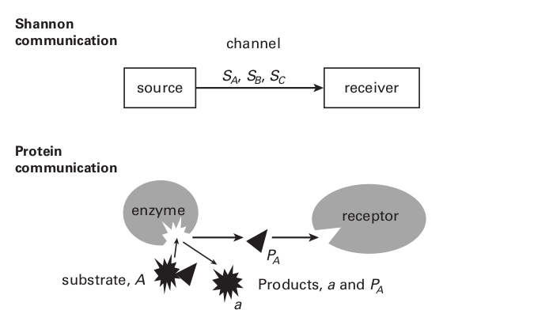

## Chapter 5. Information Processing: From Molecules to Molecular Circuits

第3章解释了当信号减少有关源状态的不确定性时，信息就会被传输。进一步说明，在以脉冲方式传输信息时，信息速率（bits/s）取决于脉冲速率和计时精度。**本章指出了收益递减规律：随着脉冲速率的提高，每个脉冲的信息量会减少（图 3.6）。**此外，更高的信息速率（即更高的脉冲速率和更高的计时精度）使用不成比例的更多空间和能量，这两者都限制了资源。这些资源限制直接提出了信息传输效率的三个原则：只发送需要的东西；以可接受的最低价格发送；尽量减少电线。第 4 章表明，这些原则在从厘米到微米的空间尺度上塑造了大脑设计的许多方面。

然而，随着脉冲跨距离上传递信息，它们主要是报告结果。信息的实际处理主要发生在 1000 倍更精细的空间尺度上，即分子尺度上。这些信息通过化学反应进行处理：分子扩散、结合、交换能量、改变构象等。此级别的关键参与者是单个蛋白质分子（~6 nm）。它们是多种输入的目标，例如小的“信使”分子，在与受体蛋白结合后，可减少其对来源的不确定性。蛋白质分子还提供多种输出，例如，改变其他分子的能量或浓度，从而降低它们的不确定性。

这些流程不仅以不同的规模运行，而且通常使用不同的格式。分子信号通常不是脉动的，而是分级的，即模拟的。尽管格式发生了变化，但任务保持不变：减少不确定性。因此，传递信息的相同原则仍然适用。第 5 章解释了单分子是如何处理信息的。它确定了单个蛋白质分子的信息容量的限制，以及注册一位的不可降低的成本。 一个合乎逻辑的起点是来自电脉冲的信息被迫将格式更改为化学浓度。

当一个神经元向另一个神经元发送脉冲时，就会出现一个问题：传递信息的神经元出发的导线与接受信号的神经元之间存在约20nm的物理间隙，当信号设法穿过该间隙时，就会出现另一个强大的屏障，即约 5 nm 厚的双层疏水膜。如何跨越这两个障碍，最终将信息传递给接收者？膜同样是无线信号的问题（第 4 章）：细胞外的激素如何将其信息传递到细胞内？两种情况下的解决方案都是更改消息格式。这为处理信息提供了无限的机会，也提供了丢失信息的机会。

来自脉冲的信息以一团小分子的形式穿过间隙——恰当地称为发射器。当一个或多个发射器分子与跨越细胞膜的蛋白质分子结合时，信息最终会进入接收器神经元。结合触发蛋白质改变构象，并将信息携带到细胞中。无线信使（激素）的工作方式相同——与跨膜蛋白结合以改变其构象。因此，大多数信息从源神经元到接收神经元的传递是通过化学（浓度、结合反应）和物理学（分子结构的变化）发生的。

信息可以通过多种方式进入细胞。 蛋白质构象的变化可能会打开一个穿过膜的通道，以允许携带电流的离子进入。 或者它可能会导致蛋白质的细胞质尾部释放一个小分子，该小分子可以结合并改变其他蛋白质。 改变的蛋白质可以通过随机游走（扩散）来寻找目标。 为了节省时间，通过允许改变的蛋白质用小脚沿着膜的内表面滑行，可以将搜索从三个维度减少到两个维度。

这种机制完成了大脑的大部分信息处理。它们放大、执行逻辑运算、存储和调用，等等。尽管这些机制可能由全有或全无脉冲触发，但它们本身通常是分级的：小分子的浓度不同，活化的蛋白质数量不同，离子电流的幅度不同，等等。这些模拟信号的信息内容，如脉冲代码，可以通过香农公式进行有用的分析。极少数的方程，都是直观的，可以从根本上解释：（1）什么限制了信号的信息处理；(2) 是什么减少了他们的信息；(3) 为什么更高的信息速率更昂贵。

> **Figure 5.1**
> **Shannon ’ s general communication system maps onto communication between two protein molecules.** When Shannon’s source is in states A , B , or C , it transmits signals $S_A$, $S_B$ , or $S_C$ , so eliminating the receiver’s uncertainty about the state of the source. The protein source is an enzyme that, upon encountering substrate A , produces two products P A and a . The protein receiver is a receptor that specifically binds $P_A $. $P_A$ ’s presence or absence at the receptor ’ s binding site establishes the state at the source, namely, that A is present or absent.

奖励与脉冲相同（公式 3.3）：通过这些公式，人们可以“跟随金钱”，从而发现受限的神经资源是如何使用的。此外，在这种纳米尺度上追随资金会引出神经设计的所有剩余原则。因此，现在我们解释香农如何计算指定源所需的信息量以及信号可以携带多少信息（图 5.1；香农和韦弗，1949 年）。

#### How much information is needed to specify a source? (信息论中的熵)

指定源所需的信息随着源可能占据的状态数的增加而增加。 在只有一种状态的情况下，没有不确定性，因此不需要任何信息，指示这种已知状态的信号是多余的。 高效的设计将减少冗余以满足只发送需要的内容的原则。

如果有两个同等可能的状态 A 和 B ，那么根据定义，1 位信息通过识别 A 或 B 来消除不确定性（例如，A = 0；B = 1），一位信息是信息论的立论基础。 将源的自由度从两个状态增加到四个状态，A、B、C、D，概率会更低，例如，
                                                                 p ( A ) = p ( B ) = p ( C ) = p ( D ) = 0.25

现在情况更加不确定，需要两个位来决定。 第一个位在两个同等可能的对之间做出决定，例如 (A, B) 与 (C, D)，第二个位在该对的成员之间做出决定。 这两位构成状态的 2 位代码，例如，

​                                                                  A = 00;  B = 01;  C = 10;  D = 11

1 位指定两种状态，2 位指定四种状态的事实说明了一般关系。 当源可以处于 U 个等可能状态中的任何一种时，为了识别源的状态，接收器必须至少获得$I$个bits。
$$
I = log 2 ( U )
$$

​                                                                                        (公式 5.1)

请注意，正如预期的那样，定义源状态所需的信息量随着情况的复杂性而增加——这里是可能性的数量U。

自然界中的大多数来源都有可能不同的状态，这会影响指定状态所需的信息量。 例如，当我们改变 A、B、C、D 四个状态的概率分布为

​                                         p ( A ) = 0.125;  p ( B ) = 0.5;  p ( C ) = 0.25;  p ( D ) = 0.125

所有四种状态都可以用 2 位代码来识别:(A = 00；B = 01；C = 10；D =11)，但 3 位代码更有效（图 5.2）。第一位决定状态是否为 B，第二位决定状态是否为C，第三位决定状态是D还是 A。请注意，每个选择都是二元和等概率的——1 位。 当重复使用时，这个 3 位代码平均比 2 位代码更有效。 在 50% 的情况下，3 位代码只需要 1 位即可识别正确的状态，p ( B ) = 0.5。 在 25% 的情况下，它需要 2 位来识别正确的状态，p ( C ) =0.25)，而在 25% 的情况下，它需要 3 位来识别正确的状态， p ( A ) + p ( D ) = 0.25 . 由于使用如此分布，每次确定状态的平均位数为

​                                           0.5 × 1 bit + 0.25 × 2 bits + 0.25 × 3 bits = 1.75 bits

因此，3 位代码的效率比 2 位代码高 12.5%。 这说明了香农的发现之一：将编码方案与被编码状态的统计分布相匹配是有效的。 大脑首先到达那里（第 9 章）。

> **Figure 5.2**
> **Two ways to improve efficiency with which signal states represent information.** 
>
> **Left:** This decision tree implements a 3-bit code to represent four states that have different probabilities. An alternative would be to assign 2 bits to every state, but 3-bit code is more efficient because half the signals transmitted (those for state C ) use only 1 bit, and this more than compensates for giving the least frequent states ( A , D ) 3 bits.
>
> **Right:** A limited number of signal states is used most efficiently when all states are used equally often. In this two-state system the condition p(A) = p(B) = 0.5 maximizes information capacity at 1 bit per state. Left reprinted from Laughlin (2011).

3 位代码还提醒我们，指定状态所需的位数随着状态的不确定性而增加。 一位指定最可能的状态，p(B) = 0.5； 接下来最有可能的两位，p(C)=0.25； 最不可能的三位，p(A)=p(D)=0.125。 一般来说，当遇到状态$x$的概率为$p(x)$时，指定状态$x$所需的信息为$I_x$。
$$
I_x = log_2(1/ p(x)) = – log_2(p(x))
$$
​                                                                                       公式(5.2)

这种关系与公式(5.1)一致：当有$U$个等可能状态时，$p(x) = 1/U$ 。

四态源解释了基础知识，但信息论如何应用于现实世界的各种可能性？ 对于实际应用，例如他雇主的电话网络的设计，香农推导出了一个通用方程。 指定任何源的状态所需的位数是
$$
H ( x ) = −\sum_{1}^{x}p(x) \cdot log_2(p(x))
$$
​                                                                                      公式(5.3)

$H(x)$表示每个状态的信息量，状态$x$的概率为$p(x)$，$p(x)$乘以状态$x$所需的位数，然后将所有的状态值的$p(x) \cdot I_x$累加便是$H(x)$的值，这个值便是所有状态所需信息位数的期望。

香农将$H (x)$这个量命名为熵，因为公式(5.3)与玻尔兹曼热力学系统的熵方程的形式相同。事实上，这两个熵得到了相似的定量，玻尔兹曼熵量化了系统的总无序，香农的熵量化了系统的总不确定性，它能够回答我们的下一个问题。

#### How much information can a signal carry?

信号携带的比特数由熵方程给出，这里是信号状态的熵。 我们从信号指定来源的能力开始。 当每个源状态都分配有自己的信号状态（源到信号的 1:1 映射）时，信号可以携带指定源所需的所有信息，因为它总是可以表示源的每个状态，公式(5.3) 表明这个信息就是信息源的熵。 这个等式提出了一种计算信号携带的信息的通用方法。 识别信号的状态并使用它们来计算信号的熵（以比特为单位）。当源状态 1:1 映射到信号状态时，计算显然成立，但是当源状态和信号状态相差很大时，它是否有效？ 例如，当来自麦克风的模拟信号转换为 CD 的数字格式时，或者当模拟突触电位触发动作电位序列时，它是否有效？

香农在数学上证明了熵在不同格式之间是相等的。因此，总是可以设计一种映射，使得具有H个bit信号的熵必定对应有H个bit信号源的状态表示。因此，来自具有许多稀有状态的源信息（例如电话交谈中的声音）可以被压缩为更频繁地使用较少状态的代码，例如数字网络中的高频无线电信号或以太网。简而言之，要量化一个信号可以携带多少信息，只需使用公式(5.3)计算其香农熵即可。这样做之后，可以考虑将神经源耦合到神经接收器的信号的设计问题。

熵为系统的信息容量设定了上限，但通常的通信系统，特别是神经系统，无法达到该上限容量。第一个限制是噪声，因为当噪声进入系统时，信息会丢失。因此，我们必须考虑噪声如何影响神经回路的设计。第二个限制是冗余，因为重复信号会降低系统发送新信息的能力。但是，当存在噪声时，冗余可以增强系统识别源信息的能力。因此，每个实际通信系统中的噪声和冗余都是互补的。

#### How noise destroys information

噪声（与信号状态变化无关的随机波动）通过引入不确定性来破坏信息。在无噪声系统中，接收器可以完全置信地将给定信号状态与源状态相关联；然而，当存在噪声时，接收器信号是否感知到了变化，还是噪声？被噪声破坏的信息量取决于噪声引入的不确定性，因为比特解决了不确定性，这也是描述噪声所需的比特数——它的香农熵（公式 5.3）。因此，在存在噪声的情况下，信号所携带的信息是信号熵减去噪声熵。因为熵趋向于随着状态数的增加呈对数级增加的趋势（公式 5.1），而减对数相当于作除法，所以信息随着信噪比的对数而增长，信噪比的对数公式为$log_2(S/N)$，$S$是信号，$N$是噪声。

#### Redundancy

冗余（表示已知事物的信号状态）不携带任何信息。冗余有两种形式。第一种是不那么极端的重复形式——状态不再完全相关，它们是部分相关的，当状态 A 与状态 B 相关时，接收 A 会增加接收 B 的概率，从而减少与 B 相关的不确定性，传递信息的电路通常使用横向和自我抑制来消除这种形式的冗余，以便只发送需要的信息（第 9 章和第 11 章）。

在第二种冗余形式中，信号状态携带的信息比它们可能携带的信息少，因为它们使用得太频繁或太少，考虑具有两种状态，A 和 B 的二进制信号，这两种状态携带的信息取决于信号熵。
$$
H = -p(A)log_2(p(A)) - p(B)log_2(p(B))
$$
​                                                                                           公式(5.4)

当$p(A)$等于$p(B)$时，$H$在每个状态1bit处达到峰值(图 5.2)。这种最佳编码策略，推广到具有许多状态的系统，并广泛用于可用信号状态的数量受到功率限制和噪声严重限制的系统（例如，卫星、移动电话）。视网膜神经元面临类似的限制，并使用与许多其他细胞信号系统相同的策略（第 9、11 章；Bialek，2012）。

现在我们知道了: (1). 描述一组事件需要多少信息(公式 5.3); (2). 一个信号传达了多少关于这些事件的信息(也是公式 5.3);  (3). 这些量如何依赖于冗余和噪声。 这就引出了另一个问题：当事件迅速变化时，大脑如何跟上？ 为了回答这个问题，我们推导出以比特/秒为单位的信息速率的表达式。

#### Calculating the information rates of continuously changing signals

信息传输的速率取决于每个信号状态传达的信息量以及这些状态随时间演变的速率。第 3 章通过计算熵给出了动作电位的信息率。 这个数量取决于信号的物理特性：以给定精度计时的离散脉冲，这种特性使低速率更便宜。 其他格式具有不同的属性，这些属性对信号质量、比特率和效率之间的关系施加不同的约束。

大脑的大部分信息由模拟信号表示，根据定义，模拟信号不断变化。 这些包括信使分子浓度的变化，配体激活的受体蛋白数量的变化，以及离子通道在神经膜上产生的电势的变化。 随着模拟信号的变化，它会经历一系列信号状态（图 5.3）。 这些状态以每个状态传送的比特数乘以状态变化率的速率传递信息。 可区分状态的数量是信号和噪声覆盖的响应范围，即$(S + N)$除以噪声（图 5.3）。 因此，根据公式5.2，每个状态提供$log_2 (1 + S/N ) $个bit位。 模拟信号可以在时间$Δt$上改变电平(单位时间内信号能通过的数据量---带宽)（图 5.3）。 因此，状态以$R=1/Δt$的速率传递，当连续的信号状态不相关（即输入中没有冗余）时，信息速率为
$$
I = R \cdot log_2(1 + S/N)
$$
​                                                                                    公式(5.5)

在许多实际系统中，计算速率比较复杂，公式5.5假设冗余为零，即信号状态之间没有相关性。为此，信号状态必须随机变化。要真正随机，信号必须能够从任何一种状态跳转到任何其他状态，但这种能力受到跳转所需时间的限制。 例如，酶以有限的速率产生产物，因此需要时间来改变给定体积的隔室中的产物浓度； 同样，通过电阻器提供的电流需要时间来为电容器充电。 因此，信号在一个时间间隔 Δt 中可以跳转到的不同状态的数量受到信号可以更改的速率的限制，但是如果有足够的时间，它可以移动到任何状态。 这种时间依赖性使信息率的计算变得复杂。

> **Figure 5.3**
> **Signal range, noise, and response dynamics determine the information rates of analogue signals.** Noise divides a waveform ’ s signal range into discriminable states, and states can change at time intervals Δt . The faster, more reliable waveform obviously conveys more details of the signal. From equation 5.5, it also has a higher information rate because it has a higher S/N and, with shorter Δt , changes level at a higher rate.

香农通过使用傅里叶变换将连续模拟信号和噪声转换为其频率分量解决了这个问题。 每个频率分量都是独立的，即改变一个频率分量的幅度或相位对任何其他频率都没有影响； 同样的，每个频率都携带有自己的信息。 因此，信号携带的总信息是其每个分量频率携带的信息的总和(公式5.6)。
$$
I = \int_0^{co} log_2(1+S(f)/N(f))\cdot df
$$
​                                                                                            公式(5.6)

其中$I$是每秒位数，$S(f)$和$N(f)$是信号和噪声的功率频谱，$co$是信号的截止频率，$co$定义了信号的带宽。

信息速率的推导有两个附加条件(公式 5.6)：系统必须是线性的，并且信号和噪声都必须随高斯分布随机变化，以便传输的频率是不相关的。当系统由低幅度高斯输入驱动时，这些条件可以很好地满足（例如，Rieke 等人，1997）。请注意，当$S(f)/N(f)$的频谱平坦时，频率之和减少到公式(5.5)，带宽为$1/2Δt$代替速率$R$。
$$
I = (bandwidth) \cdot log_2(1+S/N)
$$
​                                                                                               公式(5.7)

带宽$S/N$和信息速率$I$之间的这种关系会影响神经设计，因为要以更高的速率传输信息，神经元需要更宽的带宽（更快的响应）和更高的$S/N$，而这些需要额外的材料和能量。因此，我们在资源和性能之间进行了权衡，正如我们将看到的，这对神经设计产生了深远的影响。

任何真实系统中的信息都必须以物理或化学方式体现。 大脑使用信号蛋白来处理信息，所以我们现在检查它们的物理和化学。

#### How protein molecules transmit and process information

**A protein acquires its specific function by folding to reduce its free energy.** 蛋白质分子由以遗传指定序列连接的氨基酸线性链形成（Alberts 等，2008），线性序列会成为有用的分子。链条是柔性的，因此它通过最小化势能和最大化熵来弯曲和折叠以减少其自由能（Williamson，2011；Dror 等人，2012）。带电荷的氨基侧基试图形成一对有吸引力的对立面（+ 和 - ）并避免排斥刑如（+ 和 +）或（ - 和 - ）的组合。为了增加熵，疏水侧链避免极性基团并聚结成油团。 所有这些对位置的争夺都必须在包装限制范围内实现。

受到热能的冲击，电位梯度的上下拉动，以无序交换顺序，蛋白质分子不断地改变其三维结构（构象），直到它落入足以抵抗热运动的深度的局部最小自由能。蛋白质分子已达到稳定的构象（图 5.4）。

这种稳定的构象决定了蛋白质分子的物理和化学性质（Williamson，2011）。一种典型的蛋白质，含有数百个氨基酸，折叠成 5 到 10 纳米的结构，以采用支持其功能的形式：长纤维形成头发，带有连接旋钮的球状块构建细胞骨架。蛋白质可以定位氨基酸的子集，它们可以与特定分子结合并相互作用。这种结合位点使蛋白质能够收集和发送信息。

#### Binding specificity allows information transfer

回想一下，当接收方的变化可以与源的状态相关联时，信息就会传输。化学结合满足这一要求。例如，当酶分子与其底物反应产生产物时，酶只结合底物，而受体蛋白（受体蛋白）只结合产物（图 5.1）。因此，来源通过使用可扩散的信使产品告诉接收者“存在底物”。如果酶和/或受体放松它们的结合特异性，细胞质中的其他分子也会结合。这种串扰会降低接收器对源处存在的一种特定基板做出响应的可能性。因此，结合特异性使
信息传递。

蛋白质的结合位点一旦接收到信息，如何进一步加工？通过变构。这是蛋白质通过转换到新的稳定构象来响应特定输入的能力，例如结合信使。

#### How allostery works(变构原理)

考虑蛋白质分子在下降到其最低可用自由能级时不断改变构象。 这一进程实际上是一次穿越能量景观的航行（图 5.4），其中地图坐标代表蛋白质的构象，海拔高度代表其自由能。

下降遵循能源景观的梯度，热波动将其推过颠簸。因此，蛋白质探索一个区域并找到通往较低区域的路径。当蛋白质进入太深而无法通过热力将其释放出来的山谷时，它就会被困住，并且构象会被限制在一个小区域内（图 5.4）。在这里，蛋白质可能在一小组功能不同的构象之间穿梭，或者它可能保持在一个稳定的构象中心（图 5.4）。如此受限，分子承担了由其构象决定的作用。

现在考虑当外部因素改变能源格局时会发生什么。外部输入可能是PH值或电势的变化，可能是结合或释放特定分子，也可能是通过将高能磷酸基团连接到氨基侧基团来注入能量。这样的输入改变了蛋白质的能量格局，抑制了某些区域并提升了其他区域（图 5.4）。蛋白质通过在微秒到毫秒（Williamson，2011；Dror 等，2012）内移动到新的稳定构象来响应。新的构象在物理和化学上都不同于以前的构象，因此分子对化学和物理输入的反应不同。此更改使其能够处理信息。

> **Figure 5.4**
> **Protein structure, conformational state, energy landscape, and allostery.** 
>
> **Upper:** The β2 adrenergic(肾上腺素) receptor protein spans the cell membrane’s lipid bilayer(脂质双分子层). Here it is shown in the conformation where binding an adrenaline molecule at a site on the outside has opened a cleft for binding a G protein molecule on the inside. Note the prominent helices(螺旋) crossing the membrane. 
>
> **Lower left:** Section through a protein molecule’s energy landscape. During folding, the protein descends the energy landscape and adopts the stable conformation A. 
>
> **Lower right:** An external input changes the energy landscape and the protein moves to conformation B. This is allostery(变构). 
>
> Upper adapted from http://en.wikipedia.org/wiki/Beta-2_adrenergic_receptor#mediaviewer/File:2RH1.png .

#### How a protein uses allostery to process information

有限状态机通过运行定义明确的状态变化序列（转换）来处理信息，每个状态变化都由特定条件触发，例如输入的存在或不存在，或输入的结合。 这是变构。 当蛋白质分子经历一系列状态变化时，每个状态变化都以特定输入为条件，它会产生以这些输入为条件的输出（Huber & Sakmar，2011）。 因此，变构使单个蛋白质分子能够计算（Bray，1995）。 例如，单个分子很容易被编程来执行布尔AND运算（图 5.5）。

本章的其余部分将讨论一个特定的有限状态机，它包含一对相互作用的蛋白质。受体蛋白接受无线信号肾上腺素，这是一种让生物体做好战斗或逃跑准备的激素，然后通过细胞膜传递信息（“肾上腺素存在！”）。 在那里，它传输到膜内表面上的接收器蛋白质，这些蛋白质在细胞内放大和传播信息。 然后两种蛋白质都为下一个信号复位。 受体蛋白是β2肾上腺素能受体，同样，受体蛋白也是G蛋白。

我们选择这个例子有几个原因。 首先，β2 肾上腺素受体及其 G 蛋白代表了一类广泛、普遍存在的有限状态机（第 2、7 和 8 章）。 人类基因组指定了 800 多种与 G 蛋白偶联的不同受体蛋白和 100 多种不同的 G 蛋白。 其次，这个例子表明了大多数神经计算使用的空间尺度。 第三，它通过放大来举例说明计算，并通过这样做说明了解决广泛设计问题的分子解决方案，克服了噪音。 第四，阐明了在这个空间尺度上计算的原因：空间和能量的高效率。 正如将要解释的那样，该系统中 1 位的能量成本接近理论下限，大约在30以内。

选择这个例子而不是其他可能性的最后一个原因是构象变化的序列，由肾上腺素与受体的结合触发并由激活的 G 蛋白的释放完成，已通过 x 射线衍射在原子尺度上进行了记录。 （Rasmussen 等人，2011；Chung 等人，2011；总结于 Schwartz & Sakmar，2011）。

> **Figure 5.5**
> **The allosteric protein as a finite-state machine.** How a sequence of stimulus-evoked changes in allosteric(变构) state could enable a single protein molecule to perform a simple computation, here a logical AND on the two inputs A and B . Ligand A binds to the protein, exposing two sites to be phosphorylated by kinase B. The pair of attached phosphates alters the protein’s conformation(构象), exposing a catalytic site that digests the substrate s to produce products j and C. Bottom row gives the corresponding program of state transitions.

#### Allostery in action

当受体的构象暴露其在细胞膜外表面的肾上腺素结合位点并掩盖 G 蛋白在内表面的结合位点时，系统就准备好接收了（图 5.6）。G 蛋白在内表面扩散，与受体碰撞，但没有遇到信号。当肾上腺素与受体结合时，蛋白质会改变构象状态（图 5.4 和 5.6）。跨越膜的七个螺旋线圈之一（线圈编号 6）移动 1.4 nm，其他的移动更短的距离。它们一起在内表面的受体分子中打开一个裂缝，以暴露 G 蛋白的结合位点。在下一次碰撞中，一个 G 蛋白通过一个特殊的旋钮接合该位点并安全停靠（图 5.6）。

> **Figure 5.6**
> **β2 adrenergic receptor and its G protein use allostery to operate as a finite-state machine.** Receptor receives a wireless signal outside the cell and, by changing conformation, relays it across the membrane to G protein. G protein dissociates and α subunit broadcasts signal to effector proteins by diffusing on inner surface of the membrane. α subunit hydrolyses bound GTP and reverts to conformation that the binds the other subunits. G protein is reconstituted, ready to signal again. Further details in text. Figure adapted from summary diagram from the definitive study of structural changes that pass information through these two molecules (Rasmussen etal., 2011), with permission.

这种耦合改变了两种分子的能量格局。 G 蛋白开始一系列构象变化（图 5.6）。 它的三个亚基中的两个，β和γ，分离并扩散到细胞质中。 α亚基通过在其铰链处摆动两个大部分来对失去其伙伴做出反应。 这个运动跨越 110 度以上，需要数百微秒，就像牡蛎展示它的珍珠一样，揭示了一种小分子，二磷酸鸟苷 (GDP)，它深深地结合在蛋白质中。 暴露的 GDP 迅速与细胞质中的一种分子——三磷酸鸟苷 (GTP) 交换，其额外的磷酸盐为其提供了更高的能量。

GTP 的结合将能量转移到 α 亚基，再次改变了格局。 铰链门关闭，保留了推动状态变化序列的高能 GTP。 旋钮缩回，从而将 α 亚基与受体分离，使其自由扩散到膜的内表面。 现在，α 亚基上的另一个结合位点暴露给其他蛋白质结合并改变它们的构象，以响应信号“肾上腺素！ ”（图 5.6）。 简而言之，构象状态变化的有序序列已经携带信息“肾上腺素！”穿过细胞膜，并通过释放激活的 GTP-α 亚基，开始在细胞内无线广播该信息的过程。

#### How allostery amplifies

这种形式的变构很容易放大。 当一个 GTP-α 与激活的受体蛋白解偶联时，另一个 GTP-α 停靠在它的位置，被激活，然后被释放，依此类推。 速率从每秒 10 到 500 不等，主要取决于膜上 G 蛋白的密度——因为这决定了它们遇到受体蛋白的频率。 随着裂口保持开放，受体激活和释放的 G 蛋白的数量随着时间的推移而增加。 放大率（增益）因系统而异，范围从短时间常数系统中的 4（如快速飞行光感受器（第 8 章））到长时间常数系统（如慢效激素）中的 100。

放大是一种冗余形式，因为每个副本只是重复一条消息而不添加新信息。 因此，多种 G 蛋白
受 β2 受体影响，只需重复“肾上腺素！”、“肾上腺素！ ” 。 . . 然而，出于两个原因，这种冗余是必不可少的。 为了对肾上腺素产生协同反应，信号必须及时到达细胞的许多部分，从而激活几种 G 蛋白。 其次，系统必须防止噪音。 因为热冲击偶尔会激活单个 G 蛋白分子，所以受体必须激活几个分子才能产生可靠的信息。 因此，当放大保护信息免受噪声影响时，它也会以冗余的形式引入低效率。 一个有效的设计将通过使放大增益与噪声水平相匹配来达到适当的平衡（第 6 章）。

尽管 β2 受体和它的 G 蛋白一起放大和传播了“肾上腺素！”的信号，但这个过程是不完整的。 为了发出危险信号而开启的这个有限状态机必须在发出警告后关闭。 然后机器必须重新设置以再次准备好传递消息。

#### How allostery terminates the message and resets the system

关闭和重置是通过继续移动受体及其通过其构象状态序列激活的 G 蛋白来完成的。 至于前面的所有激活步骤，每个去激活转换都有一个特定的目的。 为了使 β2 受体失活，一种酶（激酶）接受来自 ATP 分子的高能磷酸基团，并将其共价连接到 β2 受体上的特定位点。 几个这样的位点的磷酸化提高了受体的能量水平，足以改变其构象，现在暴露了一个不同蛋白质分子的结合位点，*arrestin*。 当逮捕蛋白结合时，它会阻止进入 G 蛋白的对接裂缝，从而阻止传播。

需要一些东西来保护未被占据的β2受体在它们处于接受构象时被灭活，等待肾上腺素。 受体经过工程改造，使得受体构象隐藏了磷酸化位点，并且它们仅在结合肾上腺素触发的构象中暴露。 还需要一些东西来为激活的受体提供时间来扩增，即激活和释放几种 G 蛋白。 为了实现这一点，连接高能磷酸盐的激酶被设计为缓慢工作。 此外，通过调节这种磷酸化速率，放大的增益和时间常数都被调整为没有额外的空间和很少的额外能量。

一旦抑制素阻断了向 G 蛋白的传递，β2 分子就会重置——通过继续其通过构象状态的旅程。 最初与受体结合的肾上腺素分子打开了一个对接 G 蛋白的裂口，最终不结合肾上腺素，这关闭了对接裂口。 这允许磷酸酶去除添加的磷酸盐，释放抑制蛋白，并将受体恢复到其初始状态。 它的信令周期是完整的：它已经接收、发送和重置。

但是是什么阻止了激活的 α 亚基继续扩散寻找伙伴呢？ 该亚基也是一种酶，可从其自身结合的 GTP 中去除高能磷酸盐（图 5.6），这提供了一种自动切断功能。 从 α 亚基中提取高能磷酸盐会触发其最终的构象状态变化序列。 它重新绑定了 βγ 单元，并再次突出了它的对接旋钮。 现在 G 蛋白已重置为无活性的 αβγ -GDP 形式，并再次准备好与肾上腺素结合受体对接。

总之，这个分子有限状态机使用了两个部分，受体和 G 蛋白。 它利用蛋白质分子的三个特性——结合特异性、变构和扩散——来执行状态变化程序。 该程序在细胞表面接收信号，并通过细胞膜将其机械传输。 然后程序放大信号，在小区内广播，然后复位。 这种无处不在的计算设备，即 G 蛋白偶联受体 (GPCR)，将进一步讨论（第 6-8 章）。 但在这里，我们解释了信号蛋白的另一个宝贵特性——它们的能量效率如何接近热力学极限。

#### Energy efficiency of protein devices

**Why must molecular devices consume energy to process information?**

蛋白质的信号周期在能量景观的同一点开始和结束。 如果循环中的每个构象状态都具有相同的自由能，则可以在不消耗能量的情况下完成循环。 然而，蛋白质将依赖随机的热波动来改变状态。 此外，如果自由能是恒定的，那么每个跃迁都是可逆的——向前或向后移动的概率相同。 完成这个循环在理论上是可能的：可以在不消耗能量的情况下传递信号。 然而，这样一个无损系统是不切实际的，因为依赖于一系列不可能和可逆的事件，接收器将等待很长且不确定的时间（Bennett，1982，2000）。

能量通过驱动蛋白质在预期方向上通过构象状态转换来消除这种无法忍受的等待。 此外，效果是渐进的：添加更多能量会加速循环。 但是下限呢：可以有效传递信息的最少能量是多少？

#### Lower bound to energy cost in signaling

热力学提出了一个最小值，即记录一位信息所需的能量（Landauer，1996；Schneider，2010），
$$
\Delta E=k_B \cdot T \cdot ln(2) \approx 0.7 \cdot k_B \cdot T joules \approx 3 \times 10^{-21} joules \quad per \quad bit
$$
​                                                                                           公式(5.8)

其中$k_B$是玻尔兹曼常数，$T$是以开尔文为单位的温度。 $ΔE$很小，但单个蛋白质分子也很小，因此接近能量效率的热力学极限。

β2 肾上腺素能受体及其 G 蛋白的信号周期可以通过从 OFF 切换到 ON 然后重新设置为 OFF 来记录一点。 每种蛋白质都从细胞的标准货币——高能分子 ATP 中获取能量。 一个 ATP 的水解产生$25 k_BT$焦耳，当受体被磷酸化时，它使用至少三个 ATP 分子（图 5.5）。 这给出了每比特$75 k_BT$焦耳的效率，比热力学极限（公式 5.8）高两个数量级。 G 蛋白在将其 GTP 水解为 GDP 时消耗相当于 1 个 ATP（图 5.6），每比特的效率为$25 k_BT$焦耳，比热力学极限高出一到两个数量级。

因此，两种蛋白质处理一些信息的成本都低于共价键的成本（~$100 k_BT$）。这似乎是合理的，因为蛋白质是一种柔软的装置，更像是由果冻制成的机器，而不是刚性的发条装置（Williamson，2011 年）。

是什么阻止了这两种蛋白质分子接近热力学极限？ 意识到 $0.7 k_BT$ 的限制是简单地将位注册为状态更改的成本。 它不包括传输位。 为了使位穿过膜，β2 受体将其螺旋数 6 移动 1.4 nm，并将位传递到细胞质中，G 蛋白将其大铰链部分打开 110 度。 这两种运动都需要工作（霍华德，2001），工作消耗能量。 能量也用于以适合功能的速率驱动循环——回想一下 β2 受体发出“紧急！ ” 考虑到 GPCR 传输的能量成本包括这些额外的任务，蛋白质信号传导似乎惊人地接近热力学极限。 一个数量级是一个合理的猜测。

#### Energy and the design of efficient signaling molecules

受体和 G 蛋白突然而可靠地打开和关闭——就像一个机械开关。 后者通过使用能量屏障来避免意外跳闸。 触发它所需的一些能量被回收，因此一旦触发，变化就会迅速发生。 在安全至关重要的地方，能量障碍很高，但在不太重要的地方，可以降低障碍以节省能源。 同样，蛋白质的能量景观似乎经过精心设计，每次状态转换都需要正确的能量输入。 该设计还涉及速度、可靠性和能源之间的权衡。 例如，如果蛋白质内的粘性力随着转换速率而增加，则每次转换的能量成本将不成比例地增加，从而使较低的速率更有效。 因此，在微观水平上观察到的轴突设计原则，以最低可接受的速率发送（第 3 章），也可能在蛋白质分子的纳米水平上保持不变，尽管原因不同。

#### Summary

由蛋白质分子建立的信号系统接收和传递信息，正如香农所定义的那样，使用与香农最初处理的不同的物理和化学过程。 蛋白质的三种物理和化学特性支持信息的传递和处理。 结合在分子之间建立特定的连接，酶活性提供了产生和放大信号的有效手段，而变构使信息能够通过单个分子。 Allostery 还通过作为有限状态机运行来装备单个蛋白质分子进行计算。 通过运行由特定输入触发的明确定义的状态变化程序，分子只有在遇到特定的输入组合时才能完成程序。 这些特性使蛋白质能够形成计算的分子电路。

由蛋白质构建的电路满足两个设计原则。 首先，如果我们排除量子计算，这些电路非常小，这样可以节省空间和材料。 蛋白质电路还可以节省能量，因为蛋白质分子在能量效率的热力学极限附近运行。 此外，蛋白质化学允许以满足电路对速度和准确性的需求所需的量有效地传递能量。 因此，蛋白质电路中组件的性能可以与其任务相匹配，以获得以最低速率发送带来的经济性。

这些优势——紧凑性、能源效率以及适应和匹配的能力——都表明了化学计算的原理。 这更便宜。 但要实现节省，蛋白质回路必须支持大脑的核心任务。 第 6 章现在解释蛋白质如何装备分子回路来满足大脑对信息处理的需求。

