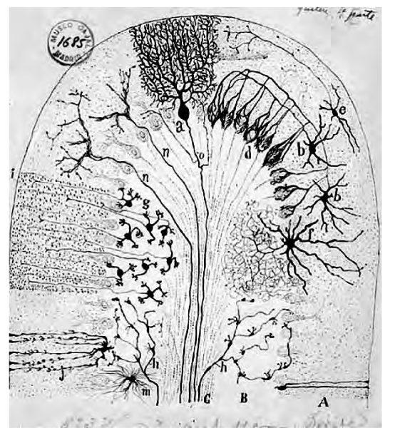
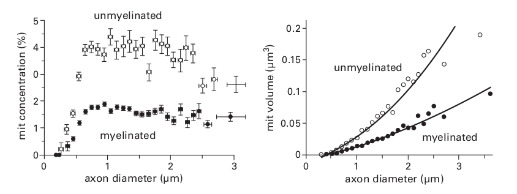

## Chapter 7. Design of Neurons

第 6 章解释说，大脑的大部分计算都是通过化学在单个蛋白质分子和蛋白质回路的规模上进行的，化学计算以不可降低的空间和能源成本提供了良好的 S/N，此外，在反应容器收缩的地方，质量作用原理可以在具有少量分子的高浓度下运行。高浓度允许低结合亲和力以实现有用的信号速率。小体积也缩短了距离——在这个距离上扩散很快。此外，由于扩散分子的浓度在空间和时间上急剧衰减，许多计算可以通过无线方式完成——只需将探测器放置在距源不同距离的位置，并让布朗运动进行数学运算。

使用蛋白质进行计算可以实现几乎无限的部件目录——因为可以通过改变单个氨基酸来定制蛋白质——这只需通过交换 DNA 中的单个碱基对即可实现。 因此，自然选择可以为特定任务精确地塑造每个组件——例如，将特定的结合亲和力和特定的协同性与特定的信号相匹配（图 6.2 和 6.3）。 调整蛋白质结构的便利性产生了巨大的多样性：总体而言，哺乳动物大脑转录 5,000 到 8,000 个基因，并使用可变剪接产生 50,000 到 80,000 种不同的蛋白质。

化学计算在纳米到微米的空间尺度和 100 微秒到秒的时间尺度上表现出色（例如，棒状光转导；第 8 章）。 然而，为了服务于行为，计算必须保持相同的时间尺度，但要走得更远 100 万倍。 为了实现超距离速度，需要将化学信号重新编码为电信号。 重新编码始于变构触发，例如配体结合或 G 蛋白激活，但变构最终必须打开膜中的离子通道以建立电信号。 这是神经元的一项关键任务：使用变构技术将电信号快速发送到某个地方。

> **Figure 7.1**
>
> **Neurons and glial cells of cerebellar cortex.** Neuron types shown here (a, b, e, f, g) all express the standard polarized design: inputs to multiple dendrites converge to cell body and output to a single axon. Neuron types: a, Purkinje; b, basket; e, stellate; f, Golgi; g, granule. Input axons: h, mossy fiber; n, climbing fiber. Two types of glia (j,m) are shown at lower left. Each Bergman glial cell (j) wraps the dendritic arbor of a single Purkinje neuron (a). Drawing by S. Ram ó n y Cajal. Reprinted with permission from Sotelo (2003).

“Somewhere fast”有两个部分。 首先，突触前神经元释放的化学信号以短分支（树突）上的突触后神经元为目标。 与蛋白质受体结合的化学递质变构打开其离子通道。 这会引发一个电信号，该信号沿着树突被动地向中心位置（细胞体或专门的电缆段）传播，以便与来自其他树突的信号整合。 其次，集成的电信号重新编码为全或全脉冲，该脉冲沿单根电缆（轴突）主动传播到与其他神经元接触的突触前末端（图 7.1）。

树突的长度为 10 – 1,000 微米，具体取决于神经元类型，在这样的距离上，“快速”意味着高达 50 微米/毫秒。 轴突有 1 到 1,000 毫米长，在这样的距离上，“快”意味着每毫秒至少 1 毫米。 因此，树突传导被动电信号的速度比化学扩散快约 50 倍，轴突传导主动电信号的速度至少比树突快 20 倍。

一个神经元从蛋白质回路的纳米级上升到突触的微米级（1000 倍），然后到树突树的毫米级（1000 倍），然后到最长的哺乳动物轴突的米级 （1,000 倍），最终整合跨越$10^9$空间尺度范围的过程。 这大大增加了空间、材料和能源的成本。 一个变构编码 1 位的蛋白质分子占据大约 50 nm； 而编码 1 位的最小神经元细胞体占用$10^9$更大的体积； 编码1位的最大神经元胞体占用$10^{12}$更大的体积和相应的更多材料。 编码1位的能量成本从大约$25 k_BT$上升到大约$10^9 k_BT^2$。

这样的数字解释了为什么神经元需要高效。 输送氧气和代谢供应的微血管分布密集，迫使神经元占据它们的间隙（图 7.2）。 如果神经元的能量效率较低，它们将需要更多的线粒体来产生更多的 ATP——而这将需要更密集的毛细血管网络，但会牺牲有效的神经元布局（第 13 章）。 同样的限制适用于空间和材料。 例如，小脑的Purkinje细胞体的直径比小脑普通神经元的直径大 10 倍，但其体积却大 1000 倍（图 7.1）。 因此，我们必须解释每个神经组件的设计：突触、树突、细胞体和轴突如何相互匹配并节省空间和能量。

#### Synapse

突触使神经元能够通过在特定连接处传输和转换信号来处理神经回路中的信息。最简单的突触是电的，由形成连接两个神经元的通道阵列的蛋白质制成。在充当简单电阻器的情况下，电突触与连接一样便宜且无噪音。这就是为什么电突触被广泛用于弱耦合神经元的原因，例如，计算一块视网膜上的平均信号以减少冗余（第 11 章），同步皮质中间神经元之间的节律活动，以及同步驱动神经元的运动神经元。一样的肌肉。但是与电阻器的耦合并不能使电路进行太多计算。需要更多的转换，并且必须放大信号以产生抗噪声的快速响应。化学突触可以满足这些要求，之所以这么称呼是因为突触前神经元通过向突触后神经元上的受体发送神经递质脉冲来进行化学传输。

> **Figure 7.2**
>
> **Blood vessels distribute densely in gray matter with even mesh.** The 500- μ m scale bar corresponds roughly to the dimension of largest local circuits. Therefore, neurons and glia must fit into the interstices of the capillary network. Were energy cost to rise, due either to lower neuronal efficiency or enhanced neuronal performance, vessel density would rise at the expense of efficient neuron layout. Cerebral cortex from superior temporal gyrus of monkey. Reprinted with permission from Weber et al. (2008).

#### Origin of graded chemical signal

当与突触前活性区对接的囊泡与质膜融合并通过融合孔将递质分子释放到突触间隙中时，就会产生化学脉冲（图 7.3）。 囊泡含有约 4,000 个递质分子，通过囊泡膜中的转运蛋白浓缩至大约 100 mm。 通过孔放电需要大约 100 μs，在此期间分子正在扩散； 然而，它们在跨越裂隙的 20 nm 处聚集的突触后受体蛋白的浓度短暂上升至约 10 mm（图 7.3）。 这足以使发射器与低亲和力受体协同结合，从而打开它们的通道并启动电信号，即微型突触后电流 (MPSC)。

> **Figure 7.3**
>
> **Fusion of one synaptic vesicle briefly raises the concentration of transmitter within the synaptic cleft to 10 mM.** 
>
> **Upper left:** Synaptic vesicles, about 40 nm, from mouse cerebellar cortex docked to presynaptic membrane across the synaptic cleft from the postsynaptic density. This density houses a complex of proteins that support, among other functions, long-term potentiation (see chapter 14). Courtesy of K. H. Harris.
>
> **Upper right:** Synaptic vesicles, about 30 nm, from Drosophila medulla. Note that cleft width and vesicle size are similar for mammal and fly. Fly vesicle contains similar number of transmitter molecules as mammal (Borycz et al., 2005). Courtesy of Zhiyuan Lu, Patricia Rivlin & Fly EM Team, Janelia, HHMI. 
>
> **Lower left:** Concentration decays steeply in space and time. 
>
> **Lower right:** Concentration at 20 nm from fusion site suffices to bind and open roughly half of the postsynaptic ion channels. Half-saturation by one vesicle allows multivesicular release to enhance the response. Decay to lower concentration with time and distance can be exploited by other types of receptor molecules with higher binding affinities (figure 11.10). P o , open probability of postsynaptic ion channels. Graphs are modified and reprinted with permission from Xu-Friedman & Regehr (2004).

这种设计需要将囊泡内的分子数量及其浓度与其排空时间、扩散距离和受体结合常数紧密匹配。 如果囊泡含有较少的分子或较低的初始浓度，则突触后受体的最终浓度对于其结合亲和力来说将太低。 如果囊泡排空更慢或跨裂隙的扩散距离更大，也会发生同样的情况。 这些因素中的任何一个都可以通过受体的更高亲和力来补偿，但这会牺牲带宽（第 6 章）。 这些因素也可以通过更窄的裂隙来补偿，但这会增加裂隙电阻并减少突触后电流。 因此，裂隙宽度似乎可以最佳地平衡突触后受体的递质浓度和电阻（Savtchenko 和 Rusakov，2007；Graydon 等人，2014）。 所以这里是纳米尺度的共态。

#### Molecular mechanism of vesicle fusion

为了使囊泡融合（胞吐）完全起作用，需要多个变构过程。 为了将化学编码的信息转换为电信号，同时保持时间精度和 S/N，这些变构过程必须有效地耦合，正如现在所解释的那样。

为了保持时间精度，囊泡融合必须作为触发事件迅速发生。 这需要提前将其与一个专门的活性区对接，然后用多个 SNARE 启动囊泡，每个 SNARE 都是由四个蛋白质分子组成的复合物。 SNARE 在将囊泡与突触前膜紧密结合后，采用亚稳态的高自由能构象（图 5.4）。 因此，一个小信号可以将 SNARE 推过其能量景观的驼峰并触发融合。

触发因素是大量钙离子通过聚集在活性区的电压门控通道到达对接的囊泡。 当通道响应突触前去极化电信号而打开时，数百个钙离子进入以在不到 500 μs 的时间内将局部浓度提高 50 倍。 几个钙离子被附着在囊泡上的蛋白质突触结合蛋白结合，然后结合到 SNARE 并将其推过能量驼峰（Südhof，2013）。 当 SNARE 下降到较低能量的构象时，释放的能量会对囊泡造成猛烈的拉扯。 三个 SNARE 的合力足以将囊泡与突触前膜融合，并打开一个孔，其后果已经注意到。 从突触前电信号到突触后受体激活的整个过程发生得足够快，以保持时间精度并在 600 μs 内完成。

速度和时间精度源于几个设计原则。 分子成分非常小，并且彼此靠近——在纳米范围内。 这允许使用不可还原的少量分子进行快速化学反应，以达到传输快速信号（高带宽）所需的高浓度。 化学通过储存能量然后通过串联开关释放能量来实现速度和增益：（1）电压开关打开钙通道，释放储存在钙的电化学梯度中的能量（图 7.4）； (2) 突触结合蛋白以低亲和力结合钙，释放储存在 SNARE 内的能量； (3) SNAREs 融合囊泡，释放集中发射器储存的能量。

通过使响应曲线变陡的协同作用来提高时间（图 6.3）：几个电压门控钙通道合作建立足够的钙浓度，几个钙离子合作导致突触结合蛋白结合 SNARE，几个 SNARE 合作融合囊泡。 因此，通过引导存储能量的开关，化学信号以良好的 S/N 和时间精度重新编码为电信号。

为了传输高频信号，急剧上升的化学信号也必须急剧下降。 因此，每个阶段都必须迅速终止：（1）钙通道在膜复极化时立即关闭； (2) 由于钙被低亲和力的缓冲蛋白快速结合，钙浓度在几十微秒内局部下降； (3) 突触结合蛋白由于对钙的高度依赖而急剧关闭； (4) 通过与突触和神经胶质膜上的转运蛋白快速结合并从裂隙扩散，递质浓度在不到 1 ms 内衰减。

简而言之，快速释放和快速终止会在裂缝中产生一种化学信号，该信号在大约 0.6 ms 内达到峰值，持续时间小于 1.5 ms，从而以不可减少的延迟和大约 1 kHz 的带宽传输信息。 这足以传输由神经元电信号编码的大多数频率，因为膜时间常数受到能量成本的限制（第 6 章；Attwell & Gibb，2005）。 因此，突触处的化学信号机制与突触前神经元的带宽相匹配。

#### Vesicle release is stochastic

到达突触前末端的动作电位可能导致单个囊泡被释放，也可能失败。 释放是随机的，概率在 0.1 和 0.9 之间变化。 发布的不确定性会引入噪音，从而减少信息，但它可能具有优势（Harris et al., 2012）。 例如，它降低了两个囊泡冗余携带相同信号的可能性。 它还提供了一种机制来调整突触的有效性——它的权重——通过调整释放概率。 这为体内平衡和可塑性提供了机制（第 14 章）。 随机释放的成本和收益将在后面的章节中进一步讨论。

> **Figure 7.4**
>
> **Driving forces on key ions at the neuron ’ s resting potential.** Calcium and sodium ions are driven strongly inward whereas the forces on potassium and chloride ions are weak until the membrane is depolarized. Then their driving forces increase with the degree of depolarization and tend to oppose it. Since a neuron must depolarize to release a graded chemical signal or to fire an all-or-none spike, inputs whose allosteric effects open calcium or sodium channels are excitatory, and inputs whose allosteric effects open chloride or potassium channels are inhibitory.

#### Recovery and cost of presynaptic chemical signal

通过胞吐作用融合的囊泡扩大突触前膜，从而增加其电容和时间常数。 为了防止这种情况，终端通过内吞作用取回每个融合的囊泡，向内折叠添加的膜片并将其夹断。 这听起来很简单，但当然，它需要几种蛋白质的变构作用——扭转 SNARE 所完成的工作。 显然，突触末端必须在胞吞作用和内吞作用之间保持严格的平衡。

尽管突触小泡在形态上看起来很简单，但它实际上是一个复杂的分子机器，包含约 40 种蛋白质的约 800 个蛋白质分子（Fern ndez-Chacón & Sü dhof，1999）。 除了结构膜蛋白和转运蛋白来填充递质外，还有一些特定的蛋白质可以完成其他任务：将囊泡与突触前膜附近的邻居连接起来，以便快速招募到停靠点（Hallermann & Silver，2013；Hallermann 等人， 2010），在每个 SNARE 中提供两种蛋白质以及触发它们的突触结合蛋白，并标记囊泡以进行内吞修复。 通过特异性回收囊泡膜，而不是非囊泡膜，特定的囊泡蛋白被一起回收，允许囊泡重新填充并准备在一分钟内重新释放。

使用化学偶联蛋白质的变构，囊泡释放机制在空间、材料和能量方面是有效的：挤出适量的钙离子，~12,000 ATP； 激活 SNARE，< 100 ATP； 取回囊泡，< 500 ATP； 并填充囊泡，~11,000 ATP (Attwell & Laughlin, 2001)。 因此，突触前化学量子的总成本约为 23,000 ATP。 正如我们现在解释的那样，对这个信号的突触后电反应成本大约高出 10 倍。

#### Postsynaptic electrical response

穿过裂隙到达受体蛋白的递质分子随机结合，当两个或多个分子协同结合同一蛋白时，它会改变构象以打开通道（图 6.6 和 6.7）。 一个囊泡的内容物，一个量子，打开了大约一半的可用通道（图 7.3）。 因此，通过增加囊泡内的递质浓度来扩大量子，或释放几个量子（多囊释放）可以使开放通道的比例逐渐增加（见下图 7.17）。 因此，呈现给突触后受体簇的信息包被分级，捕获上游事件幅度和时间的通道的开放也是如此。 仍然处于化学模式，它很便宜。

但现在离子流过开放通道的方向和幅度取决于它们的电化学驱动力（图 7.4）。 当递质是谷氨酸而突触后受体是配体门控阳离子通道（第 6 章）时，钠离子和某些情况下的钙离子被强烈向内驱使膜去极化。 该通道也可渗透钾，但其较弱的驱动力向外移动的离子较少。 净离子电流将分级化学信号转换为分级电信号。 成本是能量的 10 倍，但这对于以可接受的时间延迟进行远距离发送至关重要。 回想一下，虽然分级化学信号的扩散成本很低，大约每毫秒 1 微米，但分级电信号需要电池，但同时传播的距离要远 50 倍。

更高的能源成本需要采取措施降低噪音。 这遵循只发送需要的内容的原则，这意味着发送尽可能少的噪音。 噪声源包括：囊泡的随机释放、囊泡融合的时间、递质量子的大小、受体结合/解除结合的时间以及通道打开/关闭（Ribrault 等，2011）。 所以神经元采取各种措施来减轻它们。

囊泡量子脉冲中释放的分子数量因神经元类型而异。 该数字很大程度上取决于囊泡直径 d，因为体积为 $d^3$，并且取决于最终的囊泡内浓度，大约 100 mm。 每种神经元类型选择直径在 30 到 50 nm 之间的囊泡（图 7.3）。 这允许分子数量的大约五倍范围。 直径小至 20 nm 的功能性囊泡已通过基因操作实验产生，但它们包含的递质分子少于 30 nm 囊泡 - 不足以建立有效的突触后浓度。 可以想象，具有更多转运蛋白分子的小囊泡可能会建立更高的内部浓度，但实际上，转运蛋白的过表达会产生具有相似平均浓度的更大囊泡。 因此，30 nm 的囊泡似乎是从苍蝇到哺乳动物的下限（图 7.3）。

增加突触后受体的数量 M 可将突触后 S/N 提高 $\sqrt{M}$，并通过更快速地对电容充电来减少时间常数（第 6 章）。一个小的突触聚集了大约 20 个受体，与单个受体相比，S/N 提高了约 4.5 倍。一个大的突触可以将受体簇扩展到大约 10 倍，从而将 S/N 提高大约 14 倍（图 7.5）。但这三倍的好处带来了 10 倍的成本，因此它被保留用于特殊目的，例如以高时间精度传输的听觉突触（第 10 章）。无论如何，分级电信号现在服务于神经元的下一个任务：整合和发送输出。

#### Different protein receptors process on different timescales

一个神经元必须在不同的时间尺度上记录事件，并使用具有不同动力学的突触后受体来做到这一点。 以一个广泛的配体门控阳离子通道家族为例，谷氨酸受体 (Attwell & Gibb, 2005)。 NMDA 受体和 AMPA 受体两种类型以相似的 ON 速率结合谷氨酸，但 NMDA 受体的 OFF 速率慢 400 倍。 这种较慢的 OFF 使 NMDA 受体具有更持久的反应，涵盖更长的时间尺度（图 7.6）； 它还导致对谷氨酸的敏感性提高 400 倍：AMPA 受体需要接近 1 mM 的谷氨酸浓度才能协同结合两个谷氨酸分子，而 NMDA 受体在约 1 μM 时会双重结合。

> **Figure 7.5**
>
> **Postsynaptic receptor clusters from different synapse types span a 10-fold range of size.** This reflects customized S/N for each type, according to needed benefit and cost. Area of postsynaptic density corresponds to size of the receptor cluster. CA3 → CA1= hippocampus; MF → GC = cerebellar mossy fiber to granule cell; AVCN → MNTB = anteroventral cochlear nucleus to medial nucleus of trapezoid body; AN → AVCN = auditory nerve to anteroventral cochlear nucleus; 1a, 1b → Pyr = pyriform cortex; CF → PC = climbing fiber to Purkinje cell; PF → PC = parallel fiber to Purkinje cell; MF → CA3 = hippocampal mossy fiber to hippocampal pyramidal cell. Reprinted with modification and permission from Xu-Friedman and Regehr (2004).

> **Figure 7.6**
>
> **Neurons use different types of receptor to encode a range of temporal frequencies.** Graph shows time course of activation for AMPA and NMDA receptors by a 0.3-ms pulse of 1 mM glutamate. To more finely optimize binding for a range of high frequencies, different AMPA types are employed along with different regulatory molecules. Reprinted with permission from Attwell & Gibb (2005).

AMPA 受体覆盖了神经元的最短时间尺度（图 7.6）。 它的谷氨酸打开和关闭的高速率与通道打开和关闭的快速速率常数相匹配，因此 AMPA 受体以大约 0.8 ms 的时间常数完成其电响应。 这种速度保留了通过快速囊泡释放传输的时间信息。 它还与低膜电阻的能量成本（时间常数 = 电容 × 电阻）所施加的神经元膜时间常数的下限相匹配。 换句话说，AMPA 受体配备了一个兴奋性突触来传输神经元反应的全部带宽。

为了使 AMPA 受体覆盖这种快速时间尺度和宽带宽，突触后受体部位的谷氨酸必须迅速下降。谷氨酸每毫秒扩散约 1 μm，因此通过将 AMPA 受体限制在直径小于 1 μm 的小突触后贴片，其浓度在一毫秒内下降 e 倍（图 7.3）。主动摄取可防止连续释放期间的谷氨酸积累。周围神经元和神经胶质膜上的转运蛋白迅速结合谷氨酸并将其移动到细胞中，由三个钠离子的流入提供动力。转运体工作缓慢，需要整整一分钟才能取回一个囊泡释放的 4,000 个谷氨酸分子。因此，要在所需的毫秒时间尺度上清除它们，需要将转运蛋白集中在突触周围：在一毫秒内结合 4,000 个谷氨酸分子需要 10,000 个以高亲和力结合的转运蛋白（Attwell & Gibb，2005）。

为了有效匹配组分(components)，AMPA 受体位于囊泡释放位点附近，大约 20 nm 范围内，在那里它们会看到谷氨酸浓度的快速、高峰值和急剧衰减（图 7.3）。 因此，受体的分子结构与囊泡含量和与释放部位的距离相匹配（图 7.3）。 在某些情况下，NMDA 受体位于离释放部位较远的地方，在那里它们看到谷氨酸浓度的上升和下降较慢，从而使它们能够整合来自连续释放事件的贡献。 它们的持续反应也可以与快速 AMPA 受体相结合 (Clark & Cull-Candy, 2002)。

NMDA 受体的持续反应使其在检测coincidence detection中发挥作用。这利用了 NMDA 受体的电压敏感性。当膜处于静息电位 (– 65 mV) 时结合谷氨酸的受体反应较弱，因为它的通道被带正电的镁离子部分阻断。 当膜去极化时——例如，由于来自同一树突上突触的 AMPA 介导的电流——镁被挤出，允许钠和钙进入。 因此，NMDA 受体检测到突触前输入（谷氨酸）和突触后反应（去极化）在谷氨酸的缓慢解离所设定的约 100 ms 的时间窗口内的一致性。

NMDA 受体检测和发出信号的能力为神经元提供了模式识别和学习的能力（第 14 章）。 活性受体通过放大和扩展突触的兴奋性输入来强调巧合； 此外，它标记了信号一致的突触。 只有最近传递谷氨酸的突触才具有准备行动的 NMDA 受体。 当这些受体被去极化解除阻断时，它们会接纳引发结构变化的化学信使（钙离子）。 因为动作电位也会使突触去极化，所以 NMDA 受体使神经元能够迈出学习的第一步。 它可以识别和修改输入与最终输出一致的那些突触。

NMDA 受体时间窗口的持续时间对于学习至关重要。 更短的时间会增加假阴性——受体会错过需要更长时间才能展开的事件之间的相关性。 更长的时间会增加误报——更多不相关的事件会发生在同一时间窗口中。 NMDA 受体的关闭率创造了 100 毫秒的时间窗口，这对于生命中许多更直接的事件来说似乎是正确的。

然而，这种机制产生了一个问题（Attwell & Gibb，2005）。 缓慢的关闭率保留了一些谷氨酸结合，直到几乎每个最后一个分子都从突触间隙中移除。 这需要一个转运蛋白来利用三个钠离子的能量：两个钠可以将细胞外谷氨酸盐拉低至 180 nM，但这会使 13% 的 NMDA 受体仍然结合。 因此，要使 NMDA 的时间窗口在 100 毫秒内关闭，需要一个具有适当化学计量的转运体——成本要多出 50%。

仍然长于 NMDA 受体时间窗的间隔被代谢型谷氨酸受体 mGluR 覆盖。 该受体与 β-肾上腺素能受体（第 5 章）属于同一分子家族，并且与该受体一样，它激活 G 蛋白以传递放大的信号。 可以调整由 mGluR 驱动的响应以覆盖一系列时间间隔，从大约 0.1 秒到几十秒。 此外，mGluR 的第二信使可以像来自 NMDA 受体的钙一样，产生更持久的结构变化。

#### Processing multivesicular release

我们已经解释了受体如何通过将它们的输出改变为单一输入（一团谷氨酸）来在不同的时间尺度上进行处理。 受体还可以通过改变受体激活、失活和脱敏的动力学来检测由囊泡释放的不同时间模式产生的输入时间尺度的变化。 例如，AMPA 受体对延长的谷氨酸反应脱敏，导致对动作电位持续爆发的反应随着时间的推移而下降。 这种快速脱敏有利于在短时间内发生变化的信号，从而将 AMPA 的带宽调整到更高的频率并消除冗余。 相反，mGluR 激活缓慢且不会脱敏，从而有利于在较长时间尺度上变化的输入。

总之，谷氨酸受体家族通过产生不同持续时间的突触反应，使神经元能够在不同的时间尺度上进行处理。受体由不同的部分构成，即由受体蛋白质亚基的不同组合构成，以提供动力学、灵敏度和输出方面的关键差异：一种 AMPA 受体，它以高速率解开谷氨酸以产生一个狭窄的窗口，并对高频脱敏；对电压敏感并传递钙离子的 NMDA 受体； 和一个 mGluR，它通过第二信使作用更慢。 但仅仅改造受体是不够的。 受体的动力学和敏感性必须与转运蛋白分子的化学计量和亲和力、它们在突触周围的密度以及突触本身的尺寸相匹配（Attwell & Gibb，2005）。 这个结论，即要有效，需要深入设计，光感受器更充分地说明了这一点（第 8 章）。

#### Efficiency from synaptic inhibition

神经元采用各种形式的突触抑制。 所有这些都通过提高时序精度（Sengupta 等人，2013 年）和减少冗余来提高效率。 这些效应都有助于集中信息，从而使用于发送昂贵电信号的空间和能量得到充分利用。 抑制还用于删除下游用户不需要的信息。 这些影响在第 9 章到第 12 章中通过具体示例进行了讨论。在这里，我们解释了这些机制以及它们为什么便宜的原因。

当递质结合打开氯离子的膜通道时，实现了一种突触抑制。 开放的氯离子通道减少了由内向阳离子电流产生的去极化，从而降低了触发输出的可能性——囊泡释放或尖峰。 抑制是通过两种方式实现的。 首先，当 $E_{Cl}$ 对膜电位为负时（图 7.4），氯化物进入并中和进入阳离子所携带的电荷。 其次，无论氯化物是否流入或流出，开放的氯化物通道都会降低膜电阻，从而分流去极化。 当氯化物电流较小时，这种效应占主导地位，这通常是因为 $E_{Cl}$ 通常接近 $E_M$（图 7.4）。 小电流需要较少的恢复性离子泵送，这使得氯化物的分流抑制能效更高。

通过打开钾通道也可以实现分流抑制。 至于氯化物，钾电流很小，因为 $E_K$ 接近 $E_M$（图 7.4）。 抑制性钾通道不是由化学递质门控，而是由 G 蛋白、膜电压或钙门控。 因此，它们大大增加了节能抑制的零件清单。

配体门控氯离子通道的递质是 GABA、甘氨酸和组胺（图 6.7）。 $GABA 受体$ ($GABA_A$ ) 包含一个不同的分子家族。 受体从几类亚基（α、β、γ 等）组装成五聚体，每一种亚基都有亚型。 这允许定制属性，例如不同的结合常数、不同的打开速度和不同的脱敏速率。 $GABA_A$ 受体的配体结合在分子上的几个位点受到大脑化学物质（如类固醇）和各种外源化学物质（如酒精、巴比妥酸盐和苯二氮卓类镇静剂）的变构调节。 ” 这表明，通过与其他类型受体（内源性阿片剂和内源性大麻素）的内源性调节剂类比，应该有内苯二氮卓类药物。 已经报道了一种这样的分子，一种分泌蛋白，地西泮结合抑制剂，可增强 $GABA_A$ 受体（Christian 等人，2013）。

#### Dendrites expand a neuron’s information capacity

为了收集更多信息，神经元必须为突触接触提供更多的膜，同时最小化用于连接的导线长度（第 13 章）。 设计解决方案是生长树突，它还为电气和化学计算以及集成信号提供紧凑的隔间。 树突的结构类似于电缆——具有导电核心（细胞质）和外绝缘层（膜的脂质双层）。 电缆上的电压呈指数衰减（图 7.7），其长度常数取决于绝缘膜的单位长度电阻 $r_M$ 和导电芯 $r_{cyt}$：
$$
length \quad constant = \sqrt{\frac{r_M}{r_{cyt}}}
$$
​                                                                                            公式(7.1)

树突传输不远：$r_M$ 太低，因为钾通道保持开放以维持静息电位，$r_{cyt}$ 太高，因为细胞质中的水合离子传导不良。 因此，树突的长度常数通常小于 1 mm，并且树突通过保持比其长度常数更短来保持信号幅度。

树突可以通过变厚来增加其长度常数，从而减少 $r_{cyt}$ ，但这种改进仅作为直径的平方根（Koch，1999）。 随着长度常数随着 $\sqrt{d}$ 的增加和体积随着 $d^2 × length$ 的增加而增加，空间和材料的总成本随着（长度）的增加而增加。 如此急剧递减的回报需要保持树突较短的设计（第 13 章）。 时间分辨率（带宽）也需要较短的树突，因为较长的树突会增加电容。 这会延迟信号并将其分散，从而衰减高频（图 9.9）。 简而言之，在长于 1 毫米的树突上被动传播的信号将太弱且太慢，无法携带大量信息。 然而，这些限制树枝状长度的电缆特性可以在收集信息时被利用来处理信息。

#### Dendrites process directly

树枝状生物物理学提供了廉价且强大的模拟处理（Koch，1999）。 例如，通过将携带信息较少的输入突触放置在树突的远端，它们在最终输出中的权重会较小，而携带更多信息的信号可以通过将它们放置在靠近细胞体的位置来赋予它们更多的权重（图 11.15 和 11.16） ）。 更一般地，来自兴奋性突触的内向电流可以与来自抑制性突触和钾通道的外向电流相结合。 因此，树突用作模拟电路，可以进行加、减、除、乘和取对数（图 6.2）。

> **Figure 7.7**
>
> **Passive transmission by dendrite.** 
>
> **Upper left:** Passive cable modeled as series of thin segments, each contributing to resistance and capacitance of insulator (dendrite ’ s membrane), and to resistance of conducting core (dendrite ’ s cytoplasm). 
>
> **Middle left:** Cable smooths square pulse as it transmits over distance, d , and attenuates steadystate voltage amplitude from initial value, $V_0$ , to $V_d$. 
>
> **Lower left:** Amplitude transmitted, $V_d / V_0$, decreases exponentially when cable is extended many length constants, L (middle curve, steady-state response of semi-infinite cable ). Transmission improves when cable is terminated and end is sealed (top curve). Transmission worsens when end is open and short circuits core ’ s signal (bottom curve). 
>
> **Upper right:** Model of passive dendritic cable transmitting to cell body (larger resistor and capacitor at base of cable). Fast EPSP severely attenuated, slow EPSP less so. 
>
> **Lower right:** Neuron transmitting fast EPSP to cell body via dendrite. Fast EPSP is smoothed, thereby delaying time to peak (dashed vertical line), and attenuated. Cable transmission curves after Rall (1959). Modeled transmission of fast EPSP and slow EPSP replotted from Spruston et al. (1998). Cortical pyramidal cell morphology and recordings of EPSP adapted from Stuart & Spruston (1998) with permission.

这种由 RC 电路直接实现的操作结合了许多突触输入以在几毫秒内产生输出。 这种快速的多对一集成服务于快速决策的行为要求，很难通过化学回路实现。 通过将多个树突连接到细胞体或集成段以形成最终的公共输出，进一步利用了多对一的能力（图 7.1）。

为了提高处理能力，树突使设计复杂化（Branco & Häusser，2010）。例如，精心制作的树突树末端的树枝状树枝通过策略性地表达电压敏感的钠通道来制造符合(coincidence)检测器（Harnett 等人，2013 年）。在兴奋性突触处释放的谷氨酸结合 AMPA 和 NMDA 受体，但只有当来自几个突触的 AMPA 电流一致时，树突树枝才能充分去极化以解除对 NMDA 受体的阻断。通过它们，钙离子和钠离子进入以放大巧合，电压门控钠通道通过产生强大的脉冲（动作电位）来记录它。

该脉冲不会传播很远，因为钠通道仅限于树枝。 然而，它会产生足够的电流来将可检测信号驱动到较大的树突树中。 在这里，战略性地定位钾通道分流来自特定树枝和分支的反应，从而选择性地阻止一些输入或控制它们的增益。 因此，更复杂的树突提供了两层处理，在单个树突内进行局部处理，在较大的树突树内进行全局处理。

树突可以通过在直径 0.5 – 1.5 微米的树突棘球状头部接收突触来增加另一层处理（图 7.8；Yuste，2013；Sala & Segal，2014）。 诱发电流和化学信使从脊椎头部通过细颈，直径为 0.05 – 0.25 μm，长 0.5 – 2 μm。 颈部抵抗细胞内电流和化学物质的流动，从而在头部形成一个计算室，可以通过改变颈部直径和长度来调节。 这种设计巧妙地解决了两个相互冲突的需求。

突触必须将其电流与扩展 RC 网络（树突和树）中的许多其他电流合并。 在这样做的过程中，它失去了个性，因为它的 EPSP（兴奋性突触后电位）的幅度在很大程度上取决于网络的状态，这由大量的突触和电压门控电导决定（Yuste，2013）。 然而，突触也必须适应、匹配、学习和遗忘。 为此，它必须保持个性来监控和调整自己的 EPSP（第 14 章）。 一个具体的例子解释了视网膜的水平细胞（第 11 章，图 11.5）。

> **Figure 7.8**
>
> **Purkinje cell dendrites studded with spines of varied morphology.** Reprinted from Ram ó n y Cajal (1909).

脊柱颈部的可变阻力允许它调整脊柱头部 EPSP 的幅度。 这种强大的私人输出测量可以驱动大脑中的电子和化学电路，修改输出以适应、匹配、学习和忘记（第 14 章）。 头部体积小，化学处理快速、可靠、高效。 脊椎还通过以最小的空间和材料成本扩展枝晶的范围来提高布线效率（第 13 章，图 13.3）。

简而言之，树突在最终重新编码为更快的再生脉冲之前收集和处理模拟信号，以便沿轴突传输。 但是树突也可以反向处理。 树突树可能表达电压门控钠和钙通道，允许轴突中触发的尖峰传播回树中。 这会将有关神经元输出的信息发送回树突，在那里它有各种用途，例如，加强产生神经元输出的突触——用于学习（第 14 章）。 现在我们考虑将树突状类似物转换为轴突处的脉冲代码时的信息损失最小化的设计，以实现更快的远距离传输。

#### The axon converts to a pulse code

收集并处理来自多个树突的模拟信号后，神经元需要通过一根专门的电缆将信息远距离发送到其突触终端（图 7.1）。分级信号的被动传导太慢，它的指数衰减会使信息丢失（图 7.7）。因此，对于大于一个长度常数（~1 mm）的距离，轴突重新编码为全或全脉冲——动作电位（图 6.10）。它们行进得更快，并且通过在运行时再生来避免衰变。编码为尖峰的信息传播很远，几乎没有损失。

然而，从模拟到脉冲的重新编码步骤会丢失大量信息——多达 90%（Sengupta 等人，2014 年）。 模拟信号跟踪通过允许多个响应水平连续变化（图 5.3），而脉冲允许膜电位在两个水平之间间歇变化（图 3.5）。 因此，使用模拟的神经元可以传输超过 2,000 位 $s^{–1}$，而使用尖峰，它可以管理少于 500 位 $s^{–1}$。 此外，100 mV 的尖峰会消耗更多的能量（第 6 章），因此重新编码为脉冲会大大降低能量效率（每个 ATP 的位数）。

一个神经元试图通过在一个专门的起始位点转换成尖峰来最小化这些损失。 该初始段位于离池体的大电容一定距离处，以缩短膜时间常数（见下图 7.11）。 初始部分还更密集地包装膜通道，以进一步降低时间常数并增加 S/N。 凭借更高的 S/N 和更短的时间常数，该站点可以更快、更可靠地触发尖峰，这两者都会增加每个尖峰的比特数，从而减少信息丢失并提高效率。

在初始段增加每个尖峰的比特位是至关重要的，因为沿着轴突传输是昂贵的。 一个传输的尖峰通过吸收钠离子将整个轴突的膜电容充电约 100 mV，将它们泵出每平方微米膜的成本为 $6.3 × 10^3$ ATP（第 6 章）。 大脑皮层中的锥体神经元使用不可还原的细轴突（直径约 0.3 微米）通过其皮层内回路发送尖峰。 即便如此，每个尖峰的成本为每毫米 $6 × 10^6$ ATP，在 4 厘米的长度上，成本为 $2.4× 10^8$ ATP (Attwell & Laughlin, 2001)。 考虑到锥体神经元的全部数量，它们的尖峰占皮层回路中用于处理信息的能量的 20% 以上（Sengupta 等人，2010；Howarth 等人，2012）。

简而言之，突触和树突状模拟信号到轴突尖峰的转换造成了昂贵的瓶颈。 比特是有限的并且成本增加了，这使得必须根据神经设计原则有效地使用每个尖峰。 特别是，轴突应该通过减少冗余和噪声以及将传输限制在下游神经元需要知道的内容（第 11 章）来仅发送所需的内容。 因此，对传输的基本特征进行雕刻是一个关键过程，其中最后一步，即通过电压门控通道将模拟转换为尖峰，起着决定性的作用（Aguera y Arcas 等人，2003 年）。

#### Supply and recycling

神经元细胞体必须不断地将新鲜的细胞器，如线粒体、囊泡和受体蛋白筏向外输送到远处的树突和轴突乔木。 这些下层区域必须返回可回收材料并告知细胞核他们的需求。 双向交通需要比扩散更快——速度高达每小时 10 毫米左右。 为了效率，双向交通沿着同一条轨道，一条蛋白质单轨。

由圆柱形聚合物亚基构成的微管非常精细，横截面约为 30 nm。 两个分子马达，驱动蛋白和动力蛋白，沿着小管，以相反的方向运送货物。 电机使用杠杆臂操作，从小管垂直伸出，需要间隙； 因此，微管间距不能小于约 50 nm。 附上一些货物，小管周围的区域需要大约 30 nm。 这些分子结构为神经元过程的口径设定了一个下限。 大约 100 nm 的最细轴突的厚度刚好足以容纳单个微管及其分子马达和货物。 轴突被鼓励收缩，因为空间和能源成本随着 $d^2$ 上升，但最终它们达到了这个下限，因为它们对快速运输的需求不可减少。

沿微管单轨运输相对便宜。 驱动蛋白在小管中的每 8 纳米步骤需要 1 个 ATP，因此将货物移动 1 毫米需要大约$10^5$ATP。 虽然这看起来很昂贵，但分子步进电机速度很慢，因此每秒的成本仅为 100 ATP 左右，远低于离子通道电信号的成本（第 6 章）。

> **Figure 7.9**
>
> **Local computing by chemical axodendrodendritic synapses.** Axon terminal contacts dendrite 1 that contacts adjacent dendrite 2 that feeds back to dendrite 1 . Note the array of evenly spaced microtubules (mt) in cross section and glial wrappings (shaded). Tiny dots are ribosomes (r) that support dendritic protein synthesis. Reprinted with permission from Famiglietti (1970).

#### Variations on the standard design

标准极化设计要求每个突触输入电压在很长一段时间（2-20 毫秒）内沿着树突行进相当长的距离（最多 1 毫米），然后沿着轴突行进更长的距离，这会花费额外的时间和精力。 避免这种漫长而缓慢的循环的计算将节省大量资源。 因此，神经设计包括用于在突触和神经元级别进行本地计算的各种特征。

#### Synapses designed for local computing

某些设计允许树突之间的直接计算。 树突可以在相邻的树突上形成化学突触。 突触前树突将递质释放到突触后树突上，后者可能会通过返回化学突触到其邻居（图 7.9）。 这种树突状化学突触被许多大脑区域的电路使用，包括脊髓、丘脑、嗅球、上丘、视网膜和小脑皮层（Shepherd，2004）。 它们是高效的，因为 (1) 计算保持在模拟模式，直接且便宜； (2)避免了昂贵的长途电信号； (3) 同一神经元的不同分支可以独立计算，从而将单个神经元的计算可能性扩大多达 100 倍（Grimes 等人，2010 年）

树突状突触也可以是电的，通过间隙连接。 这种连接通过跨细胞通道（连接子）直接在树突之间传递电流。 它很快——基本上是瞬时的——因为它省去了化学突触所需的所有步骤，这些步骤需要一毫秒或更长时间。 此外，它不会放大，因此在能量上很便宜，而且如图 7.10 所示，它根本不需要空间。 这种类型的突触，这里说明的小脑皮层，无处不在。 具体的计算函数将在第 11 章中讨论。

> Figure 7.11
>
> **Two types of inhibitory synapse at the Purkinje cell axon initial segment.** 
>
> **Left:** Basket cell axon terminal (Bax) forms a chemical synapse (GABA) onto Purkinje cell initial segment. Glial fingers form a sheath around the axon. These fingers contain dense arrays of potassium transporters that rapidly bind potassium released during the action potential. Rat. Reprinted with permission from Palay and Chan-Palay (1974).
>
> **Right:** Basket cell axon tendrils form septate-like junctions with high resistance crossbridges. Their capsule surrounds the glial fingers and apparently elevates the extracellular resistance. Basket cell spikes that synchronously invade the tendrils depolarize the extracellular space, thus reducing the intracellular depolarization to modulate spike timing. Reprinted with permission from Sotelo & Llin á s (1972).

本地计算也由轴突突触完成。 一种设计将化学突触传递到轴突的初始段（图 7.11）。 如前所述，该位点严格调节尖峰频率和时间，因此化学突触可以在不咨询神经元较慢且成本更高的整合装置的情况下发挥强大作用。 另一种设计使用一种特殊形式的电抑制——快速且便宜。 正如现在解释的那样，小脑篮细胞轴突使用这两种设计。

篮状细胞轴突，丰富地包裹着浦肯野细胞体（图 7.1），发出细长的卷须包围初始部分（见下图，图 7.15）。 卷须穿透神经胶质包裹层并传递释放 GABA 的化学突触接触（图 7.11）。 此外，卷须通过高电阻交叉桥连接在一起，形成围绕神经胶质手指的胶囊（图 7.11）。 包膜明显提高了细胞外阻力，因此与树突状电突触局部同步的篮状细胞尖峰（图 7.10）侵入细卷须并使细胞外空间去极化。 这会立即减少初始部分的细胞内去极化并调节尖峰时间（Korn & Axelrad，1980）。 极化细胞外空间以控制神经元的输出是直接、经济且相对无噪音的——因此它被用于其他地方（第 9 章和第 11 章）。

其他类型的本地计算使用轴突突触，不指向初始段，而是指向另一个突触终端。 与功能相匹配，这些可以是电气的或化学的，有时两者结合在同一个结上。 相同类型的突触末端之间的电连接提高了 S/N（第 11 章，图 11.4）。 它们还提高了时间精度，因为当一个突触去极化时，其耦合的邻居会消耗一些电流，推进其自身的去极化并延迟第一个（Pereda，2014）。 这也增加了耦合端子之间的同步性，这是许多电路中的宝贵特性，直接以可忽略的空间和能源成本实现。

取决于递质和受体类型的化学轴突突触可以是兴奋性的或抑制性的。 例如，视网膜轴突末端将谷氨酸释放到丘脑中间神经元轴突末端的 AMPA 受体上（图 12.4）。 另一个突触可以将 $GABA$ 释放到$GABA_A$ 受体上，该受体控制氯离子通道。 这种联系通常是抑制性的，因为特定的蛋白质泵 (KCC2) 将$E_{Cl}$设置为接近静息膜电位（图 7.4）。 然而，某些终端表达了一个不同的泵 ($NKCC1$)，它将 $E_{Cl}$设置为正向静息电位。 在这种情况下，将$GABA$ 与$GABA_A$匹配的突触将使突触后末端去极化并变得兴奋。 这允许电路完全反转其功能，而不是通过改变解剖结构、发射器或其受体。 相反，它只是简单地更换氯化物泵。

#### Neurons designed for local computation

与标准极化设计不同的神经元数量众多，因此我们在此从视网膜中注意到两种激进的替代方案。 一种类型从其细胞体对称地辐射树突以收集化学突触输入。 这种星暴神经元没有轴突，但在远端树突尖端形成化学输出（图 11.24）。 该设计使得视觉刺激从细胞体向树突尖端向心移动，将 GABA 释放到神经节细胞上，从而阻止其向该运动方向的峰值（图 11.24）。

> **Figure 7.12**
>
> **Polyaxonal amacrine neuron reverses the standard polarized design.** Left: Instead of collecting input on dendrites and funneling to a single axon, it radiates multiple axons from distal dendritic tips. Gray boxes indicate regions shown at higher magnification. 
>
> **Upper right:** Dendrites express spines for receiving inputs. 
>
> **Lower right:** Axons express varicosities for sending outputs. Reprinted with permission from Davenport et al. (2007).

这个神经元打破了另一个规则：虽然大多数神经元只释放一种化学递质，但星爆神经元除了释放 GABA 之外还释放乙酰胆碱。 这些递质被不同的转运体包装成不同的囊泡，这些囊泡聚集在不同的突触前位点并接触不同的树突。 因此，局部计算和局部连接的星爆过程可以通过将不同的发射器释放到不同的神经元上，唤起对相同刺激的相反反应。 一次计算以相同的价格产生两种结果。

另一种激进的设计是围绕细胞体对称地辐射树突以收集局部信息； 然后，每个树突从其远端辐射出一个轴突，以毫米级传播信息（图 7.12）。 这种多轴无长突神经元是极化的，但相反。 细胞体不是汇聚单个轴突的信息，而是通过多个轴突向各个方向发散（图 7.12）。

我们得出结论，设计神经元的核心规则是为特定任务构建它。 这以最低的成本实现了所需的性能（第 9、12 和 13 章）。

#### Glial cells in design of neurons

神经胶质细胞占大脑体积的很大一部分（Halassa & Haydon，2010）。 在白质（束）中，星形胶质细胞的细胞体和过程占用了 30% 以上的空间。 髓鞘占额外的 25%，提供髓鞘包裹的少突胶质细胞体使用额外的 13%。 因此，分配给神经胶质的空间约为 65%（图 13.21；Perge 等人，2009 年）。 在灰质（回路）中，星形胶质细胞过程的比例因设计而局部变化，但总体约为 10%，加上细胞体的一些额外余量（Mischenko 等，2010；Schüz & Palm，1989）。 因此，平均而言，灰质中神经胶质的总空间约为 15%。

胶质细胞消耗大量能量。 例如，白质中星形胶质细胞突起的线粒体体积分数超过 3%，是有髓轴突的两倍多。 在视神经星形胶质细胞中含有超过 70% 的线粒体（见下图 7.21；Perge 等人，2009）。 在灰质中，只有不到 5% 的线粒体位于神经胶质细胞中，但灰质在密集的神经回路中处理信息，因此其每体积的整体代谢率高出三倍（Attwell & Laughlin，2001；Harris & Attwell，2012）。 鉴于胶质细胞在空间和能源方面的巨大成本，神经设计有什么好处？

#### White matter: Benefits of myelin and astrocytes

裸轴突有效地传导动作电位，但传导速度仅在 $\sqrt{d}$ 时上升。 因此，在需要速度的地方，裸露的轴突必须变得异常粗壮。 对于触发无脊椎动物逃逸反应的命令神经元，这个成本是可以接受的； 最著名的是，乌贼巨轴突的直径约为 1 毫米。 如果只有几个巨大的轴突，这是可行的，但它们不能被常规使用，因为它们会占用太多的大脑空间。 然而，脊椎动物移动速度很快，需要许多快速轴突。

当速度要求轴突厚度大于约 0.5 μ m 时，设计解决方案是少突胶质细胞过程将轴突的一部分包裹在质膜的多层果冻卷中。 这是髓鞘。 它的多层有效地降低了轴突的膜电容并增加了它的电阻。 这增加了空间常数并减少了时间常数。 这些改进使动作电位的前进脚传播得更远更快。 由于髓鞘包裹，动作电位速度与轴突直径成正比增加，每微米直径约 6,000 毫米/秒。

> **Figure 7.13**
>
> **Myelination saves energy as well as conduction time.** 
>
> **Left:** In myelinated axons thicker than about 0.7 μ m mitochondria occupy a constant proportion of cytoplasmic volume, about 1.5%. In unmyelinated segments of the same axons mitochondria occupy about 4% of cytoplasmic volume. 
>
> **Right:** Mitochondrial volume per unit axon length rises linearly with diameter for fine axons (d < 0.7 μ m) and quadratically for thicker ones. This figure compares ganglion cell axons within the retina, where they are unmyelinated, to their continuations in the optic nerve where they are myelinated. Thus, both plots represent the same neuron types. Reprinted with permission from Perge et al. (2009).

髓鞘包裹的部分延伸了大约 0.5 – 1 毫米，因此当电压脉冲在这个距离上被动闪烁时，它很快就会遇到浓缩钠通道的神经膜裸点（Ranvier 节点）。 这些是特定类型的 Nav1.6，可快速同步地打开以再生动作电位，然后继续其被动过程到下一个节点。 钠通道在节点处堆积如此密集（高达 $2,000/μm^2$），以至于需要复极化的钾通道横向移位。

节点间距直接随轴突直径增加。 这是有效的，因为较粗的轴突会产生较大的节点电流并增加髓鞘包裹的数量，从而进一步增加空间常数。 在尖峰到达时间至关重要的系统中，可以调整节点间距以补偿不同的传导距离（Cheng & Carr, 2007; Carr & Boudreau, 1993）。 人们可能会想象将钠通道集中在几个位点而不是将它们分布在整个轴突上会节省能量，事实证明确实如此（图 7.13）。 这种节省虽然很可观，但并不能解释白质与灰质相比能量成本的三倍差异，因此，它的血管供应要少得多。 这可以通过没有突触电流来解释（Harris & Attwell，2012）。

白质中的星形胶质细胞对于产生有效动作电位的设计至关重要。 在一个尖峰之后，轴突通过向淋巴结细胞外空间释放钾脉冲来复极化。 因为相邻的轴突都在发射，所以脉冲从节点扩散所需的浓度梯度减小了。 因此，钾必须通过钠钾泵快速去除（第 6 章）。 但是把它们放在哪里呢？

轴突交点处膜的空间被钠通道完全占据，钾通道横向移位。 因此，交点处膜不能容纳大量的泵分子。 因此，该设计在星形胶质细胞膜上放置了许多快速结合的泵，而沿着轴突放置了一些较慢的泵（Ransom 等人，2000）。 因此，白质中的星形胶质细胞是快速去除细胞外钾的关键，这可能解释了它们占空间和能量容量的很大比例。

#### Gray matter: astrocyte compartments for transmitter diffusion

当相邻突触彼此独立运行时，某些计算会受益。 当相邻的突触共享它们的发射器时，其他计算会受益。 独立与共享的程度部分取决于星形胶质细胞包裹的程度。 某些类型的突触是单独包裹的，允许每个递质脉冲结合突触后受体，然后被星形胶质细胞膜上的转运蛋白去除（见下图 7.17）。 其他类型的包裹性较差，允许发射器更长的持续时间和传播到相邻突触（见下图 7.16）

还有其他类型的突触提供来自紧密间隔的释放位点的多个突触接触，这些释放位点都被胶质囊包裹在一起（图 12.4）。 神经胶质膜密集表达胶囊内释放的特定递质的转运蛋白（约瑟夫森和莫雷斯特，2003）。 这允许来自一个释放位点的脉冲溢出到相邻的受体贴片，其后果将在下面讨论。 这种肾小球突触用于不同的位置，包括脊髓、耳蜗核、丘脑（图 12.4）和小脑（见下文，图 7.16）。

#### Other tasks for glia

星形胶质细胞显示出无数其他特性。 例如，它们通过 G 蛋白偶联受体对神经元活动和神经递质作出反应。 此外，它们还释放作用于神经元的胶质递质，如谷氨酸、D-丝氨酸和 ATP。 星形胶质细胞衍生的 ATP 可以直接或通过其代谢产物腺苷调节突触传递（Schmitt 等，2012）。 星形胶质细胞也介于血管和神经元之间，因此在调节代谢反应中发挥重要作用（Howarth，2014）。 这并没有穷尽神经胶质细胞对神经功能的特性和贡献的列表。 然而，理解仍然太不完整，无法完全掌握各种特征如何有助于高效设计。

> **Figure 7.14**
>
> **Wiring diagram of cerebellar cortex.** Granule cell (GC) integrates excitatory contacts (from distant mossy fibers and local unipolar brush cells (UBC)) with inhibitory contacts (from Golgi neurons (GO) with excitatory contacts from parallel fibers). Purkinje cell (PC) integrates excitatory contacts from a single climbing fiber and 175,000 parallel fibers (pf) with inhibitory contacts from stellate (S) and basket (B) cells that receive inhibitory input from the Lugaro cell (LC). Purkinje cell sends recurrent GA-BAergic contacts to axon initial segment of neighbors. The basket cell extends fine processes to encapsulate the Purkinje axon initial segment, an arrangement associated with electrical inhibition. GLU, glutamate; Ach, acetylcholine; GLY, glycine; NA, noradrenaline; 5-HT, serotonin. Redrawn from Sotelo (2008).

#### Each neuron ’ s design serves a larger circuit

小脑说明了神经元和神经胶质细胞在多大程度上适应更大电路中的特定功能。 小脑皮层示意图确定了电路的四种兴奋性神经元和四种抑制性神经元（图 7.14）。 尽管对他们的合作努力的完整描述仍然是一个目标，但已经足够了解他们的功能架构的某些特性如何服务于高效处理。

小脑电路执行两个操作。 首先，它将由少量苔藓纤维以高平均速率编码的信息重新映射到由大量颗粒细胞携带的低得多的平均速率。 这发生在内部突触层。 其次，它通过外层的极少数浦肯野细胞制定输出。 颗粒细胞通过大量轴突将它们各自的稀疏表示投射到外层，轴突平行运行以节省电线（第 13 章）。 每个浦肯野神经元集成来自 175,000 个平行纤维的单个突触输入，以通过其轴突发送输出模式。 为了有效地实现这两个操作——重新映射和发送输出——需要不同的功能架构。

#### Functional architecture of inner synaptic layer

内部突触层以小簇的形式密集地包裹着天文数字的颗粒细胞（图 7.15）。 细胞体非常小，直径为 6 – 7 μm。 细胞体几乎完全被细胞核填满，只剩下一个新月形的细胞质，这是蛋白质合成所必需的。 树突被限制在四个短的过程中，大约 12 微米长，终止于收集所有突触输入的专门的claws（图 7.1 和 7.14）。

颗粒细胞通过不可还原的细轴突传递给浦肯野细胞。 它的直径可以小于 0.2 μm，这为 1 – 2 个微管以及它们的电机和货物提供了足够的空间，并且内部电阻刚好足够低以防止噪音。 任何更窄的通道和通过一个钠通道的电流都会看到内部电阻高到使膜达到阈值。 这将允许仅由热抖振打开的单独通道产生自发尖峰，从而引入噪声（Faisal 等，2005）。 这种设计 - 细轴突 - 仅支持非常低的平均峰值速率，因为具有高表面积/体积比，它可以包含相对较少的线粒体。

颗粒细胞设计不允许输入突触，除了四个专门的爪子。 这提供了高膜电阻，从而降低了维持静息电位的成本。 即便如此，静息潜力的费用还是相当可观的（见下图 7.21）。 随着神经元的缩小，表面积与体积的比值增加为 1/直径，因此颗粒细胞的比值是浦肯野细胞的近 10 倍。 如此大的膜面积会导致渗漏的扩大，而且由于颗粒细胞是大脑中数量最多的神经元，因此这个小成本会变得很大（另见第 13 章）。

> **Figure 7.15**
>
> **Largest cerebellar neuron occupies more than a 1,000-fold greater volume than smallest neuron.** Thin section (~1 μ m) through monkey cerebellar cortex. Purkinje cell body (PC) and nucleus are far larger than those of granule cell (grc). The latter cluster to leave space for mossy fiber terminals to form glomeruli with grc dendritic claws and space for Golgi cells (Go). Note rich network of capillaries (cap). Fine, scattered dots are mitochondria. Courtesy of E. Mugnaini.

大部分内部突触层被苔藓纤维的大轴突末端占据（图 7.1 和 7.16）。 末端与多个（约 15 个）树突爪交织，每个树突爪来自不同但相邻的颗粒细胞，形成一个复杂的结（肾小球），几乎与颗粒细胞体一样大（图 7.1 和 7.16）。 苔藓纤维轴突以异常高的平均频率（高达 200 Hz）发射，因此是大脑最粗的轴突之一（图 4.6）。

为了匹配轴突的高速率，一个末端表达 150 个活动区域，每个突触后颗粒细胞 10 个（图 7.16）。 这些位点能够同步驱动颗粒细胞，每个突触前尖峰有一个囊泡，频率高达 700 Hz（Saviane & Silver，2006）。 这种尖峰输入到囊泡输出的直接映射保留了苔藓纤维轴突的带宽和动态范围。 然而，为了维持信号，终端必须以轴突的平均速率补充、对接和启动囊泡。 扩大的终端提供了容纳约 $5 × 10^4$ 囊泡的可释放池的体积，每个活性区约 300 个。 鉴于同步释放保持带宽和信号范围，终端如何设计以保持信息速率的另一个决定因素 S/N？

> **Figure 7.16**
>
> **A large terminal may contact many small dendrites without intervening glia.** This design pools transmitter from many synapses. It densensitizes postsynaptic receptors to reduce spike rate while improving temporal precision. 
>
> **Upper left:** Central mossy fiber terminal contacts onto granule cell dendritic claws at release sites marked by *. Postsynaptic processes pack closely with no intervening glia. The whole structure (mft + grc claws) is partially encapsulated by glial membranes (above, shaded). 
>
> **Upper right:** Serial sections through one release site, showing docked vesicles. 
>
> **Lower left:** Three-dimensional reconstruction of mossy fiber terminal. Terminal provides hundreds of active zones. Each active zone has approximately seven neighbors closer than 1 μm. Glia cover about 20% of outer surface. 
>
> **Lower right:** Granule cell strongly excited by first spike in mossy fiber but less strongly by next spike 10 ms later. Reprinted with permission from Xu-Friedman & Reghr (2003).

为了保持信噪比，扩大的终端接触许多小树突，而不介入胶质细胞（图 7.16）。 这种设计允许在一个站点释放的发射器扩散到相邻站点。 因此，一个颗粒细胞树突上的突触后受体簇接收来自其自身释放位点的发射器脉冲，以及来自距离小于 1 μm 的至少七个其他位点的脉冲。 这种来自多个站点的发射器溢出减少了由概率释放产生的噪声，并且相邻的扩散对响应持续时间的影响很小。 为了允许溢出，突触复合体在很大程度上没有表达神经胶质的转运蛋白。 因此，以高速率通过终端释放的发射器往往会持续存在，这也得到了很好的利用。

持续溢出使突触后受体簇致敏，其作为负反馈降低颗粒细胞的兴奋性突触后电流（EPSC；图 7.16）的幅度。 因此，颗粒细胞可以整合大量时间相关的输入以提高时间精度，但由于每个输入都提供一个小的突触后电流，因此平均尖峰率大大降低。 换句话说，具有大末端、多个突触后簇和少量神经胶质的肾小球经过精心设计，可以将信息从密集编码的苔藓纤维轴突重新映射到编码稀疏的颗粒细胞。

从苔藓纤维到颗粒细胞的平均尖峰率下降大约 50 倍是有效的，部分原因是比特/尖峰在较低的速率下增加（图 3.5）。 通过提高尖峰的时间精度（第 5 章和第 6 章）以生成稀疏代码，从而进一步提高效率，其中每个颗粒细胞大多是无声的，仅以大于 100 Hz 的频率触发短暂的、适时的脉冲串（Ruigrok 等人。 , 2011)。 另一个对肾小球的贡献者提高了爆发的时间精度和简洁性：高尔基神经元，其细胞体稀疏地分布在内部突触层内，并为肾小球提供 GABA 能抑制接触（图 7.14）。 这种对信号稀疏化的贡献相对便宜，因为单个单元的大小适中、速率低且数量适中。 此外，抑制比激发便宜得多（见下图 7.20）。

> **Figure 7.17**
>
> Parallel fiber synapse to Purkinje cell spine is ensheathed by glia and is facilitated at high frequencies. 
>
> **Upper:** Glial wrapping is nearly 70%, which greatly reduces spillover between neighboring active zones. 
>
> **Lower:** Excitatory postsynaptic response to brief burst of spikes at parallel fiber synapse (two spikes at 50 Hz). The second response is larger, probably because two vesicles were released simultaneously. The enhanced pulse of transmitter diffuses further from the release site to reach extrasynaptic NMDA receptors (Nahir & Jahr, 2013). Reprinted with permission from Xu-Friedman & Reghr (2001).

现在考虑电路的第二个操作——整合颗粒细胞信息以形成浦肯野细胞输出。 颗粒细胞轴突上升到外突触层并以 T 形分支，与其相邻细胞平行并垂直于扇状浦肯野细胞树突状乔木（图 7.1 和 7.14）。 它延伸 2 毫米，与许多神经元上的一个树突棘接触，包括浦肯野细胞、星状细胞和篮状细胞。 突触前活动区对接大量囊泡（图 7.17），因此一个囊泡的释放不会耗尽准备好的池。 这种设计允许第二个尖峰允许足够的钙同时释放几个囊泡并产生更大的突触后反应（图 7.17）。 单次和多次释放的谷氨酸溢出到 NMDA 受体，刚好超出突触后密度，从而延长了浦肯野神经元的巧合检测时间窗口（图 7.5）。

刺上的平行纤维接触往往被神经胶质很好地包裹，这减少了相邻突触之间的溢出（图 7.17）。 因此，颗粒细胞的输出突触被构造为可靠地传递精确定时的消息——私下（Nahir & Jahr，2013）。 单个浦肯野细胞上的所有 150,000 个平行纤维突触往往被同一个神经胶质细胞（伯格曼胶质细胞）包裹，其形式模仿浦肯野细胞广泛的树突树（图 7.1）。

小脑内层和外层的不同任务以及由此产生的不同设计说明了为什么没有通用神经元。 在内层，高速突触通过汇集兴奋性反应和通过反馈抑制来提高时间精度来提高 S/N——以允许信息丰富的尖峰爆发（图 7.16）。 在第二种情况下，尖峰通过促进爆发的突触设计传递此信息（图 7.17）。 第一个设计减少了胶质包裹以增强突触溢出； 第二种设计则相反。 现在我们可以问：这两种设计的成本是多少？

> **Figure 7.18**
>
> Energy costs by cell type. 
>
> **Left:** Purkinje cell is the most expensive neuron, and granule cell is cheapest. 
>
> **Right:** Granule cell array is the most expensive, and Purkinje cell array is far cheaper. Glial cells are cheap individually and as arrays. Reprinted with permission from Howarth et al. (2012).

#### Costs of different neuron designs

**Energy costs by cell type**

当各种能量成本加起来时，单个浦肯野细胞被证明是最昂贵的神经元，而颗粒细胞被证明是最便宜的（图 7.18）。这应该不足为奇，因为浦肯野神经元要大得多，接收更多的突触，并且以高于 10 倍的平均速率发射。另一方面，颗粒细胞阵列比浦肯野细胞阵列贵大约四倍，这似乎有点令人惊讶。这反映了颗粒细胞的数量比浦肯野细胞的数量多 274 比 1。除了高尔基神经元外，局部抑制神经元单独和阵列都很便宜。后者作为单个细胞是昂贵的，因为它从苔藓纤维中获得很高的激发率，并且比颗粒细胞大得多（图 7.14）。其主要成本 (75%) 用于突触后受体电流 (Howarth et al., 2012)。但是，总体而言它很便宜，因为数组很稀疏。小脑神经胶质细胞单独和阵列都很便宜。

> **Figure 7.19**
>
> **Energy costs by cell function:** Granule cell versus Purkinje cell. rp, resting potential; ap, action potential; postsyn, postsynaptic receptor currents; recyc, transmitter recycling (ATP for uptake by glial transporters, metabolic processing, and vesicular transporters); presyn, presynaptic calcium entry and vesicle cycling. Reprinted with permission from Howarth et al. (2012).

#### Energy costs by cellular function and computational stage

神经元的每个部分都有自己的成本，并且比例根据细胞的设计而变化（图 7.19）。 因此，颗粒细胞的细轴突（上升到突触外层，分支为 T 形，成为不可还原的细平行纤维）廉价地发送每个动作电位。 并且，由于编码稀疏，它的平均尖峰率很低。 因此，不到 10% 的颗粒细胞能量用于尖峰（Howarth et al., 2012）。 另一方面，由于细轴突具有高表面积/体积，因此需要大量能量来维持静息电位以防止泄漏。 输入端的突触后电流很昂贵，但沿平行纤维的突触释放很便宜。

浦肯野细胞逆转了这种模式。 它的粗轴突以更大的代价发送每个尖峰； 此外，电池的平均放电率很高（图 4.6）。 因此，细胞将大部分能量用于动作电位。 浦肯野细胞的第二大成本是突触后兴奋性电流，因为它有大量 (> 10 5 ) 来自平行纤维和攀爬纤维的谷氨酸能接触。 它回收囊泡和发射器的成本可以忽略不计，因为除了极少数经常性接触外，浦肯野细胞的输出都在小脑皮层之外。

请注意，这两种神经元类型都有突触前成本。 这些包括通过钠/钙交换器从突触末端挤出积累的钙，通过内吞作用回收囊泡，通过转运蛋白重新填充囊泡，以及回收和重新合成递质。 对于颗粒神经元和浦肯野神经元，这些突触前成本可以忽略不计（图 7.19），所有抑制性中间神经元也是如此（Howarth 等，2012）。 其中一些过程很便宜，因为它们使用化学（神经外吞和内吞，递质的代谢处理）。 钙挤压很便宜，因为尽管它使用能量进行主动运输，但与打开钙通道所需的电流以及与囊泡引起的突触后电流相比，释放囊泡的钙电流微不足道。 这再次强调了化学过程的经济性和电放大的高成本。

小脑皮层含有比兴奋性神经元更多类型的抑制性神经元（图 7.14）。 然而，抑制性神经元分布稀疏，它们的突触电流要便宜得多。 因此，激发的成本几乎是抑制的四倍（图 7.20）。 此外，由于抑制过程有助于减少冗余并抑制昂贵的激发，它们似乎是一项特别好的投资。

小脑神经元将它们的计算如此整齐地分配，以至于可以评估计算成本（图 7.21）。 内部突触层的任务是降低苔藓纤维的放电率，并用颗粒细胞中的稀疏代码集中信息。 这花费了总能量的一半多一点。 然后，稀疏代码必须传播到外部突触层中的所有神经元，这将花费近三分之一的总成本。 最后，外层计算的结果必须作为浦肯野细胞输出发送，由于神经元数量的减少，成本最低（15%）。 这些计算与细胞色素氧化酶的分布相当吻合，它服务于线粒体能量产生的最后一步：内突触层内的密集斑块，对应于突触肾小球，而外突触层分布广泛但较弱，而浦肯野神经元则分布强（图 13.20）。

> **Figure 7.20**
>
> **Excitatory neurons in cerebellar cortex cost nearly fourfold more than inhibitory neurons.** Reprinted from Howarth et al. (2012).

> **Figure 7.21**
>
> **Input layer to cerebellar cortex consumes most energy.** Intermediate layer consumes less, and output is cheapest. Mf, mossy fiber; Grc, granule cell; Pcell, Purkinje cell. Relabeled from Howarth et al. (2012).

#### Conclusion

本章重点介绍了神经元将输入处编码的信息整合为化学信号的多种方式中的几种，从而以远距离的速度以电的方式传输输出。 一个核心点是“神经元”是一个变形器。 它可以在物理、化学和细胞生物学最终设定的范围内呈现任何形式，以便根据神经设计中经济的基本原则发挥作用。 本章没有解释神经元如何匹配其内部化学信号以实现高效率，或者它如何以同样高的效率将它们耦合到其电输出。 这是第 8 章的主题。
