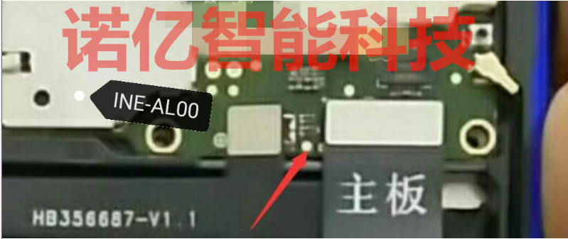
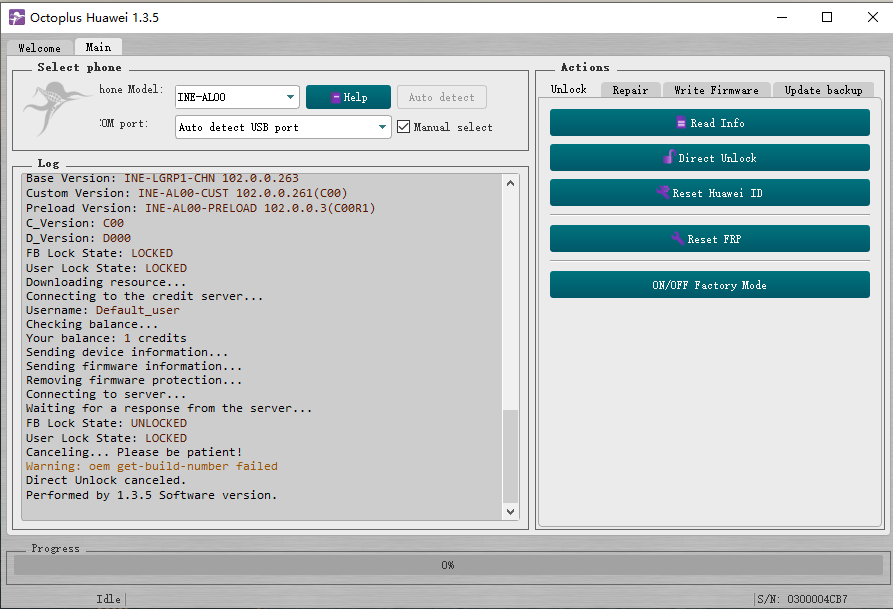
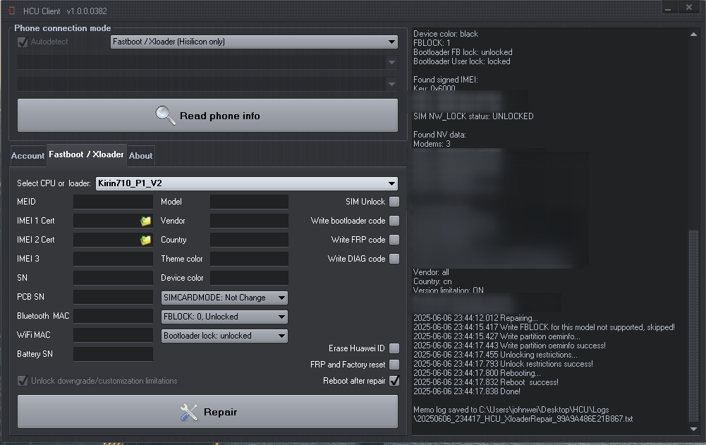

之前用的华为nova 3i手机，被恢复出厂设置了，数据也全部清空了，后续又升级到了鸿蒙2系统，此时想找回在这部手机保存的照片等数据，确实有点挑战，但是还是值得一试的，手机已经升级到鸿蒙系统了，之前没有解过手机的bootloader锁，过程中花了不少时间研究该怎么操作，目前将自己的经验总结一下，大概过程有系统降级、解bootloader锁、安装TWRP、导出磁盘镜像、数据恢复这5步。

## 1. 系统降级

手机当前的系统是鸿蒙2，需要降级到安卓系统，使用hisuite + HiSuite代理的方式进行系统降级，需要先打开[HiSuite Proxy](https://github.com/ProfessorJTJ/HISuite-Proxy)代理软件，目前最新版是V3版，该项目是开源的，所提供的release版本包含HiSuite对应的版本，具体可参见[教程](https://github.com/ProfessorJTJ/HISuite-Proxy/wiki/Complete-Guide-V2.0)；注意V3版需要访问[[Firm Finder v2.0](https://professorjtj.github.io/v2/)网站获取对应的ROM，设备型号选择INE-AL100，选择9.1版本的一个系统，点击`Add Rom`便将该rom的信息传给了HiSuite Proxy代理软件，选择回滚，SETUP完成后便可以使用hisuite进行系统升级，此时就会跳出回退版本的提示，按照操作执行后，便会下载对应的Rom包，下载完成后便执行回退，不过这个方案笔者并未执行成功，总是在下载ROM包完成后，一进入安装步骤就报错，具体原因未知，后续便尝试使用卡刷模式进行系统降级了，就没在这个方向上投入时间精力来摸索了。

需要下载对应的卡刷包进行卡刷，详细卡刷包下载与刷机教程可以参考：

[华为Nova 3i 全网通 INE-AL00 刷机SD卡刷、OTG+U盘正常升级以及三键强刷，超详细图文教程](https://onfix.cn/course/547?bid=6&mid=3754)

这里选择使用SD卡升级，准备一张sd内存卡，大小在8G以上，在ONFIX花3块钱即可下载一个卡刷包，下载了9.1.239的卡刷包，下载完成以后，解压文件夹后进入找到dload目录，将dload文件夹整体拷贝到SD卡的根目录下，将SD卡插入手机，手机拨号\*#\*#2846579#\*#\*进入工程菜单，在工程菜单点击软件升级-SD卡升级-确定，系统会自动重启至升级模式界面，升级过程中有进度条显示，待进度条走完后，手机会自动重启，重启完成，熟悉的EMUI页面就回来了，手机系统成功降级为EMUI9.1。

## 2. 解bootloader锁

系统降级完成后，使用`adb reboot bootloader`进入fastboot模式，可以看到目前手机仍然是锁定状态，即locked状态，为了实现后续操作，必须进行解锁，由于华为官方已经在2018年关闭了手机BL解锁码的申领渠道，为了能顺利解锁，需要根据机型与芯片类型选择相关工具和方法进行，并且需要知道如何短接手机进入1.0模式，为了顺利进入1.0模式，此时需要在某宝上买一个菊花1.0工程头，笔者买的是个三代的工程头，买完回来就可以尝试了。

**进入1.0模式：**

首先需要找到手机的短接点，由于每台手机的短接点都不相同，需要自行查找各自手机的短接点位置，nova3i手机的短接点位置如下图所示：



找一把镊子或者金属丝，总之能导电的就行，按如下顺序操作：

> 1. 电脑打开设备管理器；
> 2. 拔掉手机电源；
> 3. 将菊花工程头接入usb线，usb线另一头连接手机；
> 4. 用镊子将短接点和附近的金属外壳(也就是地线)连接，将菊花工程头插入电脑；
> 5. 此时电脑设备管理器的端口下会展示HUAWEI 1.0的接口，如果显示的是ser，则表示没有安装HUAWEI 1.0驱动，此时需要下载并安装对应驱动即可，[HUAWEI USB COM 1.0 driver.zip](https://androidfilehost.com/?fid=17248734326145728281)；
> 6. 驱动安装好以后，设备管理器的端口下会展示HUAWEI USB COM 1.0 (COM3)，则表示手机进入1.0模式成功；

**使用软件进行解锁：**

有多种软件可以进行解锁，有付费的和开源的工具，这里笔者只讨论自己使用过的，首先推荐的是[PotatoNV](https://github.com/mashed-potatoes/PotatoNV)这个项目，这个项目是开源的，支持Kirin 620,650,655,658,659,925.935,950,960芯片，nova 3i使用的是Kirin710芯片，该项目并不支持，但是对于是这些芯片的手机，可以尝试使用一下，另外附上知乎的一篇文章[部分华为麒麟手动获取BL解锁码](https://zhuanlan.zhihu.com/p/397173427)。

Octoplus八爪鱼是笔者尝试的第一款付费解锁软件，因该软件需要一个usb智能卡设备进行授权使用，购买一个智能卡价格不菲，某宝上有提供按小时和天租赁的服务，购买服务后，卖家会发送一个Usb-Redirector服务端的地址和端口号，有的会附带发送Usb-Redirector软件和Oc八爪鱼软件的地址，在新建一个连接，录入服务端地址和端口号后创建成功，系统便会识别这个远程的usb设备，该设备便是八爪鱼的usb智能卡设备，win10可以直接识别使用，win7需要单独安装驱动，驱动需要去八爪鱼官网下载并安装。

在插入USB智能卡设备的情况下，打开OC软件，选择手动模式，设备选择INE-AL100，端口选择HUAWEI1.0端口，点击`Direct Unlock`执行解锁操作，它执行过程中提示"please reconnect cable from the mother board"时，拔掉菊花接头，直接将usb线连接电脑，此时手机已经进入fastboot模式，上面那个提示的对话框点击OK，解锁过程继续执行，此时当fastboot变成unlock状态时，这表示解锁成功，后续会重启系统。

这种方法只能短暂解锁，当系统重启后，手机则又锁上了，该方法不能成功解锁。



后面去闲鱼上找了一个服务，20块钱，卖家使用HCU软件进行解锁，使用HCU是真的完全解锁了手机BL锁，重启后仍旧生效，不过使用HCU仍然是需要手机短接进入1.0连接模式的。



综上过程，手机算是解锁成功。

## 3. 安装TWRP

TeamWin Recovery Project（TWRP）是**一个开放源码软件的定制Recovery映像，供基于安卓的设备使用**，它提供了一个支持触摸屏的界面，允许用户向第三方安装固件和备份当前的系统。

安装twrp的难点是找到对应手机设备的img镜像，twrp的官网下载地址：https://twrp.me/Devices/Huawei/，并没有Nova 3i的镜像文件下载，经搜索互联网并进行尝试，在xda论坛找到了文件下载入口以及操作教程: [xda论坛提供的方法](https://xdaforums.com/t/guide-twrp-ine-lx1-2-how-to-install-twrp-and-root-huawei-nova-3i-p-smart.3878946/page-2)，下载SomeStuff对应的文件，解压后有twrp-kirin.img的镜像以及Magisk对应该twrp版本的安装包，执行如下操作安装TWRP：

1. 进入fastboot模式

   ```bash
   ~$ adb reboot bootloader
   ```

2. 刷入twrp的recovery镜像

   ```bash
   ~$ fastboot flash recovery_ramdisk twrp-kirin.img
   ```

3. 重启手机

   ```bash
   ~$ fastboot reboot
   ```

重启后有概率会进入twrp的界面，如果没有进入twrp的界面，待启动手机后，打开usb调试模式，执行`adb reboot recovery`后可以进入recovery模式，而目前手机系统的recovery模式正是twrp，在twrp的界面，可以在高级里面打开一个终端，该终端打开的用户是root。

## 4. 导出磁盘镜像

找一张大于等于内部存储容量大小的SD卡插入手机，进入TWRP界面，点击Mount，选择sd卡，这样就挂载sd卡到手机系统了，然后在"高Advance"下找到终端，进入终端后可以执行`whoami`，返回root，表示当前终端运行在root用户下，使用`df  -h`查看当前所有磁盘的挂载点，假设`/dev/mblock1`是内部存储设备，`/external_sdcard`是SD卡的挂载目录，使用dd命令导出内部存储的磁盘镜像文件，在执行dd命令前，SD卡需要格式化为nfs或者ext格式磁盘，fat32单个文件大小不能超过4G，使用fat32格式磁盘将无法生成全部磁盘大小的镜像文件，执行创建镜像命令如下：

```bash
~$ dd  if=/dev/mblock1  of=/external_sdcard/abc.img bs=4M
```

导出dd镜像完成后，便可以着手进行数据恢复了。

## 5. 数据恢复

使用photorec恢复数据，photorec是Linux下的一个定向恢复文件的数据恢复软件，它运行在命令行下，内置了多种数据格式的信息，可用于在分区丢失，文件系统不明等情况下恢复数据。

```bash
~$ photorec  abc.img
```

